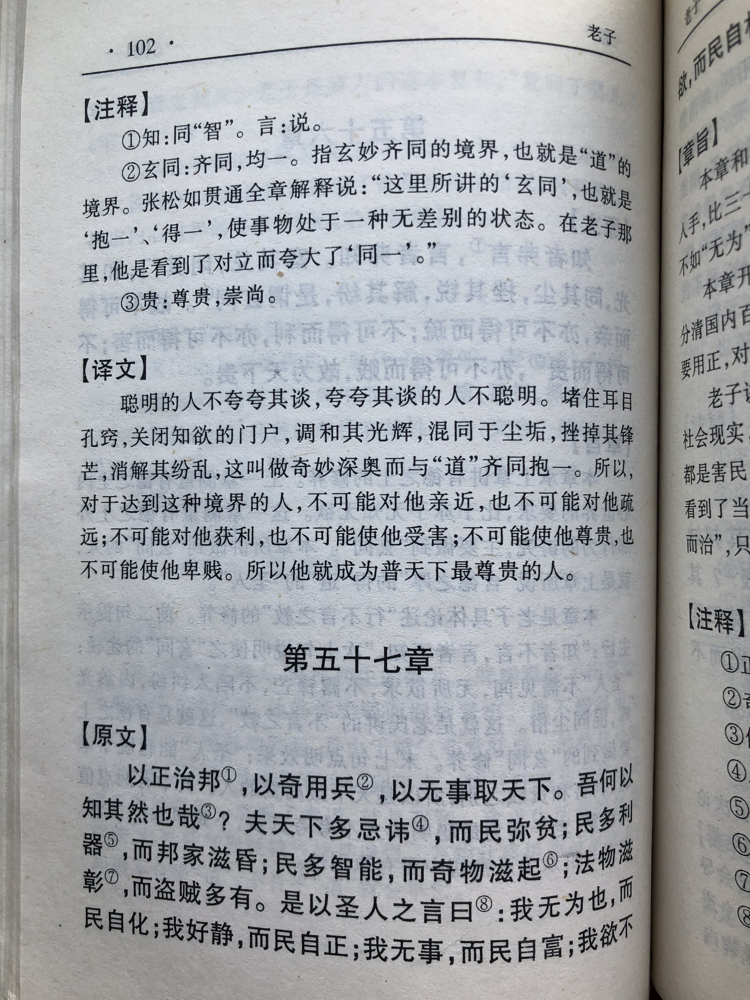
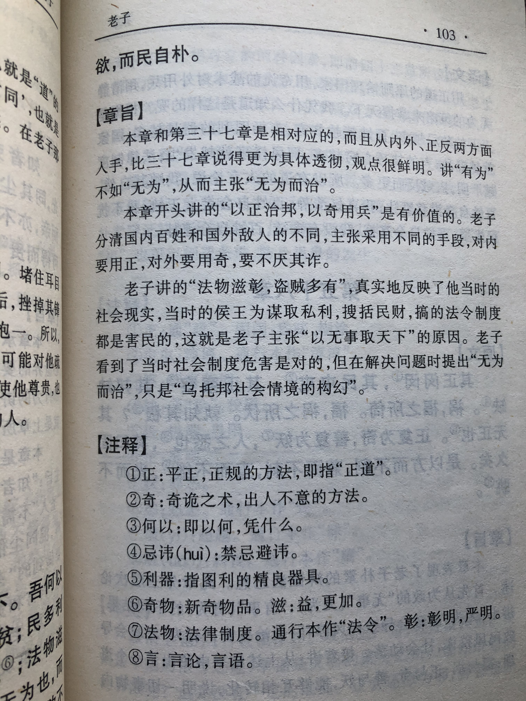

## 《道德经》第五十七章通行本原文：

    以正治国，以奇用兵，以无事取天下。
    
    吾何以知其然哉？以此：
    
    天下多忌讳，而民弥贫；
    
    民多利器，国家滋昏；
    
    人多伎巧，奇物滋起；
    
    法令滋彰，盗贼多有。
    
    故圣人云：
    
    我无为而民自化，我好静而民自正；
    
    我无事而民自富，我无欲而民自朴。
        
## 译文：
 
    以正道来治国，以奇谋来用兵，以清静无为来治理天下。
    
    我怎么知道要这样做呢？
    
    是根据以下：
    
    天下的禁令多了，百姓就越加地贫困；
    
    民众的利器多了，国家就越容易混乱；
    
    人们的伎俩多了，怪事就越容易发生；
    
    法律越是森严，盗贼反而越多。
    
    所以得道的统治者会说：
    
    我无为，百姓就自我化育；
    
    我好静，百姓就自我端正；
    
    我无事，百姓就自然富足；
    
    我无欲，百姓就自然淳朴。

## 逐句解释：

### 以正治国，以奇用兵，以无事取天下。
正：清净无为，正大光明之道。 奇：奇巧、奇谋。 
以正道来治国，以奇谋来用兵，以不扰民来治理天下。老子告诉领导人，治国得正大光明，不要为了满足私欲，不断滋扰民众，而打仗则不是光彩的事情，可以使用奇谋诡计来获胜。

### 吾何以知其然哉？以此：
我是怎么知道的呢？是根据以下：

### 天下多忌讳，而民弥贫；
忌讳：禁忌、避讳。弥：更加。
天下禁忌越多，百姓就越贫穷。领导不断设立规矩禁令，对民生就是一种干扰，人们失去自由就失去了活力。所谓苛政猛于虎，如果政令过多，且变更频繁，则民众目不暇接，应对不及。

### 民多利器，国家滋昏；
利器：锐利的武器或市场图利的工具。滋：更加。昏：乱的意思。
民众拥有更多武器或图利的工具，则国家更加混乱。人们依仗武器或工具可能会利益争夺，相互倾轧，最后搞得民不聊生，混乱不堪。当然如果拥有防身自卫的武器或工具是可以的，以免被政府或者别有用心者算计和迫害。

### 人多伎巧，奇物滋起；
人：一本作“民”，一本作“朝”，表示民众。伎巧：伎俩，智巧。
人如果喜欢耍伎俩和小聪明，那就会不务正业，从而奇闻怪事就是出来了。上行下效，领导者那么做，百姓会效仿，如果人人那样，天下将大乱。

### 法令滋彰，盗贼多有。
彰：彰显，清楚。
法律条规越是彰显明白，盗贼反而越多。盗贼不是因为有法律限制也不敢去做坏事，盗贼一开始也是普通百姓，因为无法安居乐业，走投无路才去偷盗劫掠。潜移默化、润物无声的教化，比起森严直白的法令要更有效。

### 故圣人云：
所以得道的人圣人会说：

### 我无为而民自化，我好静而民自正；
领导者无为而治而民众自我化育，领导者保持清净自然则民众就会正大光明。老子告诉领导者，少干预百姓生产生活，只要提供足够的便利，道法自然，市场背后有看不见的手，它会调控事物的发展。

### 我无事而民自富，我无欲而民自朴。
领导者如果不滋事扰民则民众会自我富强，领导者如果减少私欲，则民众也会变得质朴纯真。老子依然强调的是领导人要以身作则，为百姓树立榜样，保持清静无为，减少个人私欲，那样天下将大治。

## 心得总结：

本章是对清静无为的再次讴歌，并从几个方面论证了清静无为的好处。老子关于领导人应该遵守清静无为已经谈了很多遍了，本章论述得最为清楚。

首先，老子说打仗可以搞奇谋诡计，但是治国得走光明正道，也就是清静无为天下正。这是基本方针，不能混淆，更不能颠倒。

其次，老子说“天下多忌讳，而民弥贫；民多利器，国家滋昏；人多伎巧，奇物滋起；法令滋彰，盗贼多有。”这都是从清静无为的反面论证不那么做的危害。老子指出禁令多了、利器多了、伎俩多了、法令多了等则会天下大乱，祸害丛生。总之，治理国家不要用多，而当用减法，少干预，一切顺其自然，根据客观运行的“道”来调节人们的生产生活。这个与市场经济下“看不见的手”理论也很类似。市场经济中，“看不见的手”是指市场调节或者价值规律，“看得见的手”是指国家的宏观调控。老子那个年代还没有市场经济这个概念，但是老子的思想早就指出了类似的观点。

最后，老子指出“我无为而民自化，我好静而民自正；我无事而民自富，我无欲而民自朴。”这是用我来代指领导者。领导者如能保持清静无为，不为私欲而滋扰百姓，那么百姓就会保持淳朴和自然生长，最后走向富裕。老子清楚地看到这个世界背后运行的客观规律，告诫我们不要改变它、打破它，而应该适应它、顺从它，这个道理也就是“顺木之天，以致其性”。当顺应客观规律时，我们做事情得心应手，当违逆客观规律时你会发现处处被掣肘。当然我们可以对客观规律和自然环境适当做些调整和优化，也可以进行一定干预，但从根本上是顺应客观规律，而不是反之。这就是所谓“顺天者昌、逆天者亡”。

老子的这个思想，有时候也容易被人们所误解。有的人解读为老子的清静无为是一种乌托邦思想，是一种理想国。有的人会质问，人世间哪能没有欲望，没有欲望哪里有动力和发展？政府对于百姓哪能不干预，不监管，什么也不做那岂不是无政府主义？其实是那些人没有正确理解老子清静无为的思想。

老子的清静无为不是无所作为，更不是消极避世，老子的无为是保持内心的清静，顺势而为。即遵照百姓的意愿，抛却个人的私欲，为了众人的利益进行适度的管理和干预。也就是在治理过程中对于百姓要少干预，不要朝令夕改，更不要违反自然法则，而是要遵守客观规律，保持相对和谐。按照现代政府权力范围可划分“大政府”和“小政府”，老子的思想倾向于“小政府”，既多利用“看不见的手”，而少发挥“看得见的手”。即让市场来主导，政府只把公共职能做好，把市场监管做好，把利益分配机制做好，其他让百姓自由地生活生产。

老子的思想其实也是一种平衡思想。即社会发展使得天下混乱，人心贪婪，而要想解决本质问题就要通过“无为”、“好静”、“无事”、“无欲”来去除多余的相对性，使得回到相对性平衡。老子的这个智慧对后世的“天人合一”、“中庸之道”、乃至“和谐社会”都产生着深刻的影响。

## 附帛书版：

[返回目录](../README.md) &nbsp; [上一章](./56.md)&nbsp; [下一章](./58.md)

