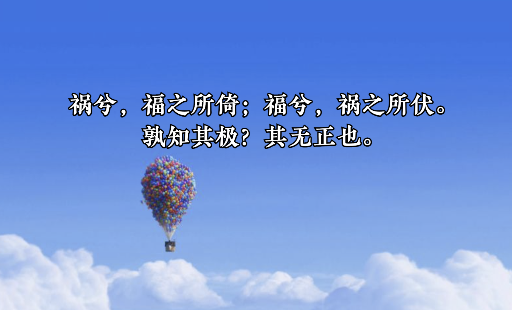
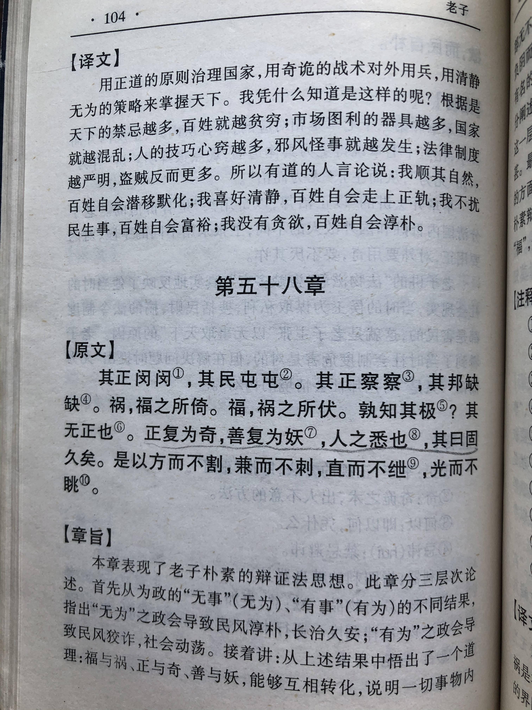
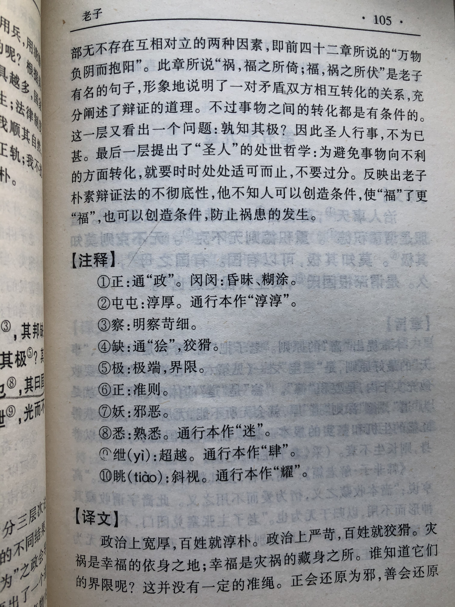

## 《道德经》第五十八章通行本原文：

    其政闷闷，其民淳淳；
    
    其政察察，其民缺缺。
    
    祸兮，福之所倚；福兮，祸之所伏。
    
    孰知其极？其无正也。
    
    正复为奇，善复为妖。
    
    人之迷，其日固久。
    
    是以圣人方而不割，廉而不刿，直而不肆，光而不耀。
        
## 译文：
 
    政治清明宽厚，人民便纯朴敦厚。
    
    政治严酷纠察，人民便狡猾多诈。
    
    灾祸中倚藏着幸福；幸福中潜伏着灾祸。
    
    谁能知道其变化的界限呢？没有固定的标准。
    
    正会转变为邪，善会转变为恶。
    
    世人看不透这个道理，已经迷惑得太久了。
    
    所以有道的圣人，为人方正而不生硬，锐利而不伤人，直率而不放肆，明亮而不炫耀。

## 逐句解释：

### 其政闷闷，其民淳淳；
闷闷：昏昧，宽厚的意思。淳淳：淳朴敦厚。
政治上宽厚仁慈，施仁政，那么民众自然也会淳朴善良。

### 其政察察，其民缺缺。
察察：严酷。缺缺：狡黠。
政治上严刑峻法，施苛政，那么民众自然也会狡诈虚伪。

### 祸兮，福之所倚；福兮，祸之所伏。
祸福相依，好坏相连。灾祸中倚藏着幸福；幸福中潜伏着灾祸。凡事难有定数，塞翁失马，焉知非福。

### 孰知其极？其无正也。
正：正道，与“奇”对应。
谁知道其中变换的界限和奥秘呢？是没有固定标准的。

### 正复为奇，善复为妖。
正的可能会再变成邪的，善的也可能会再变成恶的。事物不断运动发展，当到达极致程度时就会对立转换，所谓“反者道之动”。

### 人之迷，其日固久。
人们为此感到迷惑，由来已久。按照常人思维，不太容易明白这个道理。怎么会出现祸福转换，善恶变化呢？

### 是以圣人方而不割，廉而不刿，直而不肆，光而不耀。
割：生硬，不自然。廉：棱角。刿：划伤。耀：明亮得耀眼。
所以有道圣人或统治者，应该保持方正而不生硬，有棱角而不尖锐，直率而不放肆，明亮而不刺眼。宇宙的矛盾都是对立转化的，过于突出事物的某一面就容易走向反面。

## 心得总结：

本章是老子核心思想的延续，老子核心思想之一是清静无为，而之所以要保持清静无为，一个很重要的原因是“反者道之动、弱者道之用”。即事物的运行规律是沿着对立面转换，最后回到原点。人们只有遵循“道”的这个运行规律，才能把事情做得更好。

“祸兮，福之所倚；福兮，祸之所伏。”、“正复为奇，善复为妖。”这是说事物正反会互转，祸福会相连，没有一成不变的好，也没有一成不变的坏。因此，我们要回归质朴，保持清静，守于中。

懂得这个道理，对于领导者来说，做重大决策时要懂得正反两面思考，听取各方的意见，充分论证，找到相对的最优解。事物并不是一成不变的好或坏，在发展过程中也会正反转换，因此我们应该时刻保持清醒，不能掉以轻心。对于普通人来讲，如果我们明白了这个道理，就会知道再难的关，也过得去；再苦的活，也干得完；再丑的人，也有值得欣赏的地方。我们就没有必要自怨自艾，感叹命运的不公。

事情取得了成功也不值得骄傲，不要妄自尊大，事情失败了也不要气馁，不要妄自菲薄。对于遇到挫折或者身处困境的人来说，我们要学会坦然面对，要知道没有过不去的坎，再大的祸里面也会潜藏着福。“不以物喜，不以己悲”这是一种明白之后的豁达与开朗，有了这个心态，就可以做到“达则兼济天下，穷则独善其身。”

“是以圣人方而不割，廉而不刿，直而不肆，光而不耀。”这是一种为人处世的智慧，老子告诉我们做事要适度，做人要外圆内方，外柔内刚。凡事不要逞强，即使自身再强大，再光彩夺目，也要懂得收敛，始终保持低调和谦卑。领导者这么做，那就能使得天下大治、国泰民安，普通人这么做就会事事顺遂、万事亨通。

生活是个多面体，也一直在不停发展变化。祸福相依，正反互转，明白了这个道理，会使得我们打破思维的局限，领略人生的智慧。老子通过观察事物的客观规律悟出了无为而治的道理，我们又从老子的思想中悟到了为人处世的方式和态度。

## 附帛书版：

[返回目录](../README.md) &nbsp; [上一章](./57.md)&nbsp; [下一章](./59.md)

