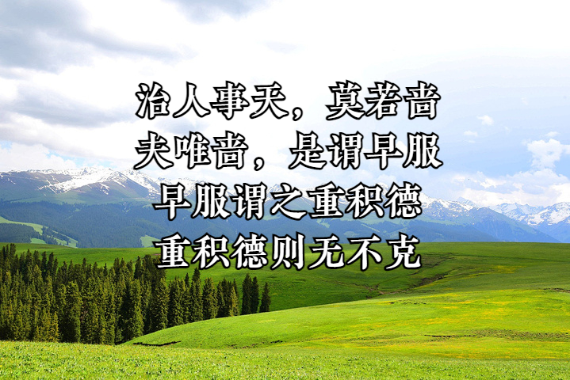
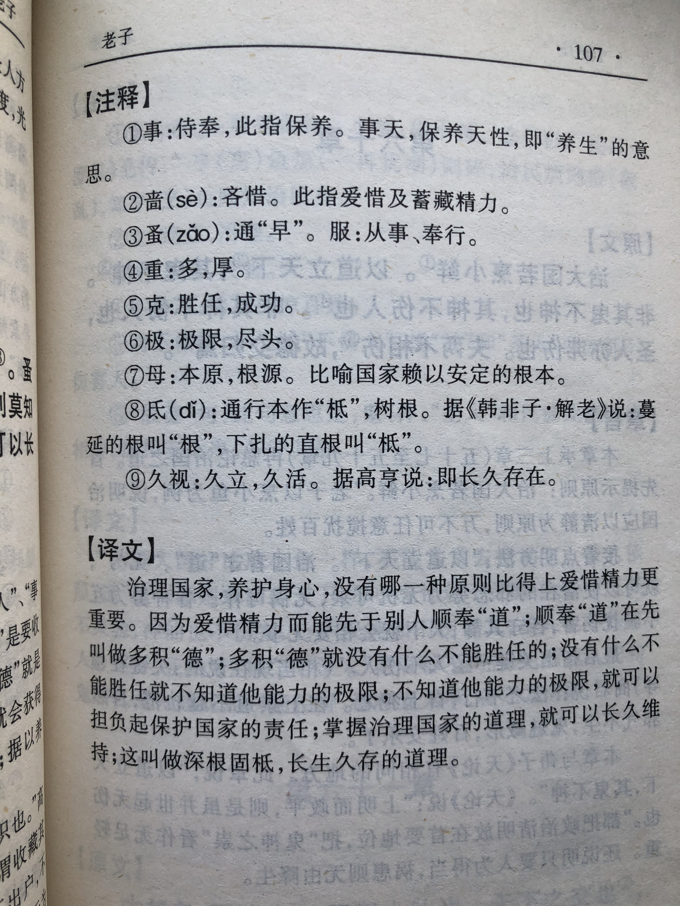

## 《道德经》第五十九章通行本原文：

    治人事天，莫若啬。
    
    夫唯啬，是谓早服；
    
    早服谓之重积德；
    
    重积德则无不克；
    
    无不克则莫知其极，莫知其极，可以有国；
    
    有国之母，可以长久。
    
    是谓根深固柢，长生久视之道。
        
## 译文：
 
    治理百姓和养护身心，没有比爱惜精力更为重要了。
    
    爱惜精力，追求能够早点入“道”；
    
    早点入“道”，就是为了多积“德”；
    
    多积攒“德”，就没有什么不能胜任的；
    
    没有什么不能胜任，那就无法估量他能力的极限；
    
    无法估量他能力的极限，他就可以担负治理国家的重任。
    
    有了治理国家的根本大道，国家就可以长久不衰。
    
    国家长久不衰，就叫做根深蒂固，也是长久存在之道。

## 逐句解释：

### 治人事天，莫若啬。
事天：保养天性，养生的意思。啬：吝啬，吝惜，这里表示爱惜精力。
治理百姓和保养身心 ，莫过于爱护自己的精力。

### 夫唯啬，是谓早服；
服：从事、奉行。指早做准备，或指趁早服从道。
爱惜自己的精力，就是奉行早入“道"。

### 早服谓之重积德；
重：重视，多的意思。
早入“道"就是为了多积“德”。

### 重积德则无不克；
克：胜任。
多积“德”后，就没有什么不能攻克或胜任的。

### 无不克则莫知其极，莫知其极，可以有国；
极：极限、尽头。
没有不能胜任的，则无法知道其能力极限，无法知道极限，则可以治理天下。

### 有国之母，可以长久。
母：本源、根本，这里指“道”。
治理天下有根本之道，则可以长久。

### 是谓根深固柢，长生久视之道。
柢(dǐ)：树木的根。视：生活。
这就是所谓的根深蒂固，是长治久安之道。

## 心得总结：

本章老子主要讲的是养生和修德，但本质上还是讲治国。“治人事天，莫若啬。”老子认为，要想治理好天下就得养好身心，并且奉行“道”的原则 ，不断积“德”。

“早服谓之重积德，重积德则无不克。”早点入道就是为了多积攒德，多积攒德就能无往而不胜。“啬”就等于早服，早服就等于早积累，即早保持生命的精气神。这里的“积德”与一般口语的“积德”并不同。老子的“德”是自然虚静之德，是人的秉性或禀赋；人们常说的“德”是儒家之德，是指人的品德和素质。老子修德是减损的过程，孔子修德是积累的过程。但老子在这里又说了个“积德”，而且要“重积德”，这个“积”实际不是“积累、增加”的意思，而是“逐渐”的意思，是逐渐地去接近和还原人的本性之德，是一个逐步有序地回归的过程，也就是“啬”的过程。

“无不克，则莫知其极。”回归到人最初的德性，也就返璞归真，就会能够无往而不胜。这种无往而不胜的能力，没有人知道极限在哪里，因为这是来自“道”的力量，它是无边无际、绵绵不绝的。当人拥有了这种能力，就可以治理天下了。

“有国之母，可以长久。”这个“母”就是最原始的根源，就是“道”，而我们依据根源表达出来就是“啬”，“啬”是“道”在外在表达。老子告诉我们为人处世都要遵从“啬”的原则，即爱护自己的身心，要保持简单朴素，而不要搞得纷繁复杂。这样才“深根固柢”和“长生久视”，也就是长久不衰。

本章老子的意思其实一种简单朴素的人生哲学，告诫我们要遵循减法原则，去掉多余的欲望，不断修“德”，不断接近于人最初的本性，回归于“道”。当能做到“无不克则莫知其极”时，就可以治理国家，且长治久安了。

## 附帛书版：

[返回目录](../README.md) &nbsp; [上一章](./58.md)&nbsp; [下一章](./60.md)

