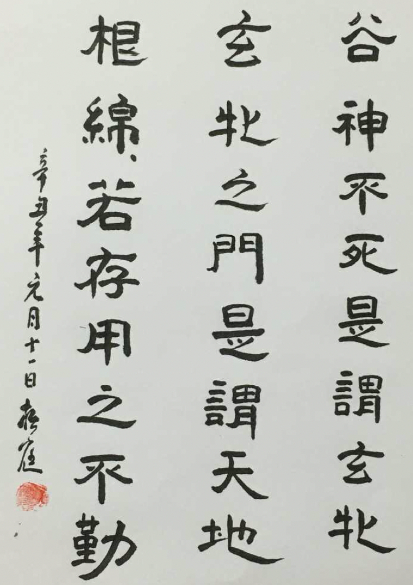
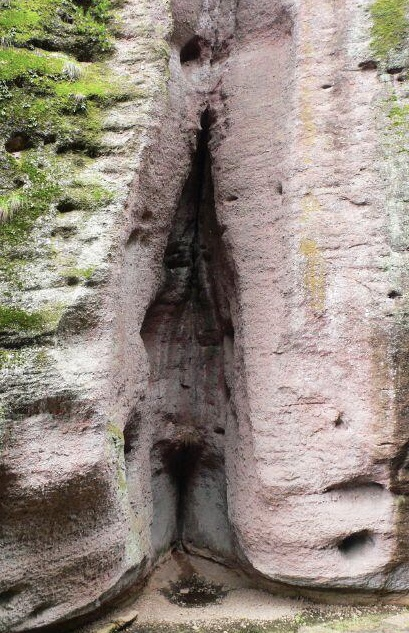
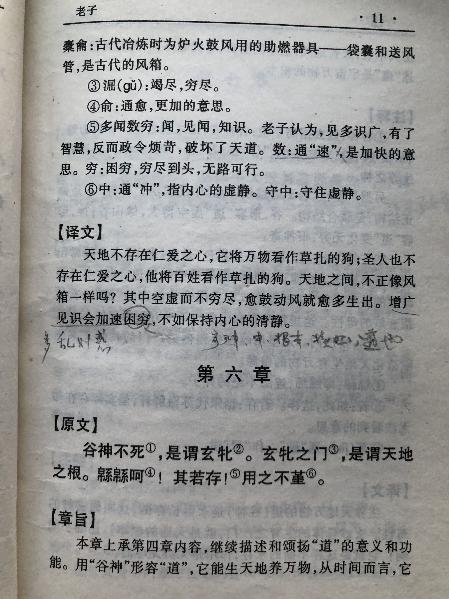
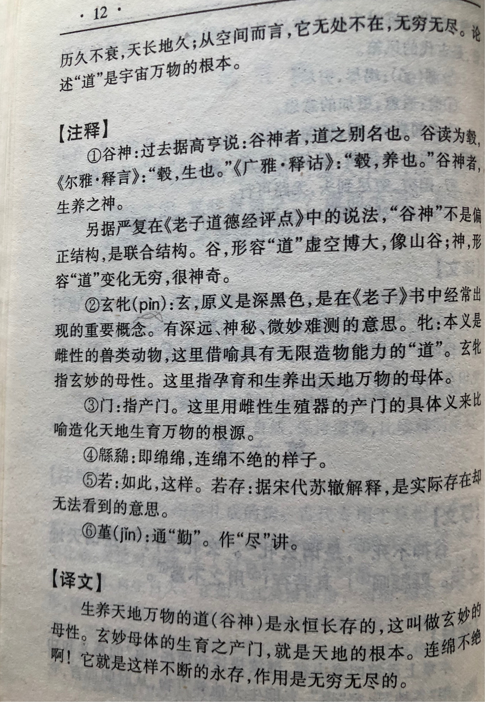

## 《道德经》第六章通行本原文：

    谷神不死，是谓玄牝。
    
    玄牝之门，是谓天地根。
    
    绵绵若存，用之不勤。

## 译文：
 
    生养天地万物的道（谷神）是永恒长存的，也就是玄妙的母体。
    
    玄妙母体的生育产门，就是天地生成的根源。
    
    它绵绵不绝啊，永久长存，作用无穷无尽。

## 逐句解释：

### 谷神不死，是谓玄牝。
谷乃山谷，内中虚空，充满神奇。玄，深黑色，很玄妙。牝（pin，四声），母牛。

### 玄牝之门，是谓天地根。
深玄奥妙的母体产门就是天地之根源，万物就像孩子从母亲的产门生产出来。这个过程的确非常神奇。

### 绵绵若存，用之不勤。
万物生育是绵绵不绝的，永不穷尽。

## 心得总结：
这一章老子指出了“道”的特性，如山谷中空，如母性的产门，也是万物生育的根源。且绵绵不绝，就像天地循环，生生不息，久世长存。

这里老子依然只是下定义，而没有给出为什么“道”是母体，为何母体产门是万物的根源，为什么“道”久世长存，延绵不绝，用之不尽。我想这里没有必要追问，因为老子本身就是下了定义，你若信便信，你若不信便不信。

我倾向于相信老子所言，“道”是存在的一个客观规律，也是孕育万物的母体。因为你若信，便会知道原来这个世界万物都是有生有灭的，而只有创造世界万物的“道”永恒长存。

同时，不管是人和还是其他动物都脱胎于母体，这个就像“道”一样玄妙高深。老子用母体来比拟“道”，也是让我们更加尊敬和信仰母性。这也会引出中华传统孝道，敬爱自己的母亲。

## 附帛书版：

[返回目录](../) &nbsp; [上一章](./5.md)&nbsp; [下一章](./7.md)

