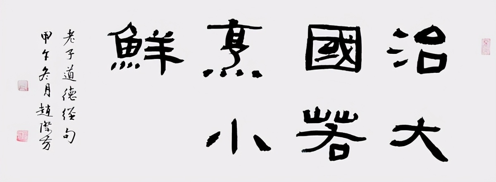
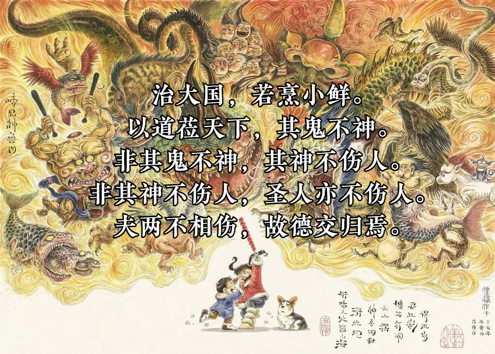
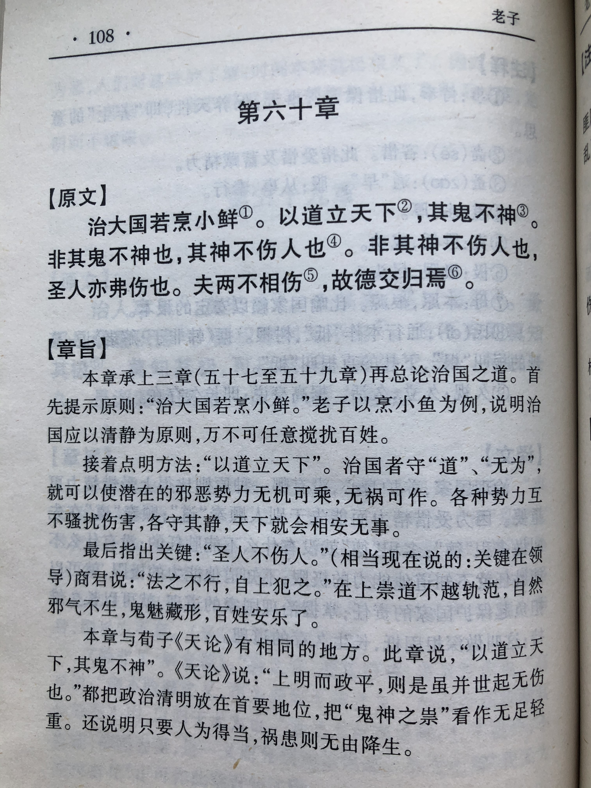
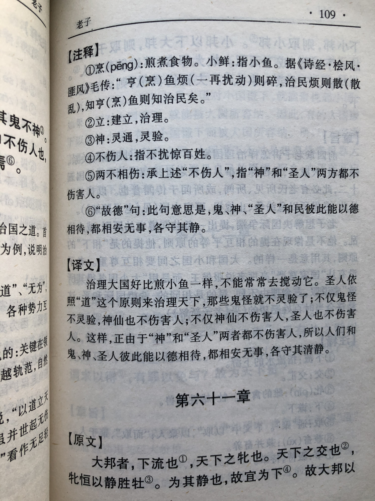

## 《道德经》第六十章通行本原文：

    治大国，若烹小鲜。
    
    以道莅天下，其鬼不神。
    
    非其鬼不神，其神不伤人。
    
    非其神不伤人，圣人亦不伤人。
    
    夫两不相伤，故德交归焉。
        
## 译文：
 
    治理大国，就像烹饪可口的小鱼。
    
    用“道”来治理天下，鬼也不再神奇。
    
    不是鬼没有神奇了，而是鬼即使有神奇也伤不了人。
    
    不但鬼的神奇伤害不了人，圣人也不会伤害人。
    
    鬼神和圣人都不伤害人，这是“德”相互融合，并归于“道”的结果。

## 逐句解释：

### 治大国，若烹小鲜。
小鲜：小鱼。
治理大国，就像烹饪可口的小鱼。烹饪可口的美味，需要文火慢炖，耐得住性子，不能一蹴而就。治理国家也是类似的道理，要遵循无为而治，顺其自然的理念。

### 以道莅天下，其鬼不神。
莅：临。
用“道”来治理天下，那么鬼也不那么神奇了。当我们遵循于“道”时，就不用担心神奇鬼怪了，事物会按照自然法则，有条不紊地进行。

### 非其鬼不神，其神不伤人。
其鬼不神：鬼不起作用。
不是鬼不神奇、不灵验了，而是即使鬼依然灵验，但它也无法对人造成伤害。正大光明的人不怕有鬼，即使真的有鬼，那也不用担心鬼会伤人。因为“身正不怕影子斜”，“不做亏心事，不怕鬼敲门。”，人只要行得正、走得端，根本不用担心鬼神。

### 非其神不伤人，圣人亦不伤人。
非：不唯、不仅。
不只是鬼神不伤人，圣人也不伤害人。这句理解起来似乎有点费解。圣人怎么会伤人呢？老子眼里的圣人其实是指得道统治者，也就是说如果“道”在天下普及，那么统治者也依循“道"，也就不会给人们带去伤害。

### 夫两不相伤，故德交归焉。
交归：交互融合，归于”道“。
鬼神和圣人都不伤害人，各方之”德“彼此交互融合，统治者德被八方，百姓享受“德”的恩泽。

## 心得总结：

本章老子主要讲治理国家之策略，以及遵照“道”所带来的好处。

“治大国，若烹小鲜。”这是千古名言，然而却经常被人误解，以为治理大国跟小菜一碟一样，不用花什么心思。其实老子的意思是无为而治。烹煮小鱼，需要小火慢炖，不要着急，更不要去干扰和翻炒，而是一切顺其自然，等到时间到了，撒点葱花香菜，直接出锅，一盘美味佳肴就成功了。如果耐不住性子，不停搅动翻炒，那么小鱼就会烂成一锅粥。烹饪小鲜表面看来很简单，几乎不花心思，似乎啥也没干，而实际上考虑周到，时刻警惕，用心良苦，需要烹饪者“识物性、善调理、懂火候”，在长期的实践中不断观察、感悟和提炼，最后形成自己的知识体系，才能把一盘普通的菜做得原汁原味，美味可口。

治理国家也是一样，要依靠天之道，也就是无为而治。他指出“以道莅天下”，即把“道”放在主体的位置，来充当指导思想，在这个过程中要把人的主观能动性，放在其次位置上，人的能动性和意志要始终辅佐于“道”，也就是顺天应人，道法自然。人可以改造和促进自然，但人是从属地位的，主体依然是“道”，人不能漠视客观自然规律，更不能把自然玩弄于股掌之间。

"非其鬼不神，其神不伤人.非其神不伤人，圣人亦不伤人。"这里说的是当一切依循于道，德被四方的时候，鬼神也不灵验了，即便有灵，那么人也无需畏惧或者乞求鬼神。中国古代无论老子还是孔子，对鬼神都是敬而远之。中国古代思想体系里并不存在一个主宰世界的神或者上帝，人们最多是相信死去的祖宗先辈。当然，对于是否存在鬼神也无法证实或证伪，人们会把死去的先辈的灵魂当成是鬼（少数可变成神）。因此，老子说即便鬼神真的存在，也或者鬼神比较灵验，但是人如果依照正道行事的话，那么鬼神也无法伤害于他。就像一个人如果光明磊落，又岂是小人能够陷害的。

“夫两不相伤，故德交归焉。”当鬼神都不伤害于人，此时各方的“德”汇聚在一起，相互交融，鬼与神、百姓与领导彼此都以“德”相待，大家都保持清心寡欲，依归于“道”，这时候就会天下大治，国泰民安。

## 附帛书版：

[返回目录](../README.md) &nbsp; [上一章](./59.md)&nbsp; [下一章](./61.md)

