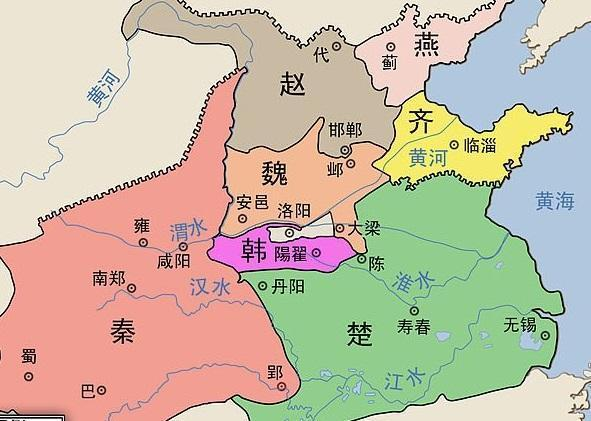
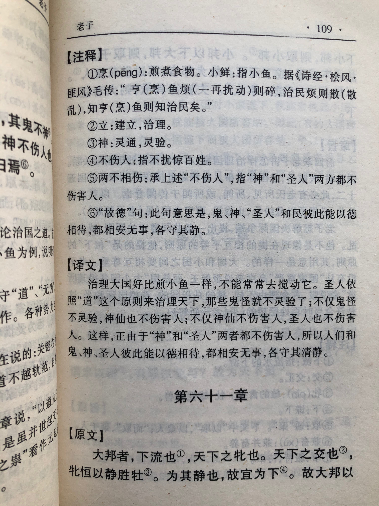
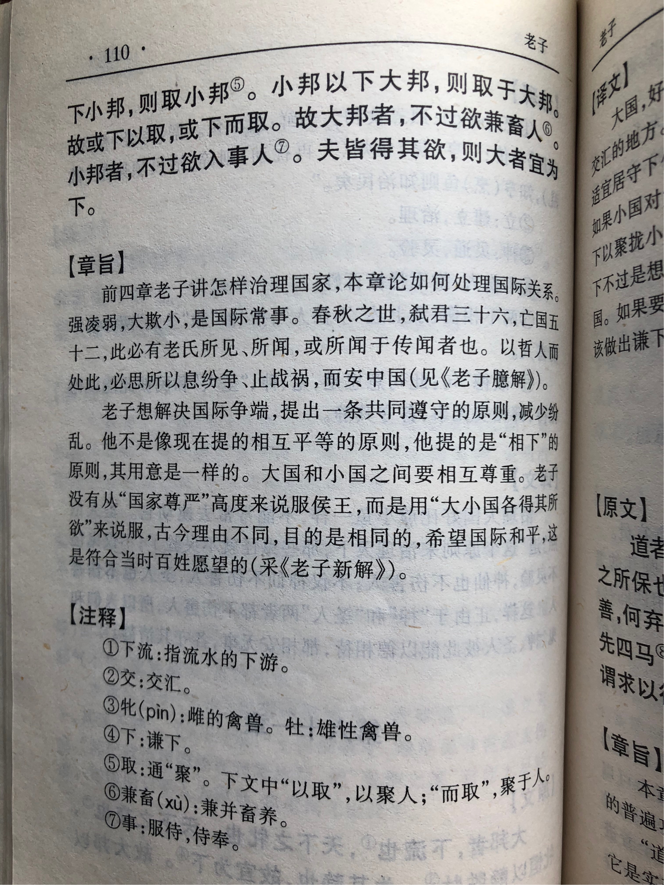

## 《道德经》第六十一章通行本原文：

    大国者下流也，天下之牝。
    
    天下之交也，牝常以静胜牡，为其静也故宜为下。
    
    故大国以下小国，则取小国；
    
    小国以下大国，则取大国。
    
    故或下以取，或下而取。
    
    大国不过欲，兼畜人；
    
    小国不过欲，入事人。
    
    夫两者各得其所欲，大者宜为下。
        
## 译文：
 
    大国居于江河下游，汇聚百川，处于雌柔的位置。
    
    天下雌雄之间的交合，雌性常以静柔而胜过雄性的刚强，因为雌性柔静，适宜居守下位。
    
    所以，大国对小国谦让低下，就可以取得小国的依附；
    
    小国对大国保持谦让低下，就可以取得大国的庇护。
    
    所以，或者大国对小国谦让以取得小国的依附，或者小国对大国谦让而取得大国的庇护。
    
    大国不过于贪婪，而能兼并畜养小国；
    
    小国不过于膨胀，而能投靠侍奉大国。
    
    双方想要达成各自诉求，保持利益平衡，大国应善居于下位。

## 逐句解释：

### 大国者下流也，天下之牝。
下流：下游。牝：雌性、母牛。
大国居于江河下游，海纳百川，处于天下的雌柔位置。大国繁荣昌盛，万国来朝，应该居于下位。

### 天下之交也，牝常以静胜牡，为其静也故宜为下。
天下的交合，雌柔能胜雄强，因为雌性守静，居于下位。

### 故大国以下小国，则取小国；
下：谦卑、低下。取：取得，聚拢。
所以大国以低下姿态对待小国，则可以取得小国的信任，从而聚拢小国。

### 小国以下大国，则取大国。
小国以低下姿态对待大国，则可以取得大国的包容，从而得到大国的庇护。

### 故或下以取，或下而取。
所以，以谦卑低下取得信任，或者以谦卑低下取得包容。

### 大国不过欲，兼畜人；
欲：欲望、欲求。兼蓄：兼并蓄养。
大国不过于贪婪，则可以兼并蓄养小国；

### 小国不过欲，入事人。
事：服侍、侍奉。
小国不过于膨胀，则可以投靠侍奉大国。

### 夫两者各得其所欲，大者宜为下。
大国和小国各得其所，保持利益均衡，大国应该保持谦卑低下。

## 心得总结：
本章主要讲大小国的关系和外交策略。春秋末期周天子名存实亡，天下分为多个诸侯国家，其中有大有小。各诸侯相互杀伐，想以武力称霸于天下，导致天下混乱不堪。在这种背景下，老子指出无论大国还是小国，都应该保持谦卑低下，守住静柔，也就是遵循于“道”，这样天下才能太平，百姓才能安居乐业。

“大国者下流也，天下之牝。”大国要像居于下游，使天下百川交汇于此。一个国家之所以成为大国，就在于它以“道”治国，胸怀宽广，海纳百川，天下小国自然会来归附。大国像是天下文明的源泉和中心，要像母体一样源源不断地向其他国家输出道德和文明，故称“天下之牝”。“静胜燥”、“弱胜强”，“清静为天下正”，因此大国要遵循于“道”，保持谦卑和低下。

“故大国以下小国，则取小国；小国以下大国，则取大国。”大国保持低下，小国也是如此。无论大小国家都应该保持低下谦卑的姿态，这样才能获取对方的信任，彼此才能成为对方的需要和依赖。“大国不过欲，兼畜人；小国不过欲，入事人。”大国也好，小国也罢，都需要去掉多余的欲望，不要穷兵黩武，而是依赖和帮助对方。

“夫两者各得其所欲，大者宜为下。”只有双方各得其所，达成各自的诉求，才能保持利益均衡，这样天下才能太平，百姓才能安居乐业。这首先需要大国起到示范作用，保持谦卑的低姿态。

老子的这个外交思想可以说是非常睿智的，也是一种平衡法则。虽然老子的想法可能过于理想，在中国古代不一定能够完全实现，因为邦国关系会受地缘、文化、经济等诸多因素的影响，但是对于现如今国际外交颇有借鉴意义。如今世界，已经进入文明法治时代，过去那种丛林野蛮时代一去不复返了，老子的和谐共处思想就能发挥作用了。无论是超级大国，还是弹丸小国，都应该学习“或下以取，或下而取。”这样才是和平美好的希望。

## 附帛书版：

[返回目录](../README.md) &nbsp; [上一章](./60.md)&nbsp; [下一章](./62.md)

