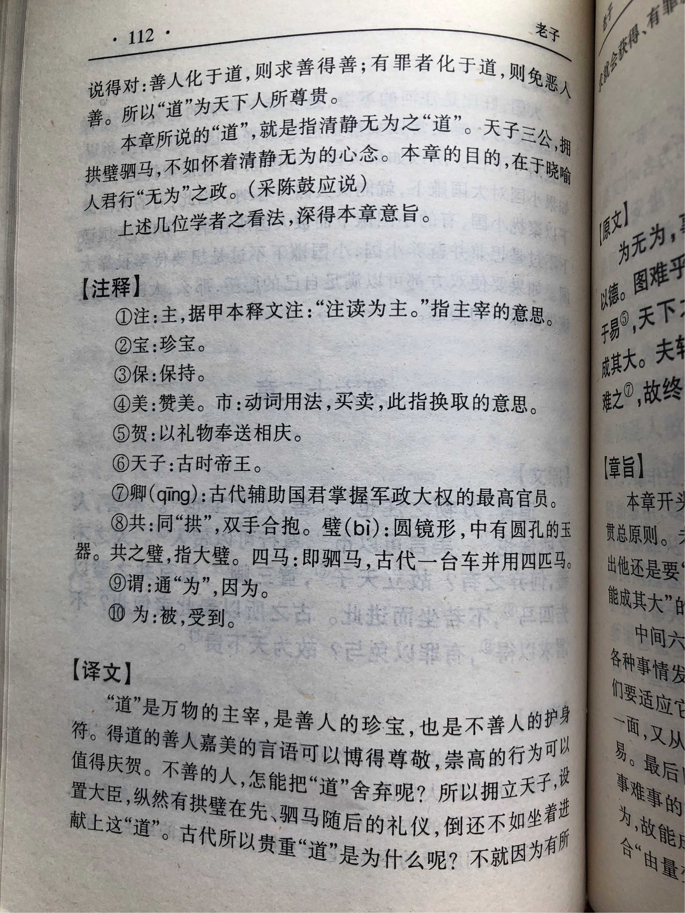

## 《道德经》第六十二章通行本原文：

    道者，万物之奥，善人之宝，不善人之所保。
    
    美言可以市尊，美行可以加人，人之不善，何弃之有？
    
    故立天子，置三公，虽有拱璧以先驷马，不如坐进此道。
    
    古之贵此道者何？
    
    不曰求此得，有罪以免邪？
    
    故为天下贵。
        
## 译文：
 
    “道”是万物之庇护，是善人的珍宝，也是不善人的护佑。
    
    美好言辞可以获得尊重，善良行为可以获得好报，不善之人又怎么能抛弃呢？
    
    所以拥立天子，设置三公九卿，纵使捧着美玉在先，驾着驷马随后，也不如进献以“道”。
    
    自古以来，人们如此推崇“道”究竟为了什么呢？
    
    不正是求它能得到庇护；有罪也可得到赦免吗？
    
    正因为这个，天下人才如此贵重“道”。

## 逐句解释：

### 道者，万物之奥，善人之宝，不善人之所保。
奥：深奥或深藏，庇护之意。其实两说皆可，不必执拗字词。
善人：善良之人或得道之人。
“道”是万物庇护之所，深奥无比，是有道人的珍宝，也是未得道之人的护身符。无论得道与否，也无论良善与否，“道”都是大家的庇护。

### 美言可以市尊，美行可以加人，人之不善，何弃之有？
美言：美好的言辞。
市尊：尊重、敬仰。
加人：帛书版为“贺人”，庆贺之意。
美好的言辞可以获得他人尊重，善良的行为可以获得相应回报，不善之人，又怎么能抛弃呢？好人好事我们拍手庆贺，但不善之人，犯了错误，也不能鄙夷抛弃。

### 故立天子，置三公，虽有拱璧以先驷马，不如坐进此道。
三公：帛书为三卿，太师、太傅、太保。古时辅国之重臣。
拱壁：双手捧着贵重的玉，表示珍贵美玉。
驷马：四匹马驾的车，代表身份高贵。
所以拥立天子，设置三公九卿，纵使捧着美玉在先，驾着驷马随后，还不如进献以“道”（或奉行“道”的原则）。珠宝虽美，驷马虽贵，还是不如君臣按照“道”的要求来治理天下，也就是清静无为。

### 古之贵此道者何？
古时候贵重“道”是为什么？

### 不曰求此得，有罪以免邪？
求以得：有求就得到。
不就是有求就能得到，有罪也能赦免吗？“道”宽大无私，有求必应。你若困惑迷惘，心中惶惑，按照“道”的指引就能解开疑团，找到答案。你若误入歧途，犯下罪过，遵照“道”的旨意，也能赎罪解脱，重回正道。

### 故为天下贵。
因此，天下人们才以“道”为贵。

## 心得总结：
这一章老子主要讲“道”的贵重，“道”是天下万物的庇护之所。同时强调了修道所应坚守的原则，人不论善与不善，得道还是未得道，都应该坚持修道，贯彻“道”的原则。

对于天子和三公来说，美玉、驷马虽然华贵，然而不及奉行“道”更有意义。“道者万物之奥。善人之宝，不善人之所保。”意思是说，道是万物的主宰，善人的珍宝，也是不善人的护身符。老子认为，“道”是天地万物的本原，是天地万物的庇护之所，它时时刻刻都在护佑着天地万物。只有奉行于“道”，天下才能大治，百姓才能生活安宁。

“道”大公无私，无差别对待众生。“美言可以市尊，美行可以加人。人之不善，何弃之有？”美好的言论可以获得尊重，善良的行为可以获得回馈，那么不善之人又岂能抛弃？这是讲“道”的平等待人，当然，这里的平等对待也不是毫无原则的。当一个人的行为合乎大道的德行时，大道就会奖赏他。当一个人的行为不合乎大道的德行时，大道就会惩罚他。

“不曰求此得，有罪以免邪？”人们之所以如此贵重“道”，在于它有求必应，有罪能免。“道”的宽厚和包容以及无差别地博爱，让人们无比珍惜。当然这是天之道，与人之道并不相同。人类虽拥有着聪慧的头脑，看问题也颇为深刻，但人们很难做到无差别地对待周围的人和事，我们常常会因某人曾有过劣迹而鄙弃他，也因为个人偏好而过于钟情于某物。我们会倾注过多的个人情感，导致发生偏见。而大道则不同，它看问题客观理性、大公无私，对任何人都是仁慈（无偏私）的，对于不善之人也同样加以护佑。

“道”之所以受人尊敬，在于不弃人之不善，在于有求必应，在于有罪以免。“道”是天地万物的根源，是人类乃至万物的庇护之所。因此，领导者应该遵循“道”的法则，秉持“道”的原则，努力做到博爱宽容、平等待人，对于百姓有求必应、不离不弃。而普通人呢？也应该学习“道”的精神，贯彻“道”的原则，做一个严以律己，博爱宽容之人。

## 附帛书版：

[返回目录](../README.md) &nbsp; [上一章](./61.md)&nbsp; [下一章](./63.md)

