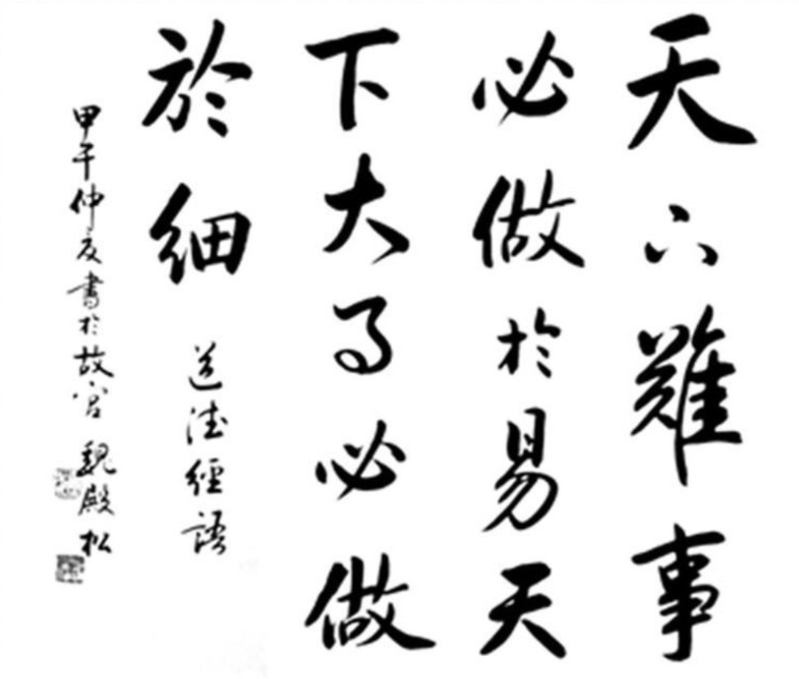
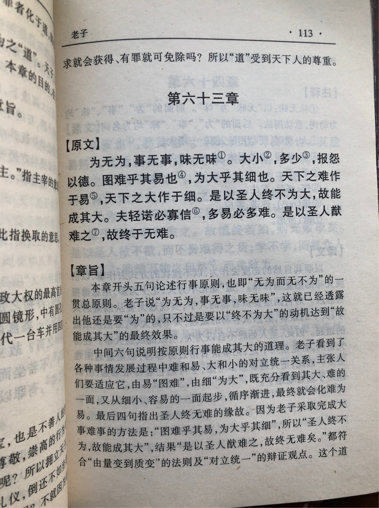
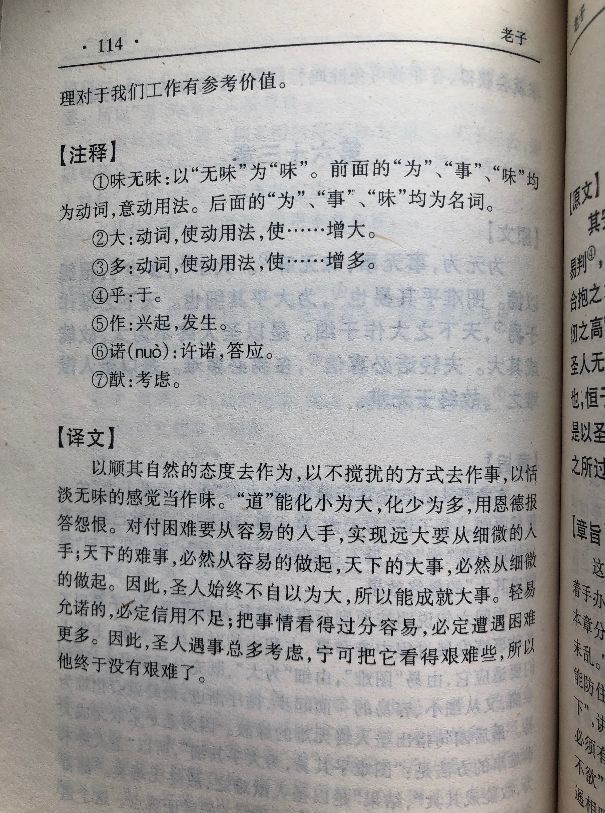

## 《道德经》第六十三章通行本原文：

    为无为，事无事，味无味。
    
    大小多少，报怨以德。
    
    图难于其易，为大于其细。
    
    天下难事，必作于易；天下大事，必作于细。
    
    是以圣人终不为大，故能成其大。
    
    夫轻诺必寡信，多易必多难。
    
    是以圣人犹难之，故终无难矣。
            
## 译文：
 
    以无为去有为，以无事去做事，以无味当有味。
    
    以小为大，以少为多，面对怨恨当以“德”对待。
    
    解决难事从容易处开始，处理大事从细微处着手。
    
    天下的难事，一定要从容易处着手；天下的大事，一定要从细微处开始。
    
    所以，圣人始终不自以为大，反而能成其大。
    
    轻易许诺的，必然难以守信；太过容易的，必然会面临很多困难。
    
    因此，圣人会把问题当困难来处理，认真对待，所以就不会有困难了。

## 逐句解释：

### 为无为，事无事，味无味。
为：动词，做。无为：清静无为。
以无为的态度去有所作为，以不干预的方式去做事，以恬淡无味当作有味。老子的思想一贯发人深省，这里是以“无”的态度去做“有”的事。

### 大小多少，报怨以德。
以小为大，以少为多。也有解释为大来源于小，多来自于少。还有一说是，去其大，取其小，去其多，取其少。这些虽然个别有差异，但总体意思差不多。报怨以德，即以恩德对待怨恨。这句有人认为当移至七十九章“必有余怨”句后。这里似乎念不通，但其实放这里也说得通，以少为多，以德报怨，吃亏是福。

### 图难于其易，为大于其细。
想要解决难题就需要从容易开始，想要做大做强就要从细处着手。

### 天下难事，必作于易；天下大事，必作于细。
天下的难事，必定从容易处开始做起；天下的大事，必定从细微处开始着手。这是千古名言，但凡有点阅历一看就明白。人生太多的难事大事，纷繁复杂，艰巨无比，只有从点滴做起，从细微着手，亦步亦趋，才能解决困难，办成大事。

### 是以圣人终不为大，故能成其大。
圣人：有道的领导者。不为大：不自以为大。
所以有道的领导者始终保持低调简朴，不自以为大，反而能成就伟业，干出一番事业来。

### 夫轻诺必寡信，多易必多难。
轻易许下诺言的必定缺乏信用，非常容易达成的必定困难重重。一个人轻易许诺，他的许诺一文不值。一件事看起来太容易，那它真正的困难还没有来到。事物往往就是这样，表面和实质有着很大差距。

### 是以圣人犹难之，故终无难矣。
所以有道的统治者，总是能看到问题背后的困难，始终保持如履薄冰，严阵以待的态度，因此就没有什么困难。

## 心得总结：
本章老子主要讲解“无为”的方法论。老子前面反复提到过“无为”并非什么也不作为，而是悄无声息，润物无声的作为，是一种少干预而实际上有大有作用的有为。本章就是告诉我们如何来达成这种“无为”。

“为无为，事无事，味无味。”首先要在思想层面要树立“无为”的理念，领导者保持清心寡欲，大公无私，遵循自然；其次，在具体操作层面上，对待实际的事情要少干预，少花里胡哨，少使用投机取巧的手段，而是采用光明正大，实事求是方式；再次，对于味，也就是体会和感知，应采取是恬淡无味的态度，保持质朴纯真，不要去追求什么奢靡华丽、铺张浪费。总之“恬淡为上，胜而不美。”
 
“大小多少，报怨以德。图难于其易，为大于其细。”要做大就要从小处开始，要做多得从少开始积累，而要解决难题需要从容易时就进行，要想做强做大，则需要从细微处着手。老子的哲学是一种和谐发展观，它希望万事万物都能和谐融洽相处。老子知道这个世界充满了矛盾与斗争，而化解矛盾的有效方式就是把事物激烈的对抗变为和谐共存。因此老子告诉我们要在事物萌芽状态时就做好应对策略，防微杜渐；在问题还没有变得更复杂和困难时就着手解决，避免问题扩大而一发不可收拾。这也是中医里面“治未病”的策略。古代中医将疾病分为“未病”､“欲病”､“已病”三个层次，而认为“上医医未病，中医医欲病，下医医已病”。老子的思想就是“治未病”。

“报怨以德”就是以恩德的态度来对待他人的怨恨，这里与儒家的“以直报怨”不太一样。孔子认为人待我以德，我以德报之，如果别人以怨待我，那我按照公平公正原则，直接怼回去。这两种无法区分孰高孰低，都是合理的态度。具体应用要看场合，以及实施的对象。比如普通人之间如果别人无故怨恨你，你可以怼回去；如果是底层百姓或者穷人怨恨你，你则可以采取谅解宽容的态度；如果是小人怨恨你，其实还可以采取置之不理的态度，随他去吧。老子的话是针对统治者讲的，因此要“以德报怨”，即“人之不善，何弃之有？”，这是天之道。领导者对待平民百姓的怨恨，要想想深层次的为什么，而不是采取同样的态度去对抗。孔子的话针对的普通百姓，别人无故怨恨你，你当然可以照样怼回去了，公平公正才能保证社会有序往来，这是人之道。至于小人怨恨你，而你又想做一个正人君子，那就远远躲避着点吧，这可以叫做“以避报怨”。
 

“天下难事，必作于易；天下大事，必作于细。”这是千古名言，对于人颇有教育意义。我们做事情一定要从小处开始，从细处着手，扎实稳打，步步为营。好大喜功，好高骛远，纸上谈兵，最后只会换得鸡飞蛋打，一塌糊涂。“是以圣人终不为大，故能成其大，夫轻诺必寡信，多易必多难。”圣人不自以为大，从细微处着手，反而能成就一番事业。在老子看来，轻易的允诺是不足信的，说话假大空的，不能当真，因为根本达不成。而把事情看得太容易了，一定会遭受到更多的困难。所以，有道的领导总是把问题搞得很清楚，能看到事情背后的艰难，最后反而没困难了。

以小为大，以少为多，图难于易，为大于细，这是一种处事哲学。无论领导者还是平民百姓，认真体会和踏实践行都能有所收获。从小处开始，从细处着手，防微杜渐，循序渐进，扎实稳打，步步为营。不去干扰破坏，而是顺其自然，无声胜有声。这就是达成“无为”的具体实践方法。

## 附帛书版：

[返回目录](../README.md) &nbsp; [上一章](./62.md)&nbsp; [下一章](./64.md)

