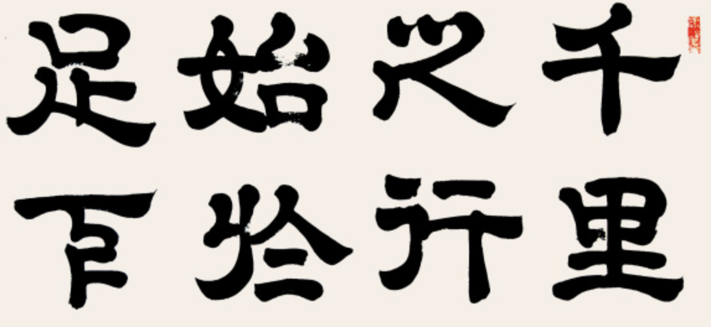
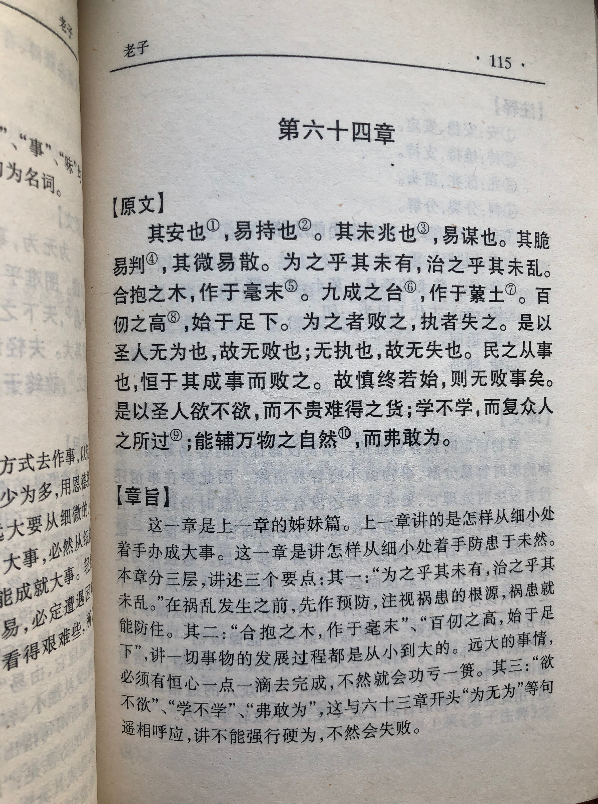
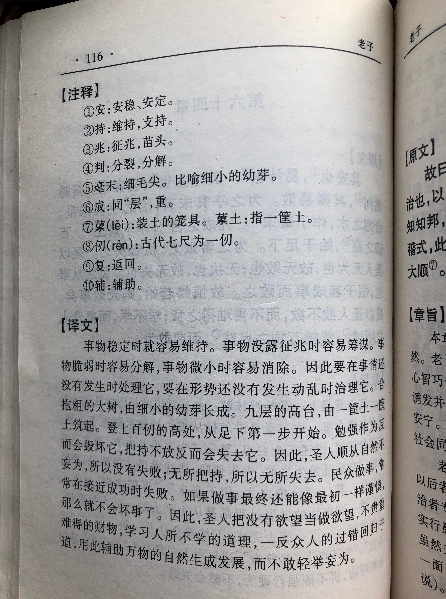

## 《道德经》第六十四章通行本原文：

    其安易持，其未兆易谋；

    其脆易泮，其微易散。

    为之于未有，治之于未乱。
    
    合抱之木，生于毫末；
    
    九层之台，起于垒土；
    
    千里之行，始于足下。
    
    为者败之，执者失之。
    
    是以圣人无为故无败，无执故无失。
    
    民之从事，常于几成而败之。
    
    慎终如始，则无败事。
    
    是以圣人欲不欲，不贵难得之货；
    
    学不学，复众人之所过。
    
    以辅万物之自然而不敢为。
            
## 译文：
 
    天下安定就容易维持，在未出现混乱征兆时容易谋划；
    
    事物脆弱时容易消解；事物细微时容易散失；
    
    做事情要在它尚未发生以前就处理妥当；
    
    治理天下要在祸乱没有产生以前就进行。
    
    合抱的大树，生长于细小的萌芽；
    
    九层的高台，垒砌于一层层泥土；
    
    千里的远行，起始于脚下的步伐。
    
    过度作为将会招致失败，过于执着将会导致过失。
    
    因此圣人采取“无为”就不会招致失败，不过于执着就不会犯下过错。
    
    人们做事情，往往在接近成功的时候却失败了。
    
    如果做事情直到结束都能像开始那样慎重，就没有办不成的事情。
    
    因此，有道的领导者以无欲当做欲望，不去珍贵难以得到的货物；
    
    把不学当做学习方向，复盘和弥补众人所犯的过错。
    
    这样遵循万物的自然本性而不去妄加干预。

## 逐句解释：

### 其安易持，其未兆易谋；
安：安定、安稳。
事物或政局安稳就容易维持，在动荡的兆头来临之前做准备，就容易谋划对策。

### 其脆易泮，其微易散。
泮：散，解。微：细小。
事物脆弱时容易消解；事物细微时容易散失。稳定团结，凝聚在一起就会强大；动荡分散，各自为战就会脆弱。

### 为之于未有，治之于未乱。
为：作为，做事。未有：没有发生。治：治理。
事情（危险）要在它尚未形成之前就处理妥当，治理天下要在祸乱尚未产生之前就进行。中医之“治未病”也是这个意思，当已经生病了，或事态严重了，再来处理就会为时已晚。

### 合抱之木，生于毫末；
合抱：几人合起手抱，形容树木很大。毫末：细小的萌芽。
合抱的大树，生长于细小的萌芽。凡事都有个由小到大，由微到明的过程。

### 九层之台，起于垒土；
垒土：堆砌泥土。
九层的高台，垒砌于一层层泥土。高楼大厦都是经过搭地基，然后层层堆叠，片砖片瓦地建立起来的，事物的发展有个客观过程。

### 千里之行，始于足下。
千里的远行，起始于脚下的步子。做事情要有起始，且贵在坚持。不迈开第一步，不坚持到底，那么就永远也无法到达目的地。

为者败之，执者失之。
为：作为、有为。为者败之，执者失之：二十九章出现过，有的说是错抄于此，但帛书本也有。
对于统治者而言用强力去治理天下，会败坏天下；用强力执掌天下，会失去天下。对普通人来讲，做事情干预过度了将会招致失败，过于执着将会导致犯下过错。

### 是以圣人无为故无败，无执故无失。
此句二十九章也出现过，此处重复提及。
因此圣人(有道的统治者)采取“无为而治”就不会招致失败，不过于执着就不会犯下过错。总之来讲，要顺其自然，返璞归真。

### 民之从事，常于几成而败之。
人们做事情，往往是接近成功的时候却失败了。这都是因为人们缺乏坚持，一开始充满干劲，后来渐渐就放松，丢失了目标。所谓功亏一篑也是这个意思。

### 慎终如始，则无败事。
如果做事情直到最后一刻都能像开始那样慎重，饱含激情，就没有办不成的事情。人们对于工作学习无不如此，很多时候都是一开始的热情，然后渐渐冷却，最后不了了之。大家学英语背单词或者练习书法应该深有感悟，英语和书法并不难，但是贵在持之以恒，如果不能坚持到底，那么最后还是学不好。

### 是以圣人欲不欲，不贵难得之货；
欲：想要。不欲：无欲，无私欲。贵：珍贵，贵重。
因此，有道的领导者的追求是无欲，以无欲当欲望，不去珍贵难以得到的货物。领导者应当去掉私欲，普通人也应当减少过度的欲望，保持简单朴素。对于奇珍异宝，不去过分珍贵，不去激发人们的欲望和贪婪。

### 学不学，复众人之所过。
学：这里指办事有错的教训。复：复盘，返回，也有补救的意思。
把不学当做学习方向，复盘和弥补众人所犯的过错。不学是学习的更高境界，以不学作为学习方向，这个似乎不合道理。但其实也很好理解，跟把无欲当做欲望一样。不学不是说真的一点儿不学习了，而是不要去死记硬背地学习，那种学习会使得人头脑僵化，失去灵活思考。学习是有价值的，但也会产生无形的桎梏，让自己深陷书本的牢笼里。老子就是告诫我们，学习应当跳出思维的牢笼，以不学的态度去学习，从而融会贯通，彻底领悟“道”的精髓。“复众人之所过”解释有很多种，有说补救众人之过失，有说避免重蹈覆辙，有说重复走众人的路。都有道理，但都不是十分确切。我以为这里是对“不学”的解释，是说要从更高的角度复盘众人的经过，返回到本原来看问题，不只是表面地学习，而是从根本上融会贯通，深入理解众人所犯过错误的根本原因。

### 以辅万物之自然而不敢为。
这样遵循万物的自然本性而不去妄加干预。

## 心得总结：
本章延续上一章继续分析如何实施“无为”。老子的“无为”并非空话，不是无所作为，而是一种可以具体实施的更高级的“有为”。上一章已经提到了“无为”具体的实施策略，如“图难于其易，为大于其细。”、“大小多少，报怨以德”等，本章继续阐述具体如何来做。

首先，老子指出“其安易持，其未兆易谋；其脆易泮，其微易散。”这是说安稳易于维持，混乱出现征兆前易于谋划，脆弱的容易消解，细微的容易分散。这就是告诉我们应该保持事物的稳定性和完整性。针对危险提前做好规划和对策是比较容易的，不要等到事物变得脆弱和涣散时再来处理，那时候会变得复杂和棘手。这与中医里面的“治未病”思想是相同的，要防患于未然。

其次，老子给出了深刻的哲学思想：为之于未有，治之于未乱。这是本章的核心，也是老子“无为”策略里面的核心观点。为什么要这么做，老子说的也很清楚。“合抱之木，生于毫末；九层之台，起于垒土；千里之行，始于足下。”事物都来自点滴的积累，有一个完善的过程，不是一蹴而就的。因此要解决根本问题，就需要在问题没发生前做好准备，让问题不去发生，或者问题刚刚萌芽就进行治理。同时，把事情做成功还需要持之以恒和坚持不懈，因为事物是个不断完善的持续过程。只有坚定决心，保持耐心，才能把事情真正做好，最终达成目标。

再次，老子指出人们做事情常常在快要成功时放弃了，所谓“民之从事，常于几成而败之。”老子告诉我们做事情应该“慎终如始”，那样就没有什么做不成功的。这是一句千古名言，道理很好懂，只是有多少人能够真的做到呢？现在领导们常常提及的“不忘初心，永葆激情”说的也都是这个意思。我们做事情如果不能坚持到底，在快要成功的最后一刻放弃了，这实在是很可惜啊。所以，要想达成“无为”，就要做到慎终如始，坚持到底，永不放弃。

最后，老子还提出了要保持清心寡欲，追本溯源，从根本上解决问题。“是以圣人欲不欲，不贵难得之货”这个意思是说，领导者应该以无欲为自己的欲望，也就是保持清心寡欲，不以奇珍异宝挑起人性的贪婪，这是对前面章节“清静无为天下正”的再次强调。“学不学，复众人之所过。”这句话理解起来有点困难，各种解释版本繁多。我的理解是以不学为学，即避免限于书本和知识的桎梏，人是活着的动物，应该保持灵活应变。人们学习应当跳出思维的牢笼，不需要刻板教条地学习，而应该结合实践融会贯通，最终彻底领悟“道”的精髓。“复众人之所过”则是说要从”道“的角度去复盘众人所犯的过错，返璞归真，返本溯源，搞懂真正的过错和应对方法，从本质上来解决问题。

“是以圣人无为故无败，无执故无失。”老子主张“无为”、“无执”，实际上是让人们依照自然规律办事，树立必胜的信念和决心，并且持之以恒地一点一滴去达成目标，避免前功尽弃、功亏一篑的结局。从以上种种具体方法和策略可以看出，老子的“无为”并不是空洞的口号，也不是让人无欲无求，了却生死，“无为”是一种从根本上思考和解决问题的“有为”，也是一种充满智慧的积极进取。

## 附帛书版：

[返回目录](../README.md) &nbsp; [上一章](./63.md)&nbsp; [下一章](./65.md)

