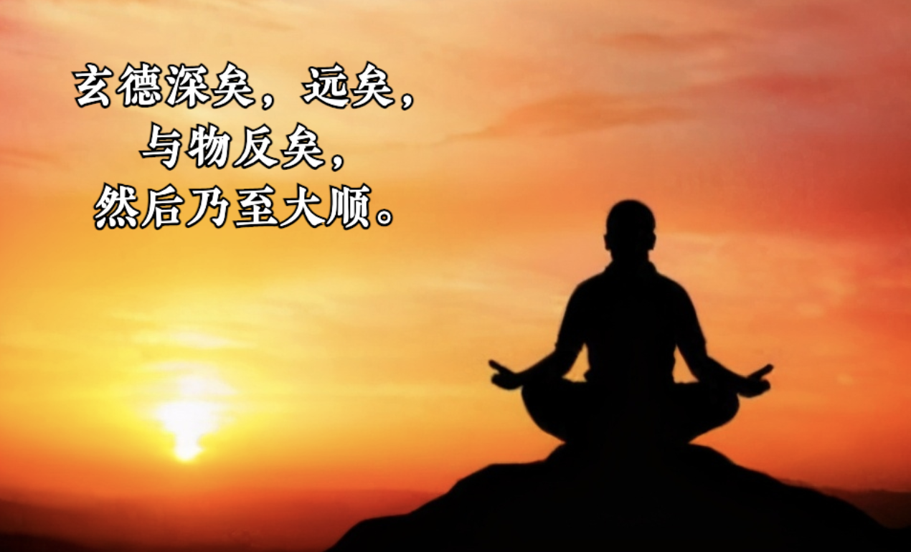
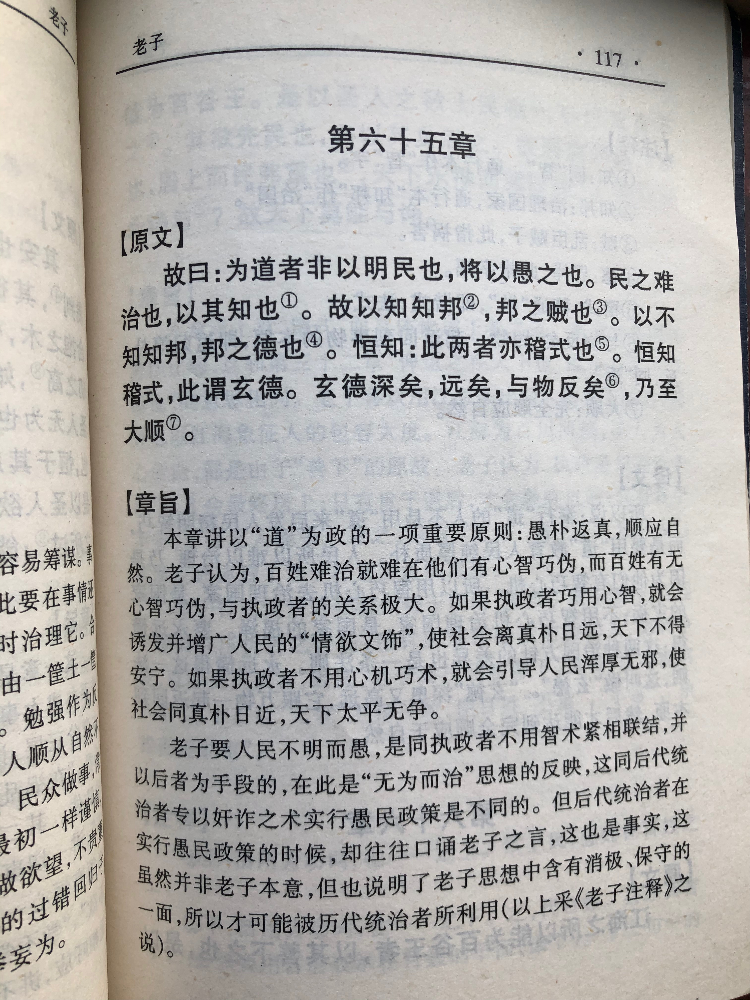
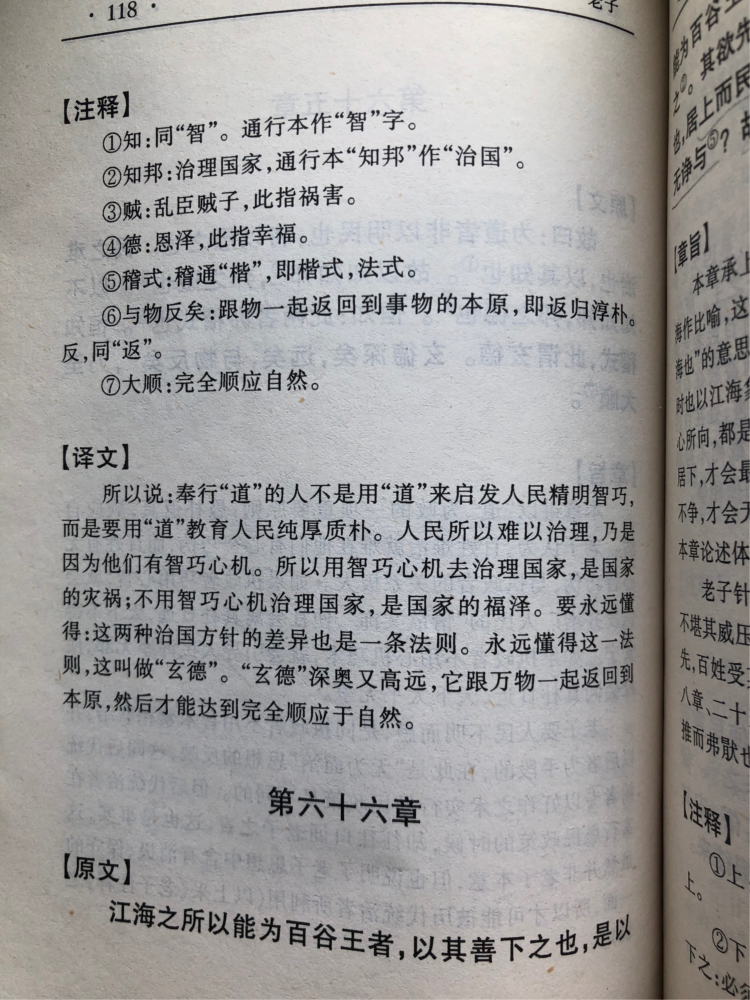

## 《道德经》第六十五章通行本原文：

    古之善为道者，非以明民，将以愚之。
    
    民之难治，以其智多。
    
    故以智治国，国之贼；
    
    不以智治国，国之福。
    
    知此两者，亦稽式。
    
    常知稽式，是谓玄德。
    
    玄德深矣，远矣，与物反矣，然后乃至大顺。
            
## 译文：
 
    古代善于为道的人，不是教导人们以聪明智巧，而是告诫人们质朴纯真。
    
    人们之所以难以统治，是因为他们使用了太多的智巧心机。
    
    所以用智巧心机来治理国家，是国家的危害；
    
    不用智巧心机来治理国家，才是国家的幸福。
    
    知道这两种治国方式的区别，也是一个法则，长久懂得运用这个法则的，就叫做玄德。
    
    玄德深不可测，远不可及，和万物一起复归于“道”，然后万物都顺应自然，天下大治。

## 逐句解释：

### 古之善为道者，非以明民，将以愚之。
明民：明白智巧，意为让人民懂得巧诈。愚，敦厚、质朴，没有智巧。
古代善于为道（治理国家）的人，不是教导人们聪明巧诈，而是教导人们敦厚朴实。

### 民之难治，以其智多。
智多：智巧、奸诈，不是善良质朴的智慧。
百姓之所以难以治理，是因为人们有很多智巧心机。

### 故以智治国，国之贼；
贼：贼臣，国之祸害。
所以用智巧心机来治理国家，是国家的祸害；

### 不以智治国，国之福。
不用智巧心机来治理国家，才是国家的幸福。无论治国还是管理，老子依然强调的是质朴善良，走光明正道，少玩那些投机取巧，智谋诡诈的东西。

### 知此两者，亦稽式。
稽式：法式、法则，一本作“楷式”。
知道这两种治国方式的区别，也是一个法则，如果懂得两者的差异，掌握了治国之道，就是后世的楷模。

### 常知稽式，是谓玄德。
能常常懂得这个法则，保持楷模行为的，就是玄德。

### 玄德深矣，远矣，与物反矣，然后乃至大顺。
与物反矣：反，通返，复归的意思。大顺：自然。
玄德是至高的德，深不可测，远不可及，和万物一起复归于道的真朴，然后万物都顺其自然，社会和谐，天下大治。

## 心得总结：
本章老子继续强调“无为”思想，提出了以道治国而不以智治国的主张。指出凡事都有两面性，智也一样，有巧诈的智，也有纯朴的智。老子强调的人们应该保持正直、纯朴、善良的智，而不是诡诈、技巧、小聪明的智。如果统治者没有以“德”为基础而用智，那么就会成为天下的祸害，如果百姓没有纯朴善良的用智，那么社会将混乱不堪，人人都都过得不幸福。
 
“古之善为道者，非以明民，将以愚之。”在老子看来，民众之所以难治，就是因为统治者没有遵循于“道”造成的，那么统治者应该怎样治理百姓呢？应该让民心纯真质朴，去掉智巧心机，这样民众就不会惹是生非，为非作歹了，当人人都善良纯朴时，社会就一片和谐，天下自然大治。然而无论是领导者还是普通人，人们都希望做一个聪明智巧之人，总是希望通过某些伎俩或邪门歪道来获取他人所不能拥有的财富和地位。老子则认为人不能从自己的利益出发，想着把个人利益最大化。让自己的利益最大化就是与公众或他人利益的对抗起来，这种做法是不符合“道”的。

老子提出的方案就是要解决这种对抗与冲突，从根本上化解人和社会、人和人、以及人性本身具有的矛盾。那么，怎样才能解决这个矛盾呢？在老子看来，世界背后是有一个亘古不变的规律在运行着，它气息微弱，绵绵不绝，它就是“道”，它支配着万事万物的运行。只有遵循这个规律，符合道法自然就能化解矛盾，从根本上打造一个美好社会，使得人人和谐共处，大家都能过得幸福。
 
“民之难治，以其智多。”民众之所以难以治理，是因为人们使用的智谋技巧多了，人性变得自私贪婪，就会通过各种智谋来获取利益。人们的这种“智”与真正的“智慧”也不同，这种“智”会导致人们相互冲突和斗争，使得天下大乱。因此，老子强调人们应该保持质朴纯真，去掉贪欲杂念。“故以智治国，国之贼；不以智治国，国之福。"这里的“贼”指的是使得天下大乱的灾祸，如果领导者以智巧心机来治国，那就会导致上行下效，人人都为了一己私利而你争我夺，就会使得天下大乱。“知此两者，亦稽式。常知稽式，是谓玄德。”以智治国和不以智治国之间的差异也是一种法则，真的懂得此道且能一以贯之的那就是后世之楷模。

“玄德深矣，远矣，与物反矣，然后乃至大顺。”“德”是“道”作用在万物上的体现，也是万物之禀赋和本性，是“道”在外的展现形式。玄德则是至深至远的“德”，它高深莫测，非比寻常。那它究竟指的是什么呢？可以理解为人之初，最质朴、最纯真的那种状态和行为，也就是纯真质朴得没有任何杂质。“德”也是无形无象的，它与事物紧密相连，体现在万事万物的运行中。“与物反矣”意思是万物伴随着“德”不断运行，最后“德”与万物依然要返归于本原，即“道”的真朴。当万物遵守于“道”，体现了“德”，再复归于“道”，如此循环反复，那么就会天下大顺，万物和谐自然。
 
在纷繁复杂的世界中，人们争权夺利，天下混乱不堪。老子早就洞悉了这一切，于是告诫人们无论工作、学习、生活都应该保持纯真质朴，遵循大道，体现德行，只有这样才能实现人生的意义，人们才能和谐共处。如果社会上人人都使用智巧，满怀心机，耍弄手段，那谁能过得好呢？“绝圣弃智、绝仁弃义”，老子说得不无道理。当然，我们要理解老子当时的社会环境，以及提出观点时的语境，不要把现在常说的智慧与他提出的那种智巧混为一谈。老子的这个道理，简单讲就是要真诚不要虚伪，要无私不要自私，否则人人都累。

当然老子主要还是面向领导者来讲的治国道理，因此对于领导人来讲，更应该懂得依循自然，秉持德行，以道治国，努力做到玄德。这样就会使得人心归顺，社会和谐，天下大治。

## 附帛书版：

[返回目录](../README.md) &nbsp; [上一章](./64.md)&nbsp; [下一章](./66.md)

