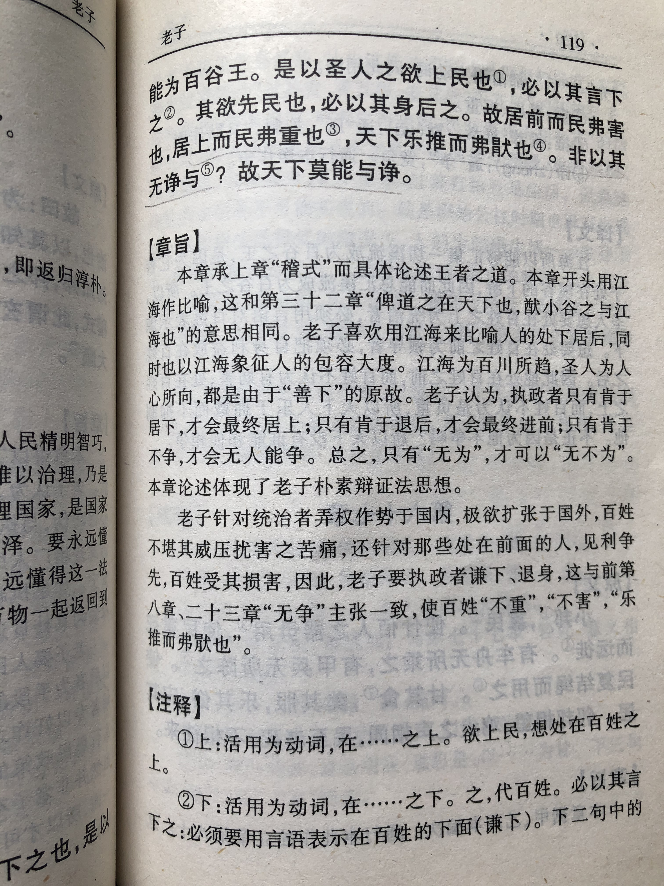

## 《道德经》第六十六章通行本原文：

    江海所以能为百谷王者，以其善下之，故能为百谷王。
    
    是以圣人欲上民，以其言下之；欲先民，以其身后之。
    
    是以处上而民不重，处前而民不害。
    
    是以天下乐推而不厌。
    
    以其不争，故天下莫能与之争。
            
## 译文：
 
    江海之所以能为百川汇聚的地方，是因为它善于居下，所以能成为百川之王。
    
    因此，领导者要管理百姓，就要在言行上对百姓表示谦下；
    
    要领导百姓，就要把自己的利益放在百姓之后。
    
    因此领导虽然居于百姓之上，但百姓却并不感到压迫；虽然他身处百姓之前，但百姓却并不觉得妨害。
    
    因此天下的百姓都乐意推举和拥戴而不会厌弃。
    
    因为他不与人相争，所以天下没有人能和他相争。

## 逐句解释：

### 江海所以能为百谷王者，以其善下之，故能为百谷王。
百谷：川谷溪流。
江海之所以能成为百川汇聚的地方，是因为它善于居下，所以能成为百川之王。人往高处走，水往低处流。人如果能学得水的秉性，善于居下，那么也能聚集人们的力量。

### 是以圣人欲上民，以其言下之；欲先民，以其身后之。
上民：百姓之上，管理人们的意思。先民：在人们之前，意为领导。
因此，领导者要管理百姓，就要在言行上对百姓表示谦下；要领导百姓，就要把自己的利益放在百姓之后。所谓先天下之忧而忧，后天下之乐而乐。领导者如果能做到这点，那百姓就会乐于跟从了。

### 是以处上而民不重，处前而民不害。
不重：不堪重负。不害：无害。
因此领导虽然地位居于百姓之上，但百姓却并不感到压迫；虽然他身处百姓之前，但百姓却并不觉得妨害。这样领导与百姓就是鱼与水的关系，和谐融洽。

### 是以天下乐推而不厌。
乐推：乐于推举。
因此天下的百姓都乐意推举和拥戴而不会厌弃。这样的领导人们会爱戴，群众的眼睛是雪亮的。

### 以其不争，故天下莫能与之争。
因为他不与人相争，所以天下没有人能和他相争。

## 心得总结：
本章主要讲的是领导者与百姓的关系。前面章节详细讲解了无为的具体策略和方法论。本章就梳理了领导者与百姓之间该如何相处的问题。

“江海之所以能为百谷王者，以其善下之，故能为百谷王。”在古代，“王”是最高的统治者，也是一个精神概念。指的是天、地、人乃至万物之间交汇融合，和谐统一的最高状态。作为最高统治者的王，是能够遵循自然，使得天、地、人和谐统一的人。这样的人也被称为拥有天德、地德和人德，老子这里用江海来比喻之。而江海之所以是百川之王，是因为它善于居下，百川都愿意流向它。
 
“是以圣人欲上民，必以言下之；欲先民，必以身后之。”老子把统治者比作江海，说圣贤的统治者之所以能够安抚万民，主要是因为他们没有私欲，把个人利益放在身后，对待民众就像江海对待百川一样谦和卑下，所以才能得到民众的尊敬和拥护。古时候阶级分明，各诸侯之王莫不高高在上，并不会关注黎民百姓生死，更别说对他们保持谦卑低下了。而老子关注民众的苦难，一针见血地指出领导者只有善居其下才能引领和管理民众。

“是以天下乐推而不厌。“这样的领导会受到人们的推举和拥戴。群众的眼睛是雪亮的，领导一心为民，民众就会归附。这些道理运用在企业管理以及为人处世上其实也是一样的。简单地说就是你对人们好，人们自然会推举你，所谓将心比心也。
 
”以其不争，故天下莫能与之争。”这里的不争是指不与百姓争夺利益，不是任何事情都不争取，保持佛系。做事情还是需要积极努力的，比如争取时间，争取创新，争取效率等，但这个争取是为了公众的利益，而不是个人的利益。当领导者能够抛弃私利，一心为民的时候，那么天下人心归顺，就没有人能够与之争夺了。

老子一直在为统治阶级规划一个理想国度。这个国度里统治者虽然高高在上统治着百姓，但因为清心寡欲，保持谦卑低下，老百姓感觉不到压迫；统治者抛却个人私欲，一心为民，因此民众并不感到有妨害。老子提出的实际是一个天人合一，和谐有序的理想社会。要想达到这种境界，需要有道的君王实行无为之治，同时也需要人们学习和遵循于“道”。

也有人批评老子是在替统治阶级着想，想着如何去笼络人心，如何保持自己的统治地位，进一步巩固阶级利益。这个说法并非错误，但我觉得这个批评并不恰当。当人类社会的阶级矛盾还没有消除的情况下，我们应该想办法调和阶级矛盾，找到一条彼此和谐共存的路。而老子就是通过深入的实际观察和深邃的思想，总结提炼了一套有效的治国策略和管理方法，这些都值得我们不断学习和借鉴。当然，不同时代、不同背景、不同特点的社会下自然会产生不同的观念和思想，我们也不必将老子的思想奉为金科玉律。我们只需保持宽广的胸襟，从古人的智慧中汲取到一些营养，结合实际情况加以运用就好。

## 附帛书版：

[返回目录](../README.md) &nbsp; [上一章](./65.md)&nbsp; [下一章](./67.md)

