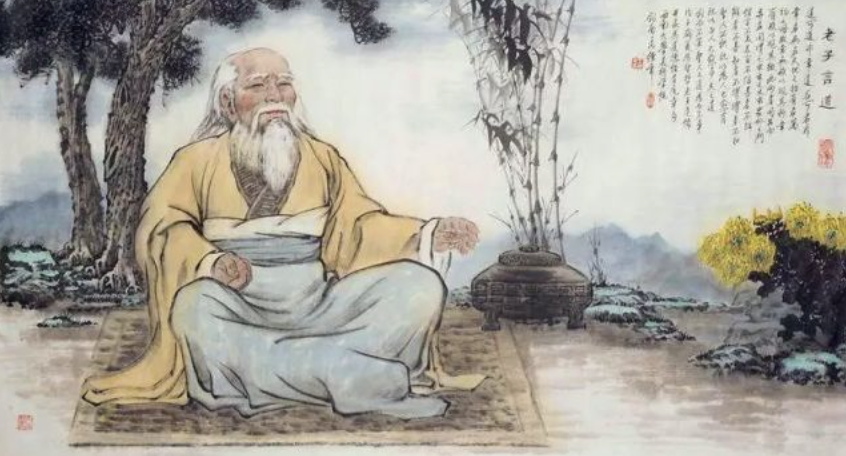
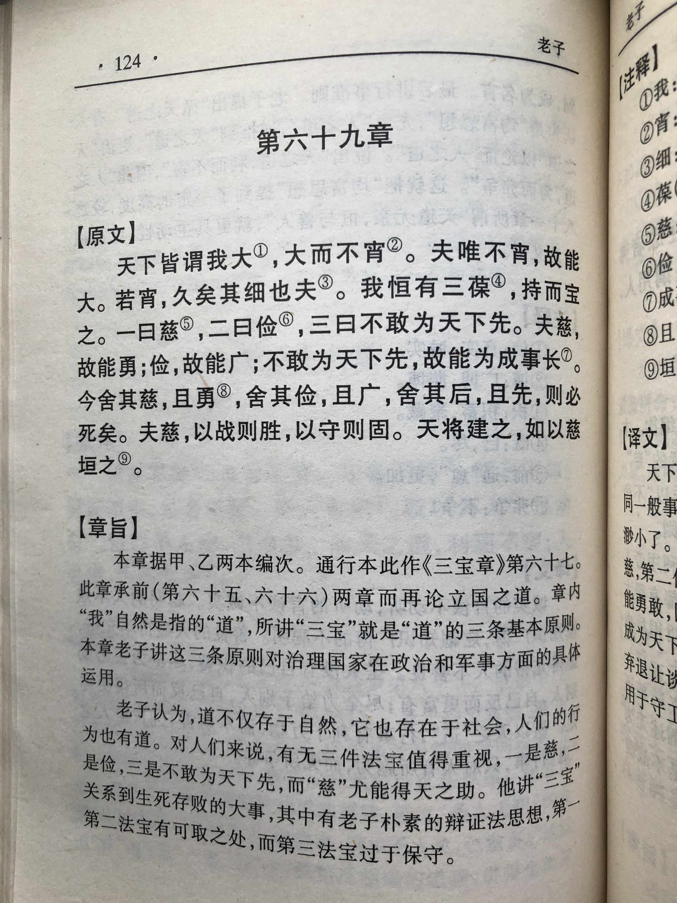
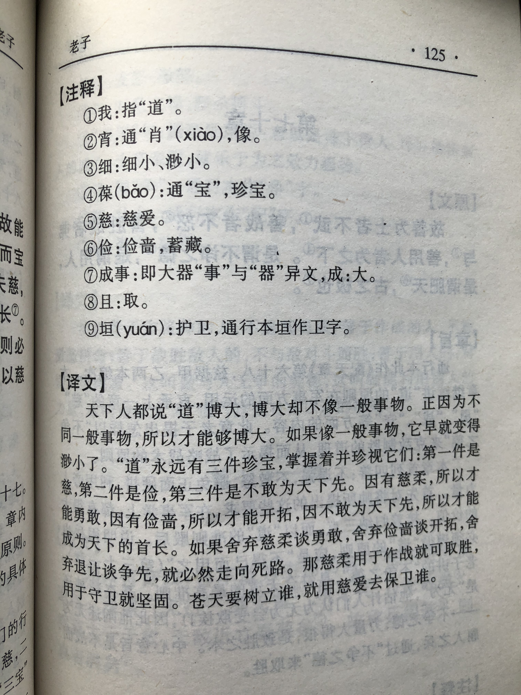

## 《道德经》第六十七章通行本原文：

    天下皆谓我道大，似不肖。
    
    夫唯大，故似不肖。
    
    若肖，久矣其细也夫！
    
    我有三宝，持而保之：
    
    一曰慈；二曰俭；三曰不敢为天下先。
    
    慈，故能勇；俭，故能广；不敢为天下先，故能成器长。
    
    今舍其慈，且勇；舍其俭，且广；舍其后，且先，死矣。
    
    夫慈，以战则胜，以守则固。
    
    天将救之，以慈卫之。
            
## 译文：
 
    天下人认为“道”很宽泛，不像具体的事物。
    
    正因为它宽泛，所以才没有具体事物的样子。
    
    如果它像一个具体的事物，那么“道”也就变得很渺小了。
    
    我有三件法宝，持有且保全它们：
    
    第一件叫做柔慈；第二件叫做俭朴；第三件是不敢处于天下人前面。
    
    有了柔慈，所以能勇武；有了俭朴，所以能宽广；不敢为天下人之先，所以能引领万物。
    
    如今丢弃柔慈而追求勇武；丢弃俭朴而追求宽广；舍弃退让而求争先，这是走向死亡。
    
    柔慈，用来征战，就能够胜利，用来守卫就能巩固。
    
    天要援助谁，就用柔慈来保护他。

## 逐句解释：

### 天下皆谓我道大，似不肖。
我道大：道即我，我即道。“我”不是老子用作自称之词。似不肖：肖，相似之意。意为不像具体的事物。也可以理解为没有任何东西和“道”相似。
天下人认为“道”很宽泛，不像具体的事物。“道”本身宽泛博大，悄无声息，没有形状，与具体之物相去甚远，但万物都蕴含着“道”。

### 夫唯大，故似不肖。
正因为它宽泛，所以才没有具体事物的样子。“道”不是具象的事物，也不只是一种抽象的概念，而的的确确是某个宽泛的客观存在，只是无法名状而已。

### 若肖，久矣其细也夫！
若肖：如果很像。
如果它像一个具体的事物，那么“道”也就变得很渺小了。“道”无形无声，不可触摸，但万物有“德，处处体现着“道”，所以“道”很博大宽泛。

### 我有三宝，持而保之：
三宝：三件法宝，或三条原则。
我有三件法宝，持有且保全它们：

### 一曰慈；二曰俭；三曰不敢为天下先。
慈：慈悲、慈爱、柔慈。俭：简朴，节约，不浪费。
第一件叫做柔慈；第二件叫做俭朴；第三件是不敢处于天下人前面。

### 慈，故能勇；俭，故能广；不敢为天下先，故能成器长。
有了柔慈，所以能勇武；有了俭朴，所以能宽广；不敢为天下人之先，所以能引领万物。慈是一种很大的悲悯和爱，那力量相当强大，就像父母之爱，所以具备了慈的人，无所畏惧。俭朴是一种美德，自然资源有限，即使再富有也不应该铺张浪费，只有勤俭节约才能有所积攒，节俭也是一种欲求克制，从而内心淡泊宽广。争先是指为了个人利益而争夺，这会使得天下混乱不堪，所以圣人总甘居人后。

### 今舍其慈，且勇；舍其俭，且广；舍其后，且先，死矣。
如今丢弃柔慈而追求勇武；丢弃俭朴而追求宽广；舍弃退让而求争先，这是走向死亡。如果舍弃了这三条法宝，那就是自寻死路。这是针对领导人来讲的，治理国家首先要有慈爱之心，关怀民众；其次勤俭节约，也就是去掉私欲；再次就是不要为了利益与百姓争夺。

### 夫慈，以战则胜，以守则固。
柔慈，用来征战，就能够胜利，用来守卫就能巩固。慈的力量最强大，一旦具备了仁慈和善良之心，那将会所向披靡，无往而不胜。

### 天将救之，以慈卫之。
天要援助谁，就用柔慈来保护他。上天来救赎一个人或国家，就会使用柔慈的方式。有了慈，便是坚定信念，便能自我防卫，立于不败之地。

## 心得总结：
老子本章主要是讲遵行“道”的三个法则，即：慈、俭、不敢为天下先。前面章节老子已经反复讲了什么是“道”和“德”，以及它们的关系，也讲了实施“无为”的具体措施和方法。本章讲的是实行“无为”必须遵循三个原则。

“一曰慈；二曰俭；三曰不敢为天下先。”这三大法宝是老子对领导者的告诫，也是治理国家的原则。首先，慈，即慈爱或柔慈。这是人类最伟大的力量，也是最受上天赞美和护佑的。其次，俭朴是一个人的美德，也是去除多余欲望的提前条件。如果能保持俭朴的生活习惯，那么就不会穷奢极欲，贪婪无度。再次，不敢为天下先就是不要与人争权夺利。主要是针对普通民众而言，不要与之争利。即保持谦让卑下，把好处让给民众。这里要注意一点，“争”是个人私利与公众利益之争，不是什么也不在乎，什么也不担当。在面对困难时要敢为人先，替民众排忧解难。

“慈故能勇；俭故能广；不敢为天下先，故能成器长。”慈爱的力量可以让人们勇敢起来，变得无所畏惧。自然界的母性有时候看似软绵无力，但当孩子遭遇危险的时候，会变得异常勇敢，还会突然爆发一种强大的力量，令人惊讶。所以，有了慈，人会无所畏惧。勤俭节约，生活俭朴才能有所积攒，才能做到宁静淡泊、心胸宽广，才能长治久安。领导人如果铺张浪费、生活奢华会导致民众怨声载道，那就与“道”背离了。不敢为天下先，就是不与民争利，这样就会受到民众的拥戴从而引领百姓。

“俭”指节俭，节俭也有个限度，那就是要满足个人的生活需要。高于这个限度，或是低于这个限度，都属于不健康、不自然和不道德的生活方式。

“今舍其慈，且勇；舍其俭，且广；舍其后，且先，死矣。”这里的“慈”是作为勇敢无畏的柔慈，“俭”是作为胸怀宽广、勤俭节约的节俭。“后”指的是把自己的利益置于民众的利益之后。如果不守住三个法宝，那么就是死路一条。即如果领导者舍本逐末，丢弃这三大法宝，那就会走上绝路。

“夫慈，以战则胜，以守则固，天将救之，以慈卫之”老子所说的“慈”其实是本章的核心所在，“慈”是慈爱、柔慈的意思，本质上就是“无为”，即无为而无不为。“无为”用在任何地方都是可以的，用在战争中自然则能取胜，用于守卫则能固守。由此可知，只有做到“慈”，即做到了“无为”，才能无往而不胜，长治而久安。

## 附帛书版：

通行版六十七章为帛书版六十九章。

[返回目录](../README.md) &nbsp; [上一章](./66.md)&nbsp; [下一章](./68.md)

