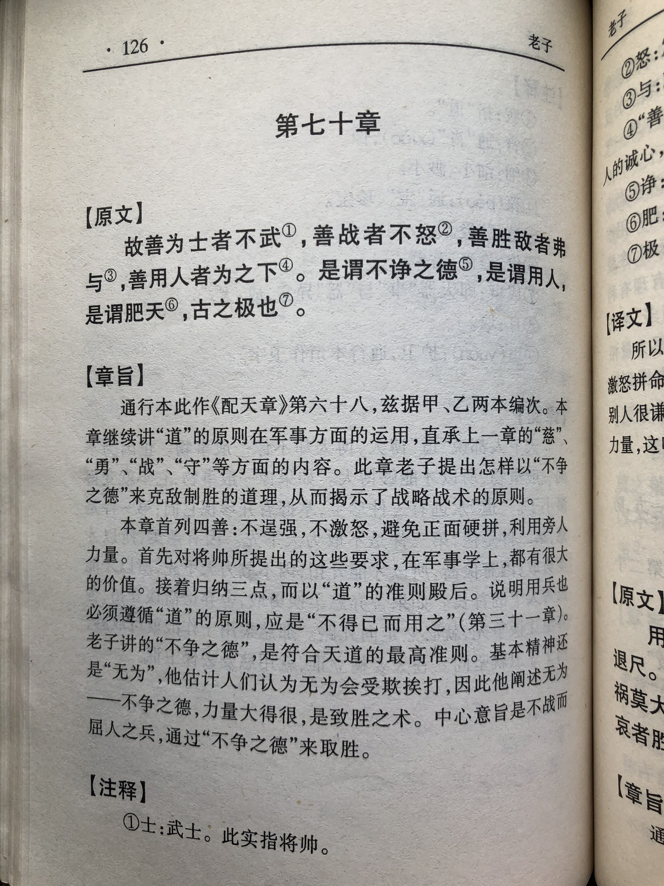
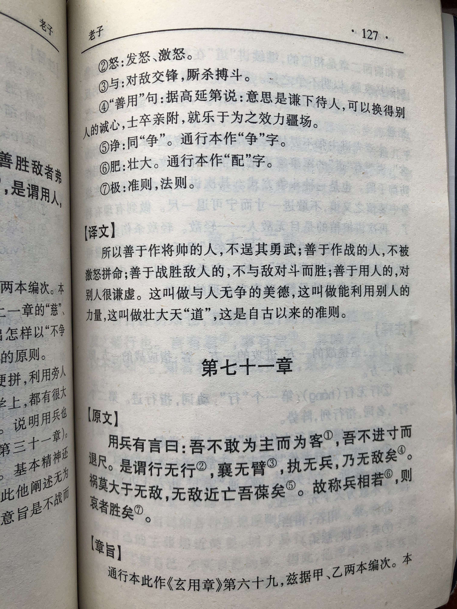

## 《道德经》第六十八章通行本原文：

    善为士者不武，
    
    善战者不怒，
    
    善胜敌者不与，
    
    善用人者为之下。
    
    是谓不争之德，是谓用人之力。
    
    是谓配天古之极。
            
## 译文：
 
    善为将帅的人并不逞其勇武，
    
    善于作战的人不被轻易激怒，
    
    善于胜敌的人不与敌人正面冲突，
    
    善于运用人才的人保持低下。
    
    这就叫做不争之德，也是用人的能力。
    
    这就是自古以来的法则。

## 逐句解释：

### 善为士者不武，
士：即武士，这里指将帅。
善于做将帅的不会以武力逞强。用兵是不得已而为之，耀武扬威不是件好事。

### 善战者不怒，
真正善于打仗的人不会轻易暴怒，而是沉着冷静，仔细分析形势，运筹帷幄。

### 善胜敌者不与，
不与：不与敌人正面冲突。古汉字“與”、“興”字形非常接近，后人在传抄时有“不与”和“不兴”两个版本。“不与”就是不与之正面冲突，“不兴”就是不急不躁，都含有沉着冷静，出奇制胜的意思，两种‬解释‬均可‬。

善于胜敌的人不会兴奋急躁，不会与敌人正面硬刚，而是审时度势，冷静分析，出其不意，克敌制胜。

### 善用人者为之下。
善于用人的人懂得保持低下，也就是保持谦和礼让。尤其对于人才，充分尊重和授权。

### 是谓不争之德，是谓用人之力。
这就是不争之德，也是善于用人的能力。不武、不怒、不兴、甘居人下是一种美德。

### 是谓配天古之极。
配天古之极：符合自然的道理。一说“古”字是衍文。
这样就是自古以来的自然法则。

## 心得总结：
本章老子又讲到了与战争有关的话题，其中告诫统帅要做到：不武、不怒、不兴、为之下。他认为统帅不应该逞其勇武，不要轻易被激怒，也不要暴躁冲动，而是要礼贤下士，懂得谦卑尊让。只有这样，才能赢得民心，最后获得胜利。

“善为士者，不武；善战者，不怒；善胜敌者，不与；善用人者，为之下。”这里的“不武”即不奉行穷兵黩武的政策，不去耀武扬威。“兵者不祥之器，不得已而用之”发动战争要基于正义，而不是去欺凌弱小。“不怒’’是指统帅遇到事情不要暴跳如雷、怒气冲天，而是要保持冷静、理性分析。善于克敌制胜的人是不会气急败坏、乱了方寸的。“不与”也就是不要避免正面冲突，不要兴奋冲动、得意忘形，打仗要有深谋远虑，要能沉得住气，要诱敌深入，然后一举歼灭之。
 
“是谓不争之德，是谓用人之力，是谓配天古之极。”善于打仗的人，并不争一时之失，也不与下属争功，而是要赢得人心，争取最后的胜利。善于用人的人，要谦和卑下，只有这样才能争取到他人的支持。要想办成大事，必须凝聚人心，依靠群众的力量。而一旦人心齐整，众志成城，那么就所向披靡，攻无不克了。

“得人心者得天下”老子把这一切看得颇为清楚。而这些思想其实都来源老子的“无为”的理念。带兵打仗如此，治国理政、管理企业何尝不是这样。不怒不狂、不争不抢、深谋远虑、谦卑低下。这些道理如果都能做到，那么做事情就会得心应手，功成事遂。

## 附帛书版：
通行版六十八章是帛书版七十章。

[返回目录](../README.md) &nbsp; [上一章](./67.md)&nbsp; [下一章](./69.md)

