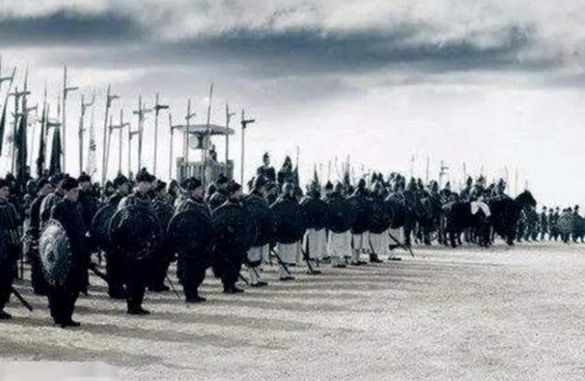
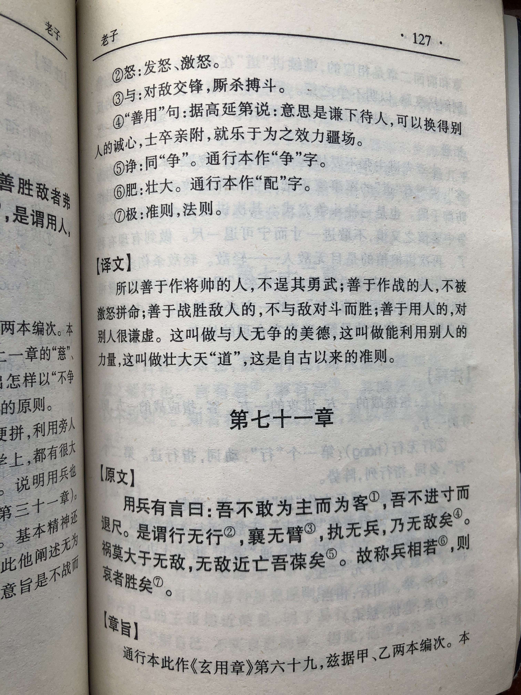
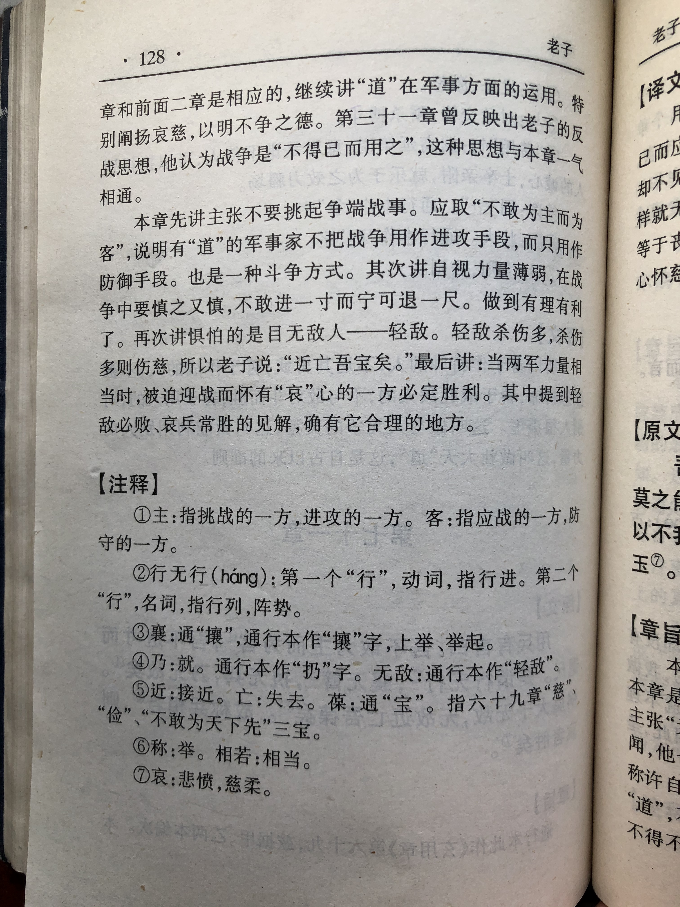

## 《道德经》第六十九章通行本原文：

    用兵有言：吾不敢为主而为客，不敢进寸而退尺。
    
    是谓行无行，攘无臂，执无兵，乃无敌。
    
    祸莫大于轻敌，轻敌几丧吾宝。
    
    故抗兵相加，哀者胜矣。
            
## 译文：
 
    用兵之道在于：我不敢主动发起战争，但是会积极应战；我不敢冒进一寸，而是宁退一尺。
    
    这就叫做行军不用阵列，奋力无需攘臂，执握不用兵器，这样就没有敌手了。
    
    祸患莫大于轻敌，轻敌就会丧失我所说的“三宝”：慈、俭、不敢为天下先。
    
    所以，两军势均力敌的时候，悲愤的一方必胜。

## 逐句解释：

### 用兵有言：吾不敢为主而为客，不敢进寸而退尺。
言：言论、主张。
善于用兵的人说过：我不敢主动发起战争，战争要基于正义，我会积极被动防御。我不会贸然进攻，而是会退守以待时机。

### 是谓行无行，攘无臂，执无兵，乃无敌。
行：军队编制，二十五人为一行。无行即无阵列。
攘：撸起袖子，激愤的意思。
执：抓握。也可以引申为威慑。
所谓行军无需阵列，奋力无需攘臂，执握不用兵刃。这样的人，兵法早烂熟于心，打仗所向披靡，没有敌手。这是旨在说明“无为胜有为”

### 祸莫大于轻敌，轻敌几丧吾宝。
祸患莫大于轻敌，轻敌就会丧失我所说的“三宝”：慈、俭、不敢为天下先。轻敌就是骄傲，自以为是，就是不合乎于“道”，就会自取灭亡。

### 故抗兵相加，哀者胜矣。
抗：对抗。也有写作“称”，相称。指势均力敌。
哀：悲恸、悲愤，也有说悲悯、慈悲。
所以，当两军势均力敌的时候，悲愤的一方必胜。打仗时充满正义、义愤填膺的一方会取得最终胜利，也就是哀兵必胜。

## 心得总结：
本章是前一章的延续，对于带兵打仗作了深入分析，将“无为”思想运用在军事上。以柔克刚，以少胜多，以弱胜强，这是老子“无为”思想的基本策略。慈、俭、不敢为天下先，是“无为”思想的三大法宝。老子认为无论治国理政，还是带兵打仗都很适用。

“吾不敢为主而为客，不敢进寸而退尺。”这里的“不敢”是不妄为、不贸然的意思。我们现今的“不敢”，是缺乏胆略和勇气的意思，与古时候并不相同。这里“不敢寸进，反而退尺”似乎不好理解，带兵打仗怎么能退避三舍呢，而是应该勇往直前啊。这里要搞清楚老子的思想体系。首先老子是反对战争的，认为战争是不祥之物，不得已而用之，因此不要轻举妄动。其次，老子认为带兵打仗要能够自我克制，避免易怒暴躁，“退后”才有利于看清形势，审时度势。再次，老子奉行的是“清静无为”思想，采取的是以退为进的策略，表面看来是退后，实际上是一种高级进攻。综上，老子对于战争不推荐主动攻击，而是采取积极防御的策略。因为主动出击乃是侵略，是非正义的，是无名之师。而防御则处于正义的一侧，士兵会因为正义而众志成城，拼死一战。

“是谓行无行，攘无臂，执无兵，乃无敌。”这里面用到了好几个“无”，体现了老子的无为思想。当统帅达到这种境界时，即对于一切了然于胸，带兵打仗就无所谓表面的形式了。什么排兵布阵、攘臂指挥、锐利武器等这些都无关紧要。古时候兵器什么也相差无几，阵势双方也都能运用。所谓兵无常势，水无常形，避实击虚，因敌制胜。老子告诉我们不必执拗于某种形式上的东西，而是应该抓住事物的本质。即师出有名，不要妄为，以退为进，以守为攻，这样就可以立于不败之地。

“祸莫大于轻敌，轻敌几丧吾宝。"这里的“轻敌”意为轻视、小看敌人，而过于自大狂妄。“宝”指克敌制胜的条件，也就是前面章节所讲的三宝：慈、俭、不敢为天下先。老子的思想是无为而无不为，看起来似乎没有准备，实际上谋划已久，预备妥当，随时可击退来犯之敌。而如果傲慢轻侮，自高自大表现轻敌，那就是自取灭亡，历史上有很多因为统帅骄傲自大最后导致失败的例子。

“故抗兵相加，哀者胜矣。”当两军对垒，势均力敌的时候，这时候被压迫的一方，也就是正义之师，往往会激发潜能，变得悲愤激昂，从而获得最终的胜利。

本章总体上仍然是之前篇章的延续，也就是在带兵打仗中体现“无为”。老子的这个思想对于后世的兵法著作也颇有影响，比如《孙子兵法》。有的学者认为老子的《道德经》不只是治国安邦之道，也是一部兵书。历史上不少将领在行军打仗时，也的确以老子的思想作为指导思想。现今社会，商场如战场，竞争异常激烈，如何保持竞争优势，如何在势均力敌的竞争中获得胜利，老子的这些思想值得我们借鉴。

## 附帛书版：
通行版第六十九对应帛书版第七十一章。

[返回目录](../README.md) &nbsp; [上一章](./68.md)&nbsp; [下一章](./70.md)

