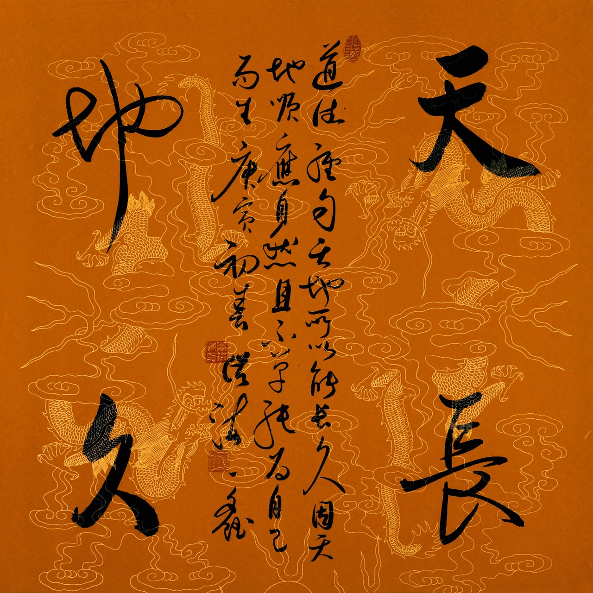
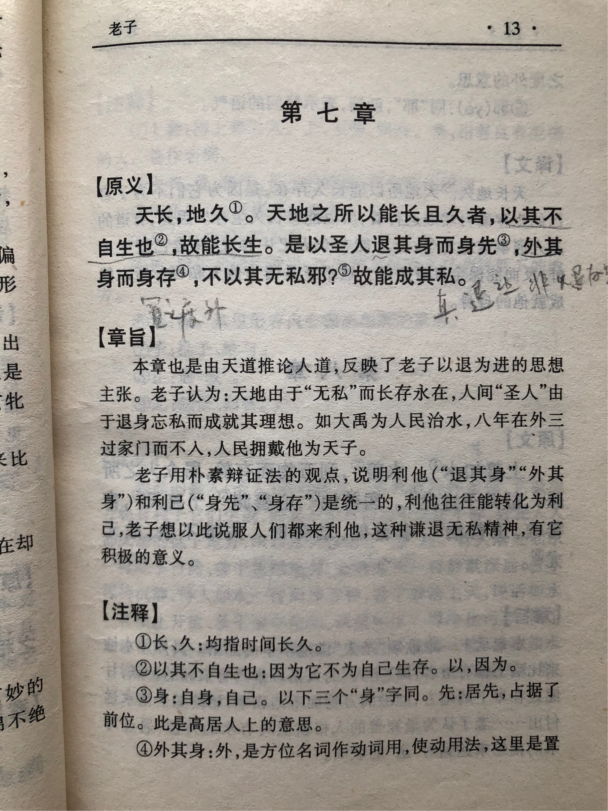
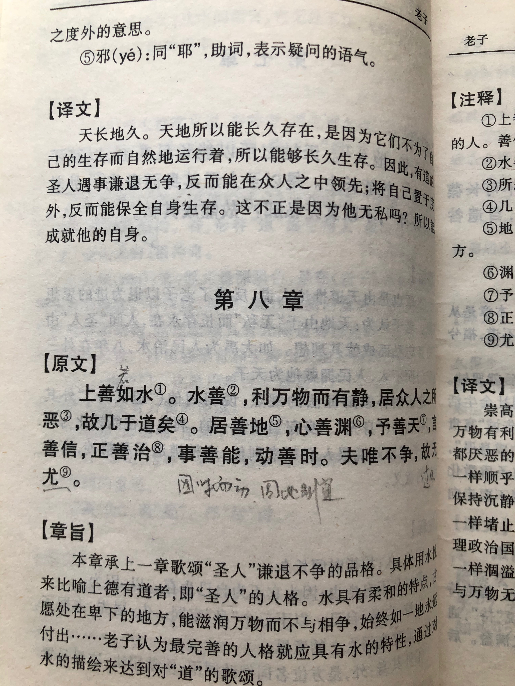

## 《道德经》第七章通行本原文：

    天长，地久。
    
    天地之所以能长且久者，以其不自生也，故能长生。
    
    是以圣人后其身而身先，外其身而身存。
    
    非以其无私邪？故能成其私。

## 译文：
 
    天长地久，天地所以能长久存在，是因为它们不为了自己的生存而自然地运行着，所以能够长久生存。
    
    因此，有道的统治者能够保持谦让不争，反而能在众人之中领先；将自己置之度外，反而能够保全自身。
    
    这不正是因为他的无私吗？所以才能成就自己。

## 逐句解释：

### 天长，地久。天地之所以能长且久者，以其不自生也，故能长生。
这里说的天地恒久是因为天地本身是无私的，并非为了自己的生存和生长而运行，因此才得以长存。这是典型的大公无私精神，也是毫不利己，专门利人的体现。大爱无疆，天下为公。真正为老百姓服务的领导者，应该为了普天下的利益而努力，而不是自身的利益，这样的领导者，才能够长久的留在人们心中。

### 是以圣人后其身而身先，外其身而身存，非以其无私邪？故能成其私。
有道的统治者遇事让别人占先，不与百姓争利，反而能赢得别人爱戴和拥护，所谓财散人聚；凡事都把自身置之度外，身先士卒，生命反而能得以保全。这就是以无私而成其私。

## 心得总结：
透过本章和全文，可以看出老子对人尤其是管理者生命的意义分析的很是透彻。人活着并不限于肉体的生存，而是把生命推广到灵魂的范畴。如果一个圣人，能谦居人后，以天下为先，先天下之忧而忧，后天下之乐而乐，那么他就会得到百姓的爱戴，也会永远留在百姓心中，从而与道和天地一样长生不灭。古往今来，尧舜禹汤，孔孟老庄，这些仁君圣贤才会被世人永久的铭记和怀念。

在现实世界中，人往往自私自利，争权夺利，而少有无私利他的。所以大公无私，廉洁奉公才是一种美德。老子告诉我们，无论是管理者还是老百姓，谦让、利他才能够保全自身，最后获得更多的回报。

## 附帛书版：

[返回目录](../README.md) &nbsp; [上一章](./6.md)&nbsp; [下一章](./7.md)

