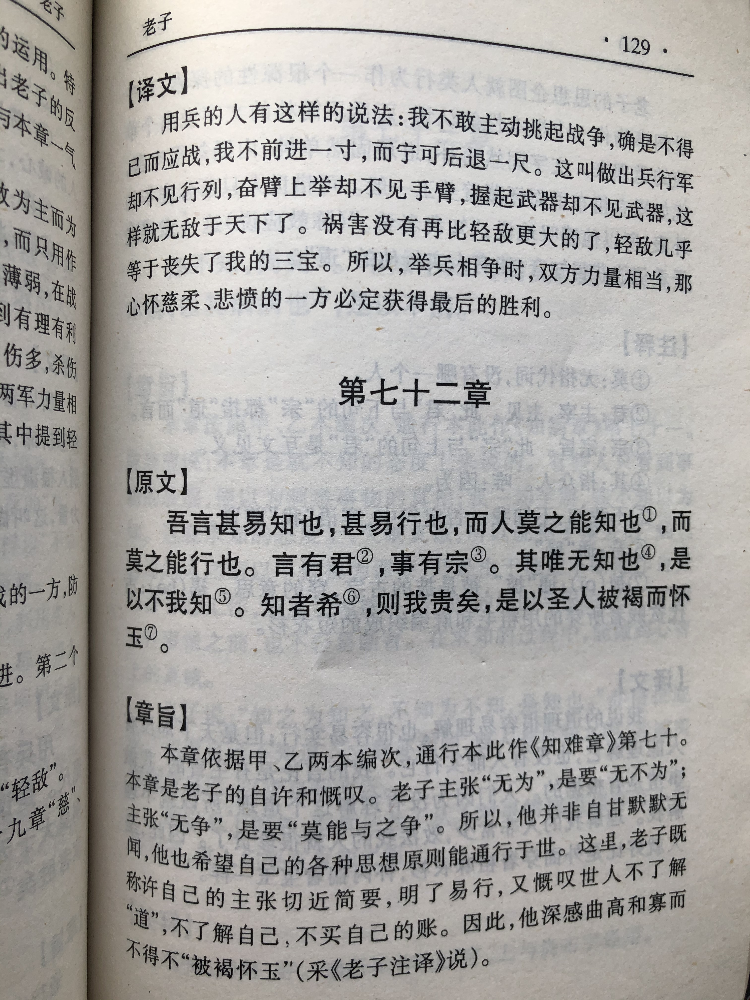
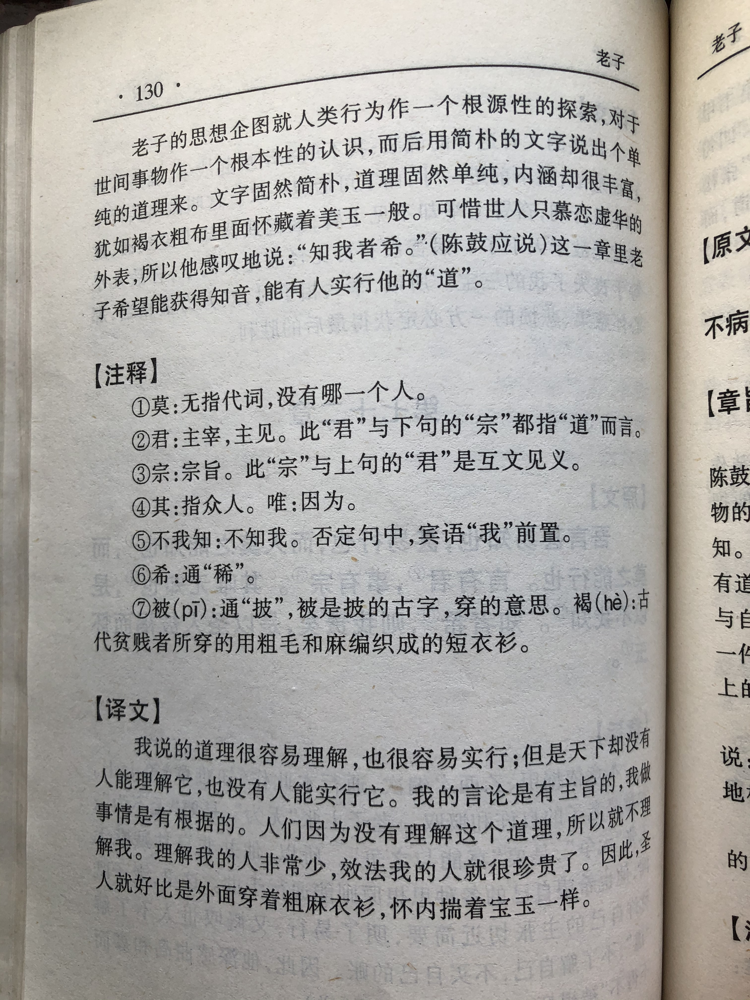

## 《道德经》第七十章通行本原文：

    吾言甚易知，甚易行。
    
    天下莫能知，莫能行。
    
    言有宗，事有君。
    
    夫唯无知，是以不我知。
    
    知我者希，则我者贵。
    
    是以圣人被褐而怀玉。
            
## 译文：
 
    我的话很容易理解，也很容易施行。
    
    但天下竟没有谁能懂得，没有谁能践行。
    
    言论有主旨，事物有规律。
    
    人们不懂得这个道理，因此不理解我。
    
    知道我的人很少，效法我的人难能可贵。
    
    因此有道的圣人穿着粗布衣服，而怀里有美玉。

## 逐句解释：

### 吾言甚易知，甚易行。
我的话很容易理解，也很容易施行。“无为”并不难懂，也不难去遵照。

### 天下莫能知，莫能行。
但天下竟没有谁能知道，没有谁能践行。天下人不懂得“道”的真谛，也不愿去实行。

### 言有宗，事有君。
宗：主旨、宗旨。君：规律或根据。此句帛书为：言有君，事有宗。
言论有主旨，行事有根据。做事说话都要有根据和原则，这样的人让人信服。

### 夫唯无知，是以不我知。
无知：指别人不理解。也有说自己无知。
可惜人们不懂得这个道理，因此不理解我。“道”就在那里，有如美玉，人们却视而不见，甚为可惜。

### 知我者希，则我者贵。
则：法则。此处用作动词，意为效法。

### 是以圣人被褐而怀玉。
被褐：被，同“披”，覆盖，穿着；褐，粗布。怀玉：玉，美玉，此处引申为知识和才能。“怀玉”意为怀揣着知识和才能。
所以圣人穿着朴素而怀揣美玉。真正的高人看着其貌不扬，却拥有着渊博的知识和良好的修为。

## 心得总结：
本章主要是讲老子的一种感慨。“道”外表虽朴素，而内涵丰富，有如璞玉。可人们却不懂得识玉，将这么好的东西置之不理。实在令人遗憾啊。

“吾言甚易知，甚易行。天下莫能知，莫能行。”“道”本来是容易理解和遵行的，但是世人却偏偏不去理解，不去遵行。在人们看来，老子的“无为”有点虚无缥缈，不可捉摸。“无为”无法换来眼前实际的好处，还要无我利他，去欲去奢，因此人们不愿遵行。这令老子的内心感到苦闷。
 
“言有宗，事有君。夫唯无知，是以不我知。”凡事都有规律，如果一个人只知关注具体事物，而不去探究事物背后的运行规律，那就是无法知道老子所说的“道”，也就是不懂得老子。人们往往只停留在事物表面，而缺乏探究精神。老子希望人们能从根本上考虑问题，从根源上化解矛盾。
 
“知我者希，则我者贵，是以圣人被褐而怀玉。”知道我的人很少，而能效法我的人更少。圣人虽穿着朴素，但有颗洁白无暇、质朴纯真的心。人们应该看到圣人的内在美，学习圣人所拥有的德行和智慧。
 
春秋战国时期，战火纷飞，百姓流离失所。统治者贪婪无度，横征暴敛，不断追求着名和利。他们目光短浅，内心浅薄，相互之间尔虞我诈，不断争夺。老子看着这一切痛心疾首，如何从根本上化解矛盾，如何让百姓安居乐业，老子一直在思索。他从世界本源中发现了“道”，总结出了“无为”的思想体系。可惜人们却不愿倾听和遵行，这令老子感到遗憾和无奈。

老子没有强迫人们去学习“道”，也没有办个宗教或学堂，控制人们的思想。老子只是平静述说着“知我者希，则我者贵。”懂的人自然明白，不理解的人可能会哈哈大笑吧。

## 附帛书版：
通行本第七十章为帛书版第七十二章。

[返回目录](../README.md) &nbsp; [上一章](./69.md)&nbsp; [下一章](./71.md)

