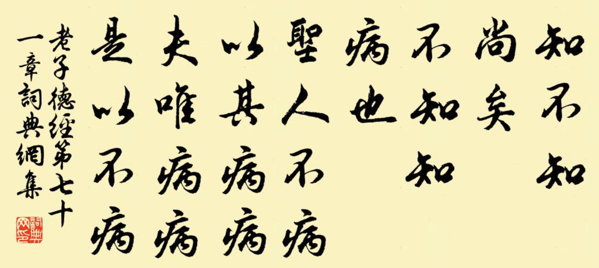
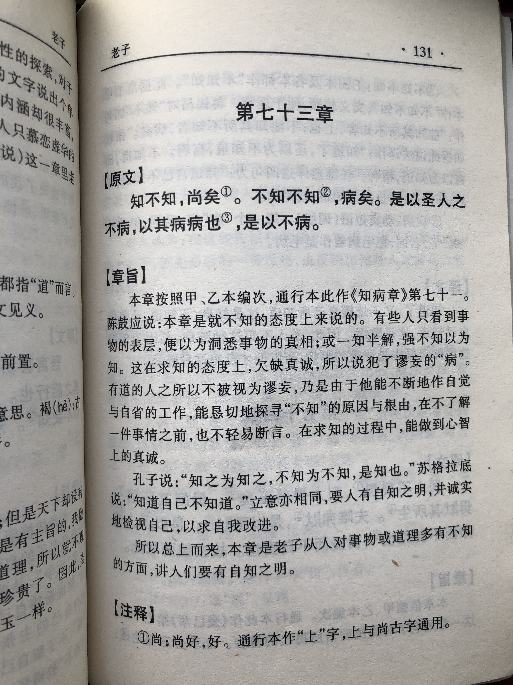
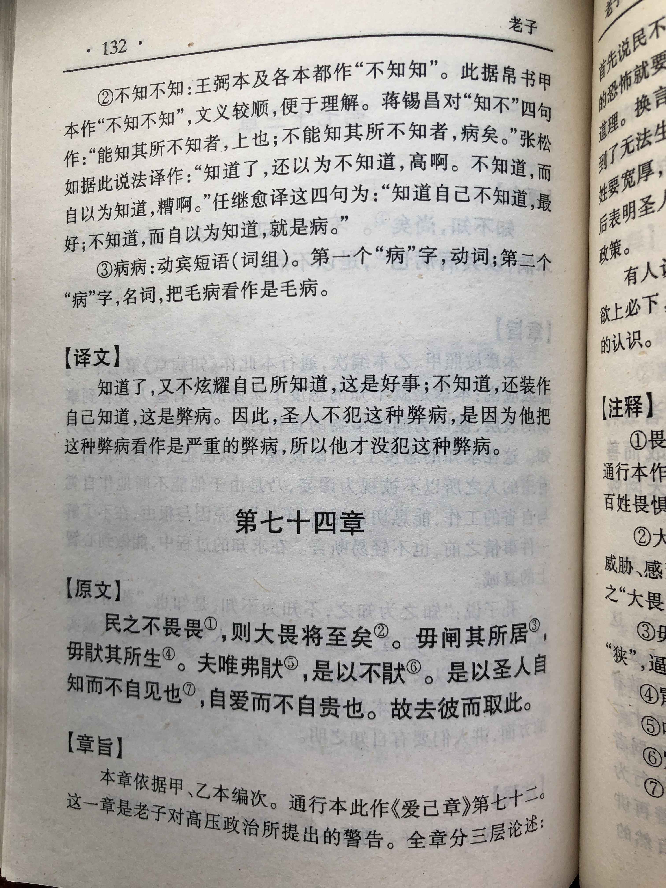

## 《道德经》第七十一章通行本原文：

    知不知，上；
    
    不知知，病。
    
    夫唯病病，是以不病。
    
    圣人不病，以其病病，是以不病。
            
## 译文：
 
    知道自己还不知道，这是一种高明。
    
    不知道却自以为知道，这是一种缺点。
    
    只有把缺点当作缺点，才不会有缺点。
    
    圣人没有缺点，是因为他把缺点当作缺点，所以才没有缺点。

## 逐句解释：

### 知不知，上；
知不知：一说知道却不自以为知道，一说知道自己有所不知。
知道自己还不知道，这是一种高明。所谓知人者智，自知者明。已经知道了而保持谦虚，不自以为是，这是一种高的修为。

### 不知知，病。
病：病，毛病、缺点。
不知道却自以为知道，这是一种毛病和缺点。

### 夫唯病病，是以不病。
病病：把病当作病，把缺点视为缺点。
唯有把缺点当做缺点，才能没有缺点。敢于承认错误，敢于面对问题，而不是自欺欺人。

### 圣人不病，以其病病，是以不病。
圣人之所以没有缺点，是因为把缺点当做缺点，所以才没有缺点。谁没有缺点呢？关键是是否敢于承认问题之所在。

## 心得总结：
本章老子主要是谈讲悟道和没有悟道的区别，把人性的弱点指了出来。很多人没有入道或者稍微入道就不懂装懂，自以为是，夸夸其谈，老子认为这是一种病态。而真正入道的人，知道自己还有不足，始终保持着求知的精神。即便他已经知道了，也会保持虚怀若谷，谦卑低下，不会刻意表现出已经知道了。
 
“知不知，尚矣；不知知，病也。”知道自己的还有不知道的是高明的，还不知道的却自以为是知就是有病了。古时圣贤都有着类似的观点。苏格拉底的名言：认识自己的无知就是最大的智慧。孔子也曾说过：知之为知之，不知为不知，是知也。他们强调的都是人要有自知之明。

“夫唯病病，是以不病。”只有把缺陷当作缺陷，知道自己的不足的，那样才可以修正缺陷，从而没有缺陷。“虚心使人进步，骄傲使人落后”这句话说起来容易，做起来难。如果真的能做到这一点，那也就离圣人进了一步。
 
“圣人不病，以其病病。夫惟病病，是以不病。”圣人没有毛病或缺点，是因为他承认不足与缺点，敢于不断改进，不断完善自己。当然人非完人，孰能无过，谁能没有缺陷呢？最重要的是承认缺陷，敢于改进，善莫大焉。老子所说的“不病”可理解为心理上、思想上的不为外物所蒙蔽。所谓自知者明，也就是人内心光明纯净，不被外物所扰。
 
领导者尤其是略有成就的领导者，容易骄傲自大，自以为是，以致于刚愎自用，听不进不同意见。这种领导者属于“不知知，病。”世界上的知识博大精深、浩渺无穷，世界上的事物也在不停运动和变化。如果止步于前，以为自己无所不知，无所不能，那就是离灾祸不远了。不知道却自以为知道的领导者往往高估自己而低估对手，这样就容易被事物的表象所蒙蔽，从而导致判断失误，带来灾祸。

本章老子是告诫人们实事求是，知道就知道，不知道就不知道，不要为了彰显权威而固执己见。而有道的统治者却能够直视自己的不足，礼贤下士，虚怀若谷，不断完善自己。这样的统治者才会少犯错误。统治者如此，普通人也一样。保持实事求是，保持谦虚谨慎，不断自我提升，不断进步，这才是求道的精神。

## 附帛书版：
通行本第七十一章与帛书版七十三章同。

[返回目录](../README.md) &nbsp; [上一章](./70.md)&nbsp; [下一章](./72.md)

