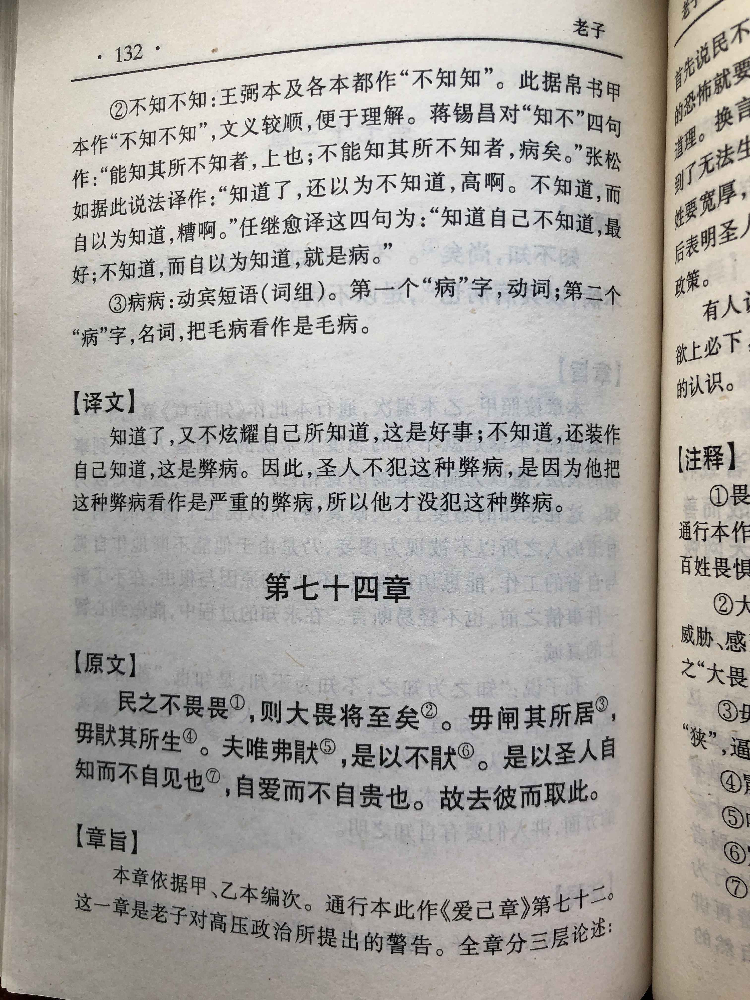
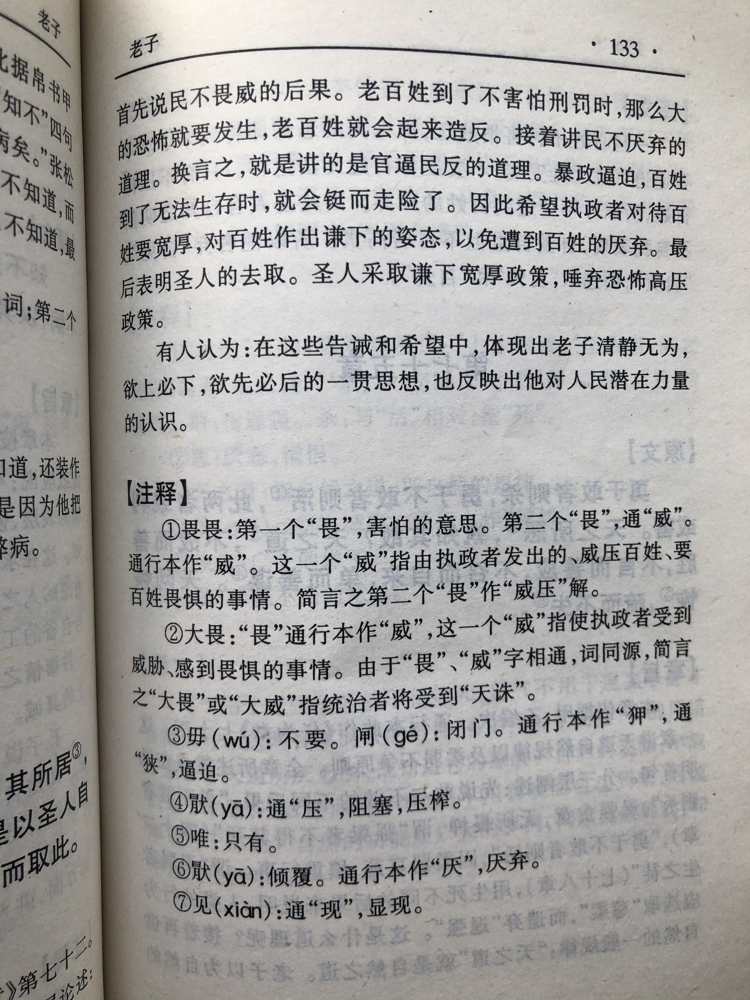

## 《道德经》第七十二章通行本原文：

    民不畏威，则大威至矣。
    
    无狎其所居，无厌其所生。
    
    夫唯不厌，是以不厌。
    
    是以圣人自知不自见，自爱不自贵。
    
    故去彼取此。
            
## 译文：
 
    人民不再畏惧统治者的威严，则反抗威严的斗争就会来临。
    
    不要逼迫人民不得安居，不要阻塞人民谋生的道路。
    
    只有不压迫人民，人民才不厌恶统治者。
    
    因此，有道的圣人有自知之明而不自我表现，有自爱而不去显摆高贵。
    
    所以要去掉那些彰显与显摆，而是保持自知、自爱。

## 逐句解释：

民不畏威，则大威至矣。
民不畏威：威，指统治者的镇压和威慑。大威至：这个威是指人民的反抗斗争。
此句意为，百姓们不再畏惧统治者的高压政策，则反抗威严的斗争就会来临。

### 无狎其所居，无厌其所生。
无狎(xiá)：狎通狭，意为压迫、逼迫。无狎，即不要逼迫的意思。无厌：厌指压迫、阻塞的意思。
不要逼迫人民不得安居，不要阻塞人民谋生的道路。

### 夫唯不厌，是以不厌。
厌：压的意思，作“厌恶”解。不厌指人民对统治者的厌恶、反抗斗争。
只有不去压迫人民，人民才不厌恶统治者。

### 是以圣人自知不自见，自爱不自贵。
不自见：见同“现”，表现。不自我表现，不自我显摆。自爱不自贵：指圣人但求自爱而不求自显高贵。
因此，有道的圣人有自知之明而不自我表现，有自爱而不去显摆高贵。

### 故去彼取此。
去彼取此：指舍去“自见”、“自贵”，而取“自知”、“自爱”。
所以要去掉那些彰显与显摆，而是保持自知、自爱。

## 心得总结：

本章老子告诫统治者要认清人民的力量，不可肆意妄为。要做到“自知不自见，自爱不自贵”，也就是要有自知之明，不要自我夸耀，要自珍自爱而不要自以为贵。

“民不畏威，则大威至。”第一个“威”意为统治者的高压政策；第二个“威”指的是民众发起的反抗。如果民众不再畏惧统治者的威严，那么人们也会揭竿而起。为什么这么说呢？统治者被人们推举为领袖，是来替百姓谋福利的。如果统治者作威作福，采取高压政策，欺凌百姓，那就会使得民众奋力抗争。这样一来，民众也就不再惧怕统治者的权威，敢于推翻暴政。

“无狎其所居，无厌其所生。”民以“生”为本，如果人们连最起码的生计都难以维持，那么还惧怕什么苛政和威权呢？所以，一旦人民饥不择食、居无定所，他们就会揭竿而起，为生存和自由而战。这样一来，社会动荡不安，天下也就大乱了。

“夫唯不厌，是以不厌。”只有不去压迫人民，人民才不厌恶统治者。人们起义反抗是迫不得已，并非人们本身想要造反。源头上来讲，统治者压榨和欺凌百姓的威权统治是祸乱之首。

“是以圣人自知不自见，自爱不自贵。故去彼取此。"如果统治者因位高权重而自我炫耀、自我显摆，那么他就会逐渐变得暴戾恣睢、任意妄为，从而成为贪婪狂妄的暴君。如果领导人不自重，人民也就不会去尊重和归顺他。因此，有道的统治者有自知之明，不会去自我表现和夸耀；有道的领导者不自贵，而是以百姓为贵。总之来讲，领导人应该保持朴素，回归自然。

## 附帛书版：
通行本第七十二章是帛书版七十四章。

[返回目录](../README.md) &nbsp; [上一章](./71.md)&nbsp; [下一章](./73.md)

