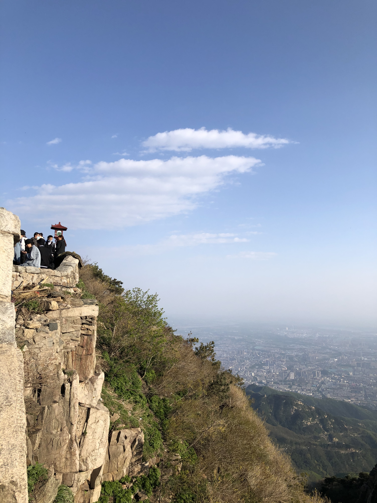
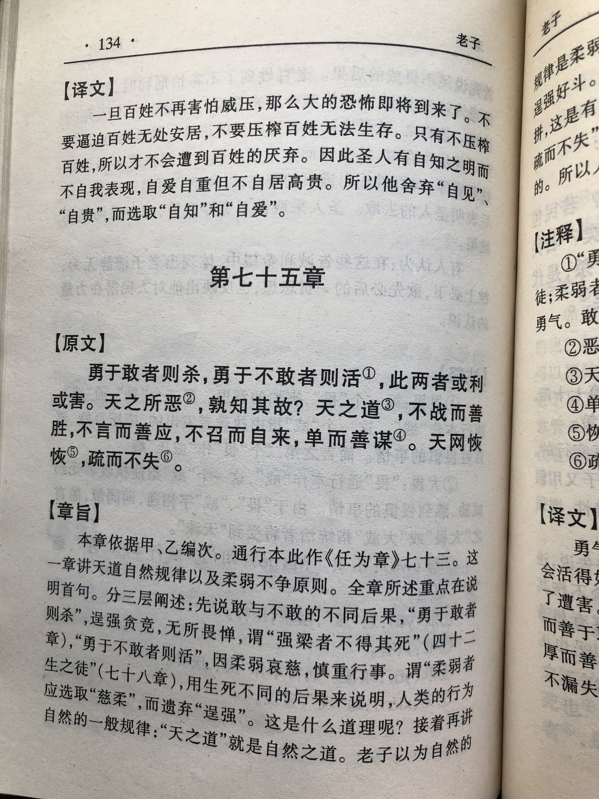
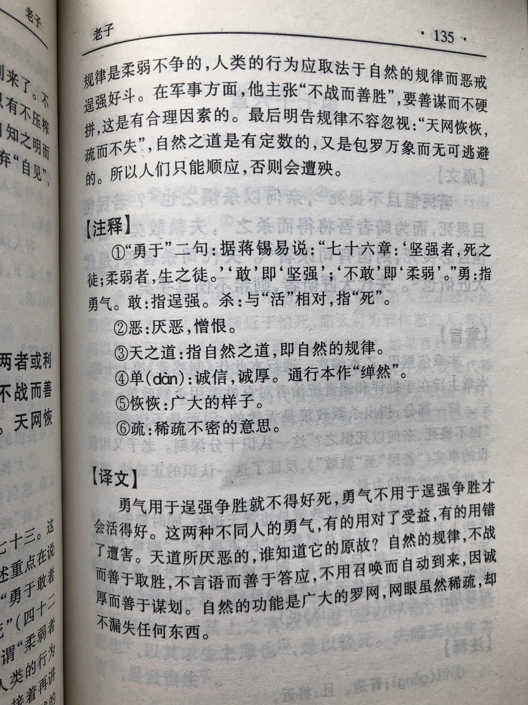

## 《道德经》第七十三章通行本原文：

    勇于敢则杀，勇于不敢则活。
    
    此两者，或利或害。
    
    天之所恶，孰知其故？
    
    是以圣人犹难之。
    
    天之道，不争而善胜，不应而善应，不召而自来，繟然而善谋。
    
    天网恢恢，疏而不失。
            
## 译文：
 
    勇敢而无所顾忌，则充满凶险；勇敢而有所顾忌，则化险为夷。
    
    这两种方式，一个有利，一个有害。
    
    上天所厌弃的事物，谁知道它的原因呢？
    
    因此，圣人做事都小心谨慎、有所顾忌。
    
    所谓天道，不争而能胜利，不言而有响应
    
    ，不召唤而自来，从容坦然而善于谋划。
    
    天道虽然宽广稀疏，却并不漏失。

## 逐句解释：

### 勇于敢则杀，勇于不敢则活。
勇：来自内心的勇气、胆量。敢：古时的“敢”表示无所畏惧，缺乏敬畏，是一种外部表现。
勇敢得肆无忌惮，则会带来灾祸；勇敢但心存敬畏，则会逢凶化吉。

### 此两者，或利或害。
勇和敢这两者，“勇于敢”带来不利，“勇于不敢”则有利。 

### 天之所恶，孰知其故？
上天的喜好厌恶，谁知道其中原因呢？上天无差别对待众生，喜欢或者厌恶某事物也不需要理由。

### 是以圣人犹难之。
所以圣人把问题当困难来处理，总是小心翼翼，有所顾忌。

### 天之道，不争而善胜，不应而善应，不召而自来，繟然而善谋。
不应：也有写成不言，即不言语，也指没有强制命令。繟（chǎn）然：也有做单、坦等，表示安然、坦然。
天之道：就是天道，相对人道而言，也指客观自然规律。 
天之道，不去争夺而能胜利，不用多言而众人响应，无需召唤而百姓自来，从容坦然而善于谋划。

### 上天虽然宽广但并不漏失。
天网恢恢：天网指自然的范围；恢恢，广大、宽广无边。 
疏而不失：虽然宽疏但并不漏失。
指上天虽宽广无边，我们也无法知道上天的喜好，但上天不会漏失任何一个奖赏，也不会漏失任何一个惩罚。

## 心得总结：
本章老子主要讲领导者做事情要有所敬畏，不可鲁莽和一意孤行。凡事有度，过犹不及。无论是领导人还是普通人，做事情必须依循于“道”，不可逆天行事。

“勇于敢则杀，勇于不敢则活。此两者，或利或害。”这里的“勇”是一种魄力，来自于内心。这里的“敢”是一种行为，并不走心。“勇”是一种力量，只有具备了“勇”，才能迎接挑战，战胜困难。但“勇”是有前提的，即心存敬畏，遵循自然，不可逆天而为。勇而无心是为“敢”，那是非常可怕的。如果领导者只是“勇于敢”，做事无所畏惧，胆大妄为，那就会引起可怕的灾祸。

“天之道，不争而善胜，不应而善应，不召而自来，繟然而善谋。”上天之道也就是恒久的客观规律，也就是“道”，我们应当遵循它。当我们遵循于“道”，表现出来就是“无为”。即不争而能获胜，不言而能回应，不召而能自来，一切都很从容坦然，无需绞尽脑汁，这就是最好的谋划。

“上天虽然宽广但并不漏失。”大道宽广辽阔、无边无际，运行起来似乎气息微弱，似有或无。但上天从不失责，它没有怜悯，也无过错，只是一如既往地运行着。上天客观公正，不偏不倚，任何事情都逃不掉上天的法眼。我们“勇”也好，“敢”也罢，做过的行为都有相应地代价，只有符合客观规律，保持对自然的敬畏，保持相对地平衡，才能用最少的代价，获得最高的收益。

综上，我们做事情既要具备勇气和魄力，也要心存敬畏，敬天爱人。如今社会，日新月异，发展迅猛，需要持续的创造力和不断地革新，这就需要强大的勇气和坚决的执行力。老子的智慧就是告诉我们既要保持强大的勇气和决心，也要敬畏自然，让社会可持续和谐发展。

## 附帛书版：
通行本第七十三章与帛书版七十五章同。

[返回目录](../README.md) &nbsp; [上一章](./72.md)&nbsp; [下一章](./74.md)

