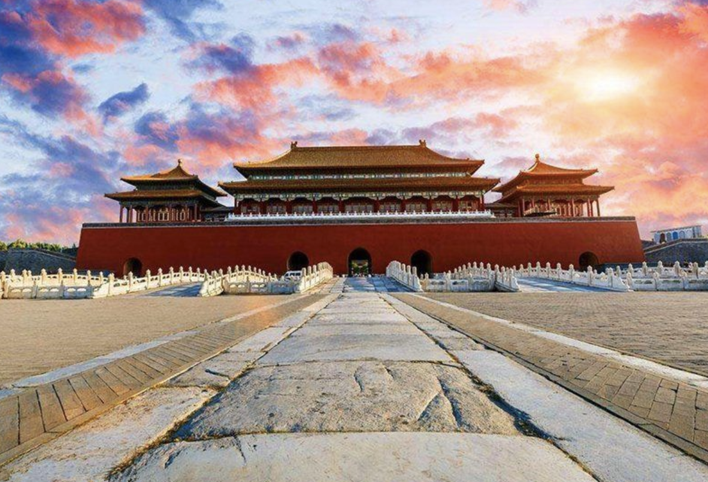
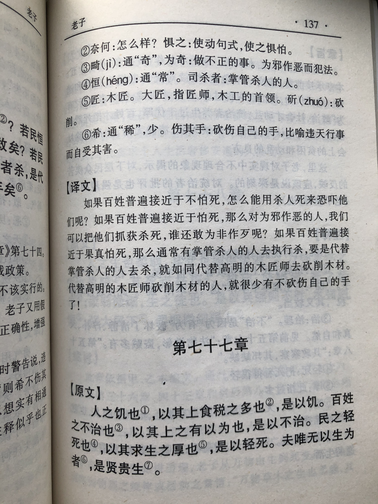
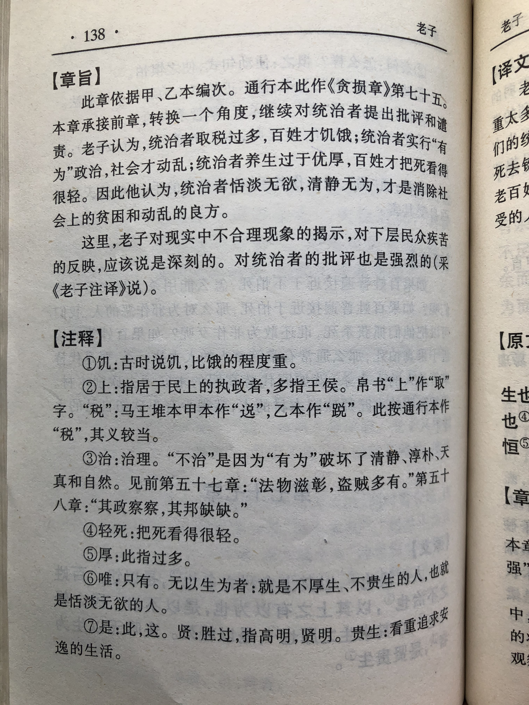

## 《道德经》第七十五章通行本原文：

    民之饥，以其上食税之多，是以饥。
    
    民之难治，以其上之有为，是以难治。
    
    民之轻死，以其上求生之厚，是以轻死。
    
    夫唯无以生为者，是贤于贵生。
            
## 译文：
 
    人民之所以遭受饥荒，是由于统治者征收的赋税太多，所以才导致饥荒。
    
    人民之所以难以治理，是由于统治者贪图功名，不断干涉民生，所以才难以治理。
    
    人民之所以冒死抗争，是由于统治者奉养优厚，老百姓没有活路，所以才冒死轻生。
    
    不以生存而任意妄为的人，要贤于那些过于重视物质生活的人。

## 逐句解释：

### 民之饥，以其上食税之多，是以饥。
食税：食用税赋，指享用民脂民膏。
人民之所以遭受饥荒，是由于统治者征收的赋税太多，所以才导致饥荒。民众养活自己尚且不易，还要养活统治阶级。

### 民之难治，以其上之有为，是以难治。
有为：相对无为来讲，是统治者强作妄为、干预自然规律。
人民之所以难以治理，是由于统治者贪图功名，不断干涉民生，所以才难以治理。领导者有为是为了名利，而真正为了老百姓则是无为不争，清静自然。

### 民之轻死，以其上求生之厚，是以轻死。
轻死：轻视死亡，即不怕死。求生之厚：奉养过于丰厚奢侈。
人民之所以不怕死，是由于统治者奢侈无度，老百姓实在奉养不起，所以才冒死轻生。

### 夫唯无以生为者，是贤于贵生。
无以生为：不为了生而恣意妄为，比如奉养过厚，奢靡无度。贤：胜过、超过的意思。贵生：厚养生命。
不为了生存而去恣意妄为的人，要贤于那些贵重养生的人。领导者挥霍无度，奢靡浪费，那不是真正的养护生命，那是祸害百姓，也是危害自己。清心寡欲，顺其自然才是养生之道。

## 心得总结：
本章老子依然在讲“无为而治”的具体策略，告诫领导者不要赋税过重，不要恣意妄为，也不要奉养过厚。前面章节刚提出过“民不畏死，奈何以死惧之？”这一章是承接上一章而说，指出当百姓被逼无奈、没有活路时，就会冒死轻生。而真正善于养生、爱护百姓的领导者应该遵循自然，不去为了生存而肆意盘剥百姓。

“民之饥，以其上食税之多，是以饥。”统治者压迫百姓，民众奉养君王过多，不堪重负，那么就会导致饥荒。面对饥荒，老百姓走投无路，只能揭竿而起。
 
“民之难治，以其上之有为，是以难治。”人民难以治理不是人民多么刁蛮，而是统治阶级过于干扰民生，导致百姓苦不堪言，不得不反。因此，有道明君会遵循“清静无为天下正”，少干预、多支持，清心寡欲。
 
“民之轻死，以其上求生之厚，是以轻死。”“轻死”指的是不怕死，这个不怕死针对的是暴政和苛捐杂税。百姓轻视死亡是被逼无奈，谁不珍重生命呢？以死相搏是一种与威权抗争的最后呐喊。“求生之厚”是统治者过于注重自身的奉养，奢靡华贵，挥霍无度，人民被压迫的连温饱都无法解决。面对这种不公正的现象，人民不堪忍受，所以才不惜冒着生命危险去铤而走险。
 
“夫唯无以生为者，是贤于贵生。”其中，“无以生为”是对“求生之厚”和“有为”的否定，有道的君王不会为了自身奉养优厚而劳民伤财、恣意妄为。最后老子点明了本章主旨：不去厚养自己的生命，而是采取无为而治的人，才是真的善于养护生命的人。

统治者和民众本来有着天然的阶级矛盾。如果统治者以人民的利益为重，不去滋扰民生，那么人民就会生活富足，国家就会太平安定，统治者的地位也就会稳固。与此相反，如果统治者不以人民利益为重，过于追求自身奉养，不顾人民的死活，那么人民就会冒死抗争统治者的压迫。

“水可载舟，亦可覆舟。”道理易懂，古今能做到的有几人？统治者流芳百世，被人民尊敬的少之又少，更多的君王死后被人们所唾弃，淹没在历史的垃圾堆里。国家治理如此，企业管理也是如此。如果管理者缺乏从员工角度考虑问题，不为员工利益着想，一味压榨劳动者的血汗，那种企业迟早会完蛋，企业家赚了再多的钱也会被众人所唾弃。

## 附帛书版：
通行本第七十五章与帛书版七十七章同。

[返回目录](../README.md) &nbsp; [上一章](./74.md)&nbsp; [下一章](./76.md)

