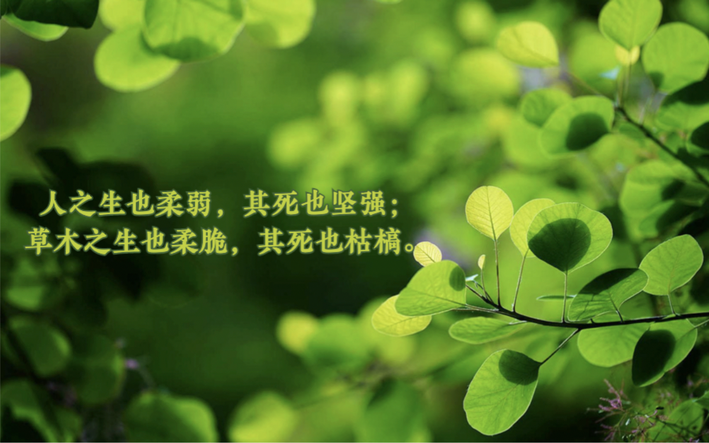
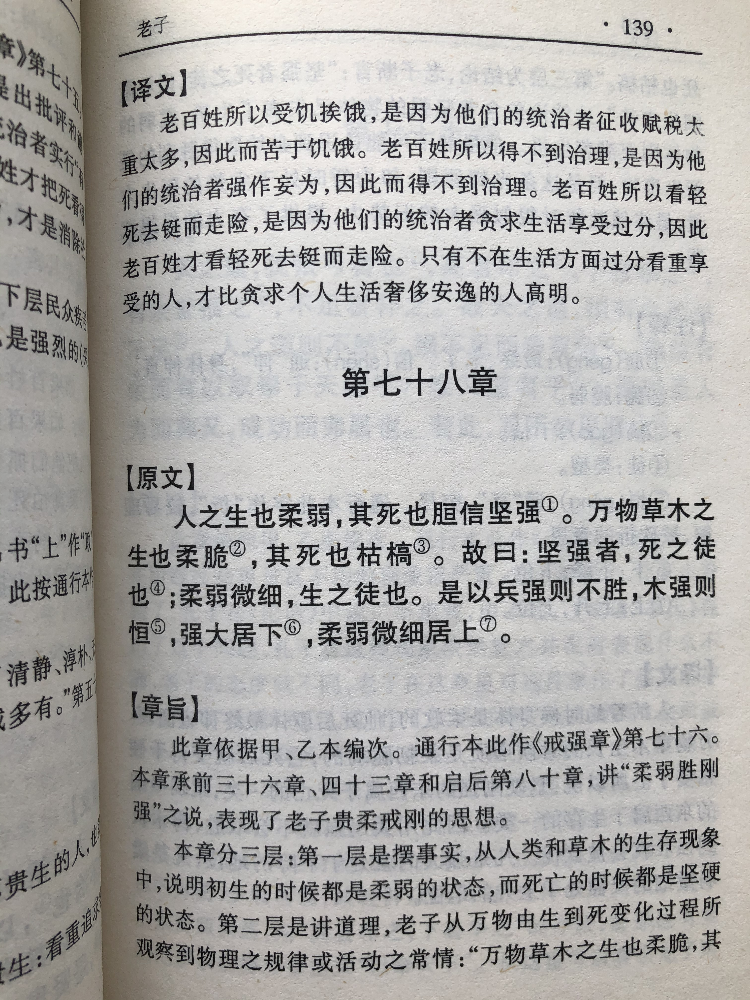
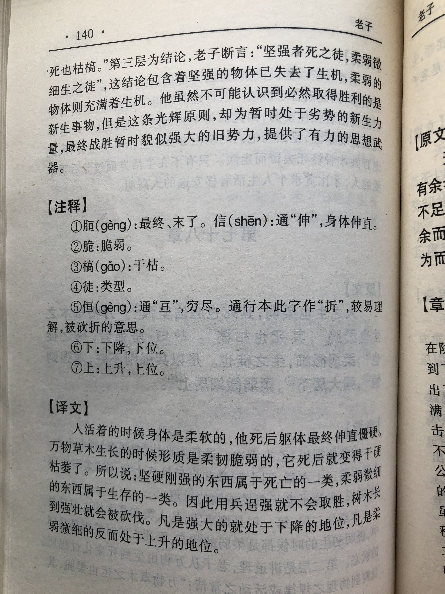

## 《道德经》第七十六章通行本原文：

    人之生也柔弱，其死也坚强；
    草木之生也柔脆，其死也枯槁。
    故坚强者死之徒，柔弱者生之徒。
    是以兵强则灭，木强则折。
    强大处下，柔弱处上。
            
## 译文：
 
    人活着的时候身体柔弱，死了以后身体就变得僵硬；
    草木生长的时候也很柔脆，死了以后就变得枯槁。
    所以，顽固僵硬是死亡之道，柔弱灵动是生长之道。
    因此，用兵逞强会走向灭亡，树木僵硬就容易折断。
    过于强大会处于劣势，保持柔弱会处于优势。

## 逐句解释：

### 人之生也柔弱，其死也坚强；
人活着的时候身体柔弱，死了以后身体就变得僵硬。人是有思想的动物，灵活柔弱反而适应能力强，而死板僵化则适应能力差。

草木之生也柔脆，其死也枯槁。
草木生长的时候也很柔脆，死了以后就变得枯槁。植物莫不如此，有生命的时候含有水分，枝叶柔弱，等到死了，就变得干枯坚硬。

### 故坚强者死之徒，柔弱者生之徒。
所以，顽固僵硬是死亡之道，柔弱灵动是生长之道。从动植物来看的确如此，柔弱代表生命，坚强僵硬反而代表死亡。这里老子只是比喻为人要懂得柔弱之道，而不是自我逞强。

是以兵强则灭，木强则折。
因此，用兵逞强会走向灭亡，树木僵硬就容易折断。兵锋尖锐，过于强盛也就是灭亡之时，物盛则衰。树木坚硬时容易折断，而藤蔓缠绕反而结实。

### 强大处下，柔弱处上。
强大的容易骄傲自满，因此处于下风；柔弱的因为谦虚谨慎，反而处于上风。历史上有很多以少胜多，以弱胜强的的例子，这皆是因为强者骄横所致。当然这里不能抬杠，在绝对力量面前，强会胜弱，但很多时候并非相差悬殊到无法较量。老子这里是做比较，在相对情况下，保持柔弱，保持低下能够激发斗志，保存实力，最后反而占据上风。

## 心得总结：

这一章老子基于“无为”的核心理念来阐释以弱胜强，以柔胜刚的道理。人和动植物都是活着的时候柔软，而死了之后变得僵硬枯槁。事物过于强大了都会走向反面，这是自然法则。“道”的运行规律就是朝着反的方向运动，循环往复。因此守住柔弱反而可以保持优势。
 
“人之生也柔弱．其死也坚强，草木之生也柔脆，其死也枯槁。”人活着因为有气血，所以身子柔弱，而死亡了就变得僵硬。人刚出生时虽柔弱无比，但处处焕发着生命力，而等到暮年，身子逐渐变得刚硬起来，就失去了活力。因此对人来讲，保持柔弱是一种养生之道，处于上位。动物如此，植物也一样，当生命旺盛时柔软脆弱，而等到死亡了就变得干枯僵硬。不管是人、动物还是花草树木，活着的时候都是柔弱的，而死后就变得僵硬起来，这是自然规律。
 
“故坚强者死之徒，柔弱者生之徒。”这句是对上句的总结，即万物活着柔弱，死了坚硬。这里的坚强并非现在意义的坚强，而是指过于坚硬、强大，缺乏柔性和灵活。万物都是如此，过犹不及。事物强大了往往说明已经经历了柔弱、成熟阶段，而走向了末路。因此，保持柔弱是保持生命力的象征。
 
“是以兵强则灭，木强则折。强大处下，柔弱处上。”兵力过于强盛就会骄傲自负，往往就会走向失败，树木过于强硬也就是走向枯槁的时候。因此，过于强大位于下位，而柔弱居于上位。
 
这一章老子观察到人和植物活着的时候柔弱，死亡了则坚硬的自然现象，发现了“柔弱胜刚强”的道理。任何事物强大到坚硬了就会走向灭亡，这是自然法则，任何人也改变不了。因此我们应该采取柔弱的策略，遵循和适应自然规律。这里有些人解读老子会以为老子是保守、退步思想，其实不然，老子的柔弱是一种更加高级的有为，是在遵循自然规律的基础上进行改造和利用，而避免激进和粗暴的方式。

学习《老子》切忌不要走向歧途。既不要误会了老子，把柔弱看成是胆小与保守，也不要处处老谋深算，总想着以弱胜强、以小博大、以少胜多。老子其实希望大家按照自然规律行事，该出手时就出手，做事情敢做敢当，只是总体上要符合清静、无欲、柔弱的特征。

## 附帛书版：
通行本第七十六章与帛书版七十八章同。

[返回目录](../README.md) &nbsp; [上一章](./75.md)&nbsp; [下一章](./77.md)

