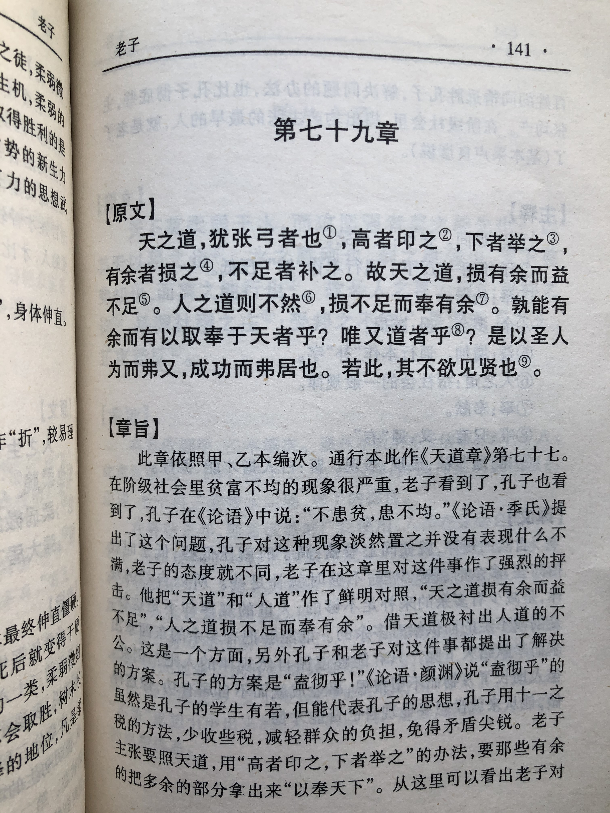

## 《道德经》第七十七章通行本原文：

    天之道，其犹张弓与？
    高者抑下，下者举之，有余者损之，不足者补之。
    天之道，损有余而补不足。
    人之道，则不然，损不足以奉有余。
    孰能有余以奉天下，唯有道者。
    是以圣人为而不恃，功成而不处，其不欲见贤。 
            
## 译文：
 
    上天之道，不是很像张弓射箭吗？
    弦拉高了就压低一点，低了就再拉高一点，拉得过满了就减少点，拉得不足就增补它。
    老天的规律，是减少有余的补给不足的。
    可是人类的法则却不是这样，人间要减少不足的，来奉献给有余的人。
    那么，谁能够减少有余的来补给天下呢？只有有道的圣人才可以做到。
    因此，得道的圣人有所作为而不自傲，有所成就而不居功，他不愿意彰显自己的贤能和成就。

## 逐句解释：

### 天之道，其犹张弓与？
客观自然运行规律，就好像拉弓射箭一般。老子喜欢借用具体事物来打比喻，什么风箱、轮毂、山谷、河流等，这次拿拉弓来说明天道的运行特点。

### 高者抑下，下者举之，有余者损之，不足者补之。
拉弓如果弦拉得高了就会压低一点，低了就再拉高一点，拉得过满了就减少点，拉得不足就增补它。射箭只有不偏不倚，不增不减，恰如其分才能命中目标。说明天之道在于维持自然界的平衡。

### 天之道，损有余而补不足。
上天的规律，是减少有余的补给不足的。以此保持相对的平衡，这样世界才能循环往复，生生不息，不断向前发展。

### 人之道，则不然，损不足以奉有余。
而人类的却不是这样，人类与上天是相反的。人间法则是弱肉强食，从本已不足那里抢夺过来奉献给有余的。这是因为人类贪婪自私，造成强者恒强，富者愈富。老子的理想社会就是人间法则学习上天法则，即天人合一、顺其自然。

### 孰能有余以奉天下，唯有道者。
那么，谁能够减少有余的来补给天下呢？唯有道的统治者可以做到。统治者掌握着大权，他们如果肯实行天道，是能够使得人类社会也保持相对平衡的，从而实现长治久安。

### 是以圣人为而不恃，功成而不处，其不欲见贤。 
功成而不处：处，“占有”的意思。帛书版为成功而弗居。见：通“现”，表现。
因此，得道的统治者有所作为而不自恃有功，有所成就而不居功，他不愿意彰显自己的贤能和成就。所以得到的领导人会遵循清静无为，去掉私欲杂念。这样的领导者减损自己的富余，而补充给老百姓。

## 心得总结：
本章老子主要讲公平公正原则，体现了一个平衡思想。万物是平衡的，多了要减损，少了要增益。自然界始终维持一个平衡法则，客观世界才得以循环运转。国与国之间，人与人之间，物与物之间，都要遵循平衡法则，一旦秩序被破坏，那么就会天下大乱。而人性有自私和贪婪的一面，总想打破这种平衡，去获得额外的收益。老子告诫统治者要抑制自己的私欲，“损有余而补不足”，厚待百姓，让利于民，保持自身的质朴与清静。

 “天之道，其犹张弓与？高者抑下，下者举之，有余者损之，不足者补之。”天道与拉弓的道理类似，多了就得收，少了就得张。也就是凡事保持平衡，不偏不倚，过犹不及。这个世界终究是平衡的，人类也改变不了自然法则。因此有余的会减少，不足的会增加。
 
“天之道，损有余而补不足。人之道，则不然，损不足以奉有余。”这是非常有名的两句话，道出了天道与人道的本质。天道有常，人道无常。人之道与天之道截然相反，人之道是“损不足以奉有余”。人道有私欲和贪婪，有余的还想从不足的那里攫取，这是造成贫富不均和权利不平等的根源。而天之道本身就是客观公正的，不善不恶，无仁无义，它使得万物都保持相对平衡，所以它能长久。长远来看，人道也是天道的一种，只要把时间拉到足够长，就会发现人道也是有常的。
 
“孰能有余以奉天下，唯有道者。”有道的统治者会把自己多余的财富拿出来补给贫穷百姓，以达到社会和谐的目标，从而实现社会的安定。无道的昏君则不管民众死活，不断压榨劳动者的汗水，从贫穷的老百姓那里攫取，最后搞得民不聊生，人们被迫揭竿而起。
 
“是以圣人为而不恃，功成而不处，其不欲见贤。 ”这里指有道的圣人，也就是统治者，有所作为，大展身手，但不会因此而居功自傲，自恃其能。真正的圣贤，有了功劳也不会强调是自己的，而是认为是劳动者创造的。“不欲见贤”意为不会表现出自己的贤能，绝不炫耀，而是始终保持谦卑、低下、质朴的德行。

这一章老子主要讲的是天道的法则，即“损有余而补不足”，这和人类社会的情形恰好相反。圣人成功后不居其功，正是效法天道的法则，用自己的有余补天下的不足。领导者如果能懂得天道和人道之差别，也知道人道其实也是天道中的一部分，那么就会修正自己的德行，使得人道如天道。

平等、公平是人类与生俱来的追求，也是人类得以长期共存的基本法则。老子在两千多年前就看到了，作为后来人，我们更加应该去遵循，并且去理解天道与人道其中的差别。

## 附帛书版：
通行本第七十七章与帛书版七十九章同。

[返回目录](../README.md) &nbsp; [上一章](./76.md)&nbsp; [下一章](./78.md)

