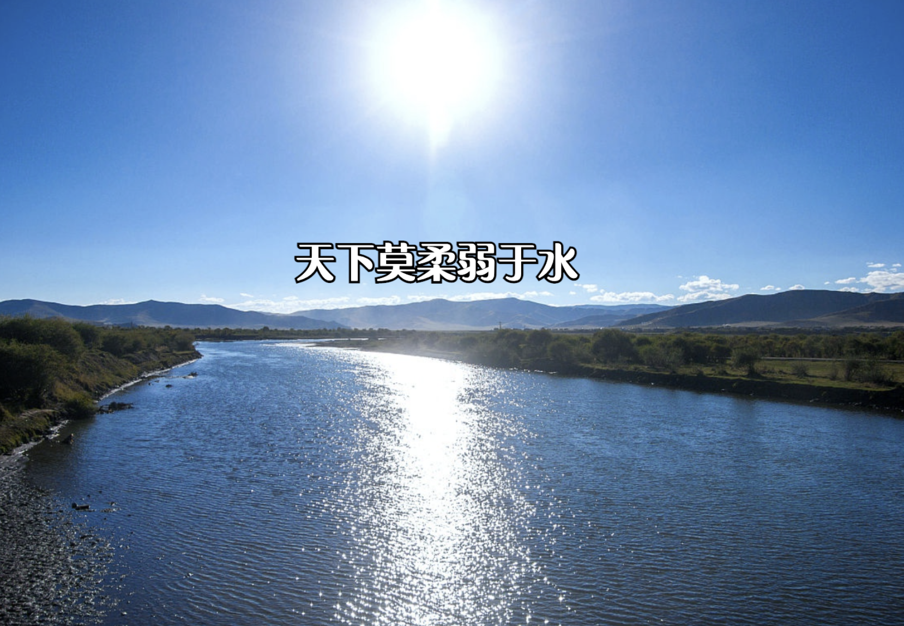
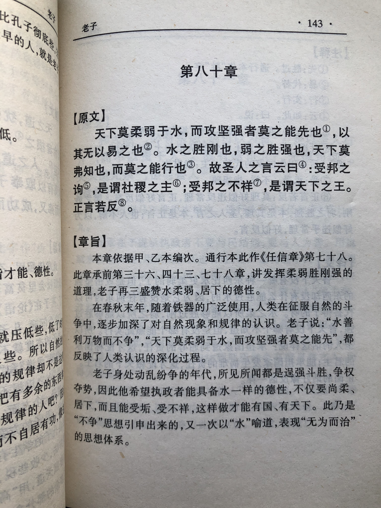
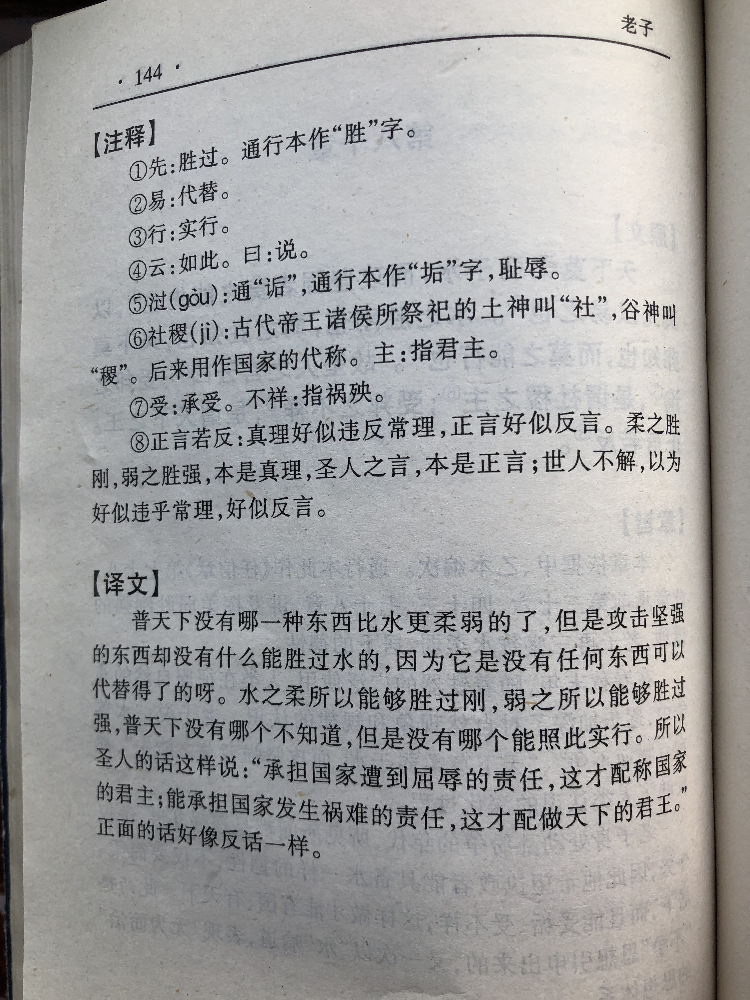

## 《道德经》第七十八章通行本原文：

    天下莫柔弱于水，而攻坚强者莫之能胜，以其无以易之。
    弱之胜强，柔之胜刚，天下莫不知，莫能行。
    是以圣人云：受国之垢，是谓社稷主；受国不祥，是为天下王。
    正言若反。 
            
## 译文：
 
    天下最柔弱的莫过于水，攻克坚强没有什么能胜过它，因此没有什么能替代水。
    弱可以胜过强，柔可以胜过刚，天下没有人不知道，但却没有人能实行。
    因此，圣人常说：能承受国家的屈辱，才配作天下的君主；能承担国家的灾难，才配做天下的君王。
    正面的语言，听起来好像都是反话。

## 逐句解释：

### 天下莫柔弱于水，而攻坚强者莫之能胜，以其无以易之。
无以易之：易，替代。意为没有什么能够代替它。
天下最柔弱的莫过于水，攻克坚强没有什么能胜过它，因此没有什么能替代和改变水。上善若水，水的品性受到老子极大地推崇。

### 弱之胜强，柔之胜刚，天下莫不知，莫能行。
弱可以胜过强，柔可以胜过刚，天下没有人不知道，但却没有人能实行。柔弱胜刚强，老子反复提及过。这个道理大家虽然都懂，但却不愿去实行。因为人人都想把自己变得强大，而不希望自己弱小。

### 是以圣人云：受国之垢，是谓社稷主；受国不祥，是为天下王。
受国之垢：垢，屈辱。意为承担全国的屈辱。受国不祥：不祥，灾难，祸害。意为承担全国的祸难。
因此，圣人常说：能承受国家的屈辱，才配作天下的君主；能承担国家的灾难，才配做天下的君王。要想拥有相应地位，就要承担相应职责。君王当以国为家，以国为身，以国为重。

### 正言若反。
正面的语言，听起来好像都是反话。也就是好话听起来不是那么地入耳，忠言逆耳。

## 心得总结：
本章主要讲天下至柔为水。水看起来柔弱无比，然而却力量强大无比，能够攻坚克强。柔胜刚，弱胜强。老子极力赞美水，说上善若水。的确，水乃万物之源，没有了水，就没有了生命。这里老子指出水不去争功，遇物成形，始终保持谦卑柔和，没有私欲，因此水的品性接近于道。
 
“天下莫柔弱于水，而攻坚强者莫之能胜，以其无以易之。”老子对于水有着深刻的认识，前面章节反复提及过水，认为水是一切之源。水的特性与道是很接近的，之所以能够攻坚克强，就是因为它的柔弱与坚韧。
 
“弱之胜强，柔之胜刚，天下莫不知，莫能行。”弱能胜强，柔能克刚，这个道理人人都懂，但是真正践行的少之又少。这是为什么呢？天下人都希望自己变得强大，而不是希望自己弱小，这是人的自私和贪婪造成的。人性有两面性，有善有恶，人们常常心里知道什么是善，因为这是非常朴素的道理，而在付诸行动时，却不愿意践行善。
 
“是以圣人云：受国之垢，是谓社稷主；受国不祥，是为天下王。”这里老子借圣人之言来说明一个道理，即能够承受国家的耻辱和灾难的才能是一国之主。要想拥有相应权利，就得承担相应职责。作为一国之君，就得为国家承担相应责任，与国为一体，荣辱与共。现代国家早已没有了君王的概念，但是作为国家领导者也同样适用这个道理。
 
“正言若反。”老子最后来了这么一句，这是什么意思呢？这句话其实是对上面的一个概括，也就是人们所想的和所做的，与事实可能恰恰相反。比如人们想要多而不要少，人们想要强而不要弱，人们想要刚而不要柔，而事实上却少能胜多，弱能胜强，柔能克刚。“反者道之动，弱者道之用”老子早就指出了“道”的运行规律。

本章依然是对无为思想的概括，再次强调了柔弱胜刚强的道理。现实生活中，从长远来看，事物是平衡的，刚强不会永久，柔弱也是暂时的。老子认为，世界本质上是柔弱的，是安静的，一切事物又在朝着对立面不停运动和发展，等到达一定阶段，依然会回到原点。世界就这样循环往复，不断发展，波浪式前进，螺旋式上升。

当我们理解了世界运动的根本规律，也就明白了老子所说的“弱之胜强，柔之胜刚”以及“反者道之动，弱者道之用”领导者如果能明白这些，那么也就懂得如何治理天下了。

## 附帛书版：
通行本第七十八章与帛书版八十章同。

[返回目录](../README.md) &nbsp; [上一章](./77.md)&nbsp; [下一章](./79.md)

