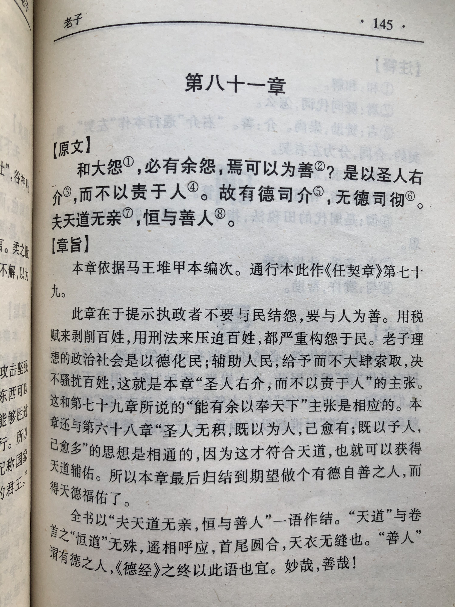
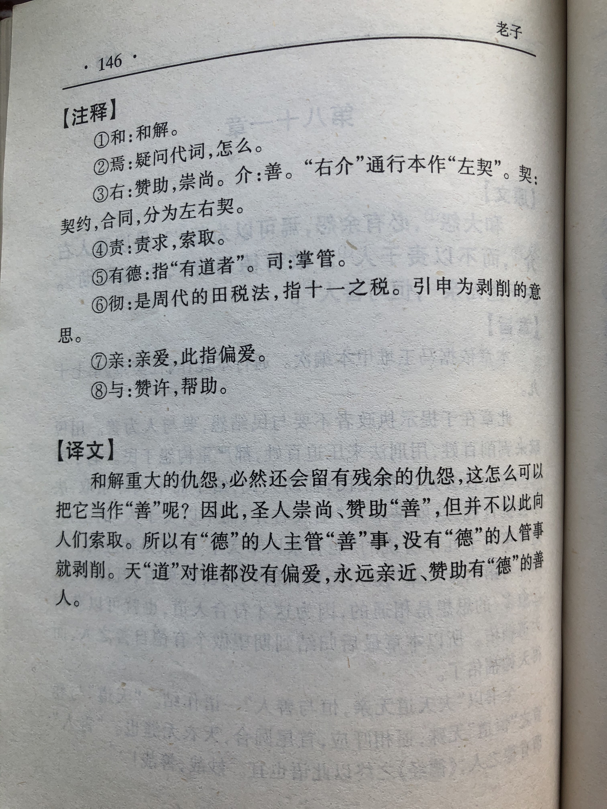

## 《道德经》第七十九章通行本原文：

    和大怨，必有余怨，安可以为善？
    
    是以圣人执左契，而不责于人。
    
    有德司契，无德司彻。
    
    天道无亲，常与善人。 
            
## 译文：
 
    和解深重的怨恨，必然会留下残余，这怎么算是妥善的办法呢？
    
    因此，有道的圣人保存借据，但并不凭此苛责于人。
    
    有“德”之人就像持有借据的圣人那样公允，无“德”之人就像掌管租税的官员那样苛责。
    
    天道对任何人都没有偏爱，它永远帮助有德之人。

## 逐句解释：

### 和大怨，必有余怨，安可以为善？
和：和解。
和解深仇大怨，必然还留有余怨，这算什么妥善的解决方案呢？

### 是以圣人执左契，而不责于人。
契：契约。责：责备，这里指索取欠债。
所以圣人拿着借条，但并不责备于人，并不以此要挟索取欠债。

### 有德司契，无德司彻。
司契：掌管合约。司彻：掌管税收的官职。
有“德”之人就像持有借据的圣人那样公允，无“德”之人就像掌管租税的官员那样刻薄。

### 天道无亲，常与善人。
无亲：没有偏爱。与：给予、帮助。善人：善良、有德的人。
天道对任何人都没有偏爱，它永远帮助善良的人。

## 心得总结：
本章老子是想告诫人们要以善待人，与前面的以德报怨类似。上天并没有亲疏贵贱之分，但会帮助有德的善人，这是因为“德”是与生俱来的禀赋，属于自然法则所带来的。万物皆有德，因此我们凡事应该以”德“行事，也就是行善。多行善事，莫问前程，那么上天终究会来眷顾和帮助你。

“和大怨，必有余怨，安可以为善？”大怨乃是深仇大恨，余怨则是难以消除的怨恨。什么怨恨大到无法消除，那一定是日积月累而来，比如统治阶级和老百姓的矛盾。想要调和这种矛盾，使得统治者和老百姓能够和谐共存，那就得一切按照“道”的规律行事。统治者首先保持清心寡欲，让利于民，从人民的利益着想，从人民的利益出发，那么矛盾就会化解。

“是以圣人执左契，而不责于人。有德司契，无德司彻。”契是债券凭证。执左契即遵循契约精神，不去胁迫和欺凌。彻指的是古代一种严苛的清偿租税制度。有“德”之人就像持有借据的圣人那样公允，并不会欺凌和胁迫债务人，而无“德”的人就像掌管税收的官员那样苛刻，盘剥百姓。“有德”即按照契约精神收取租税，而“无德”则依仗优势地位压榨百姓。

“天道无亲，常与善人。”这个与“天地不仁，以万物为刍狗”意思相同，真正的善是无偏爱的。但有德之人，也就是善良之人，会得到老天的眷顾和帮助。这并不是老天要偏爱善良有德之人，而是因为“德”是一种自然属性，来自于自然法则。

本章老子主要是强调以德待人，统治者要以宽容和爱来对待民众，而不是采取苛刻压榨的方式。最后一句“天道无亲，常与善人。”乃是千古名言，曾经激励和鼓舞了多少人。让人们相信，好人总会有好报。

虽然世界上不一定存在轮回，或者善恶不一定有报。但是我们要知道“德”是人与生俱来的禀赋，是“道”外在的体现，上天自然眷顾和护佑有德之人。读懂了这点，就能明白为什么人一定要做一个善人。

## 附帛书版：
通行本第七十九章与帛书版八十一章同。

[返回目录](../README.md) &nbsp; [上一章](./78.md)&nbsp; [下一章](./80.md)

