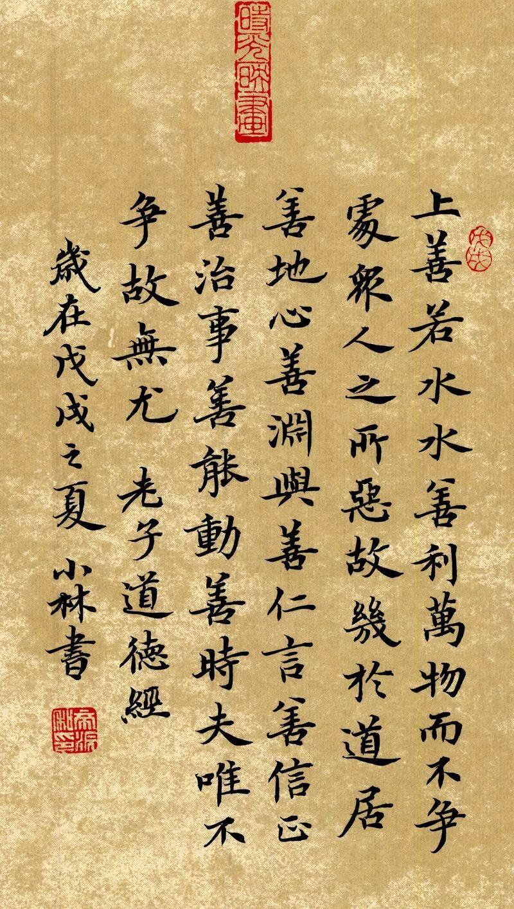
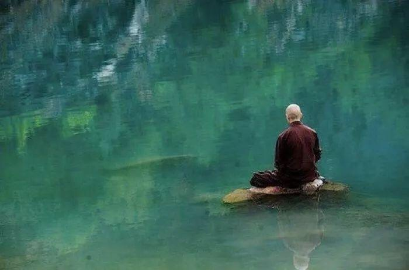
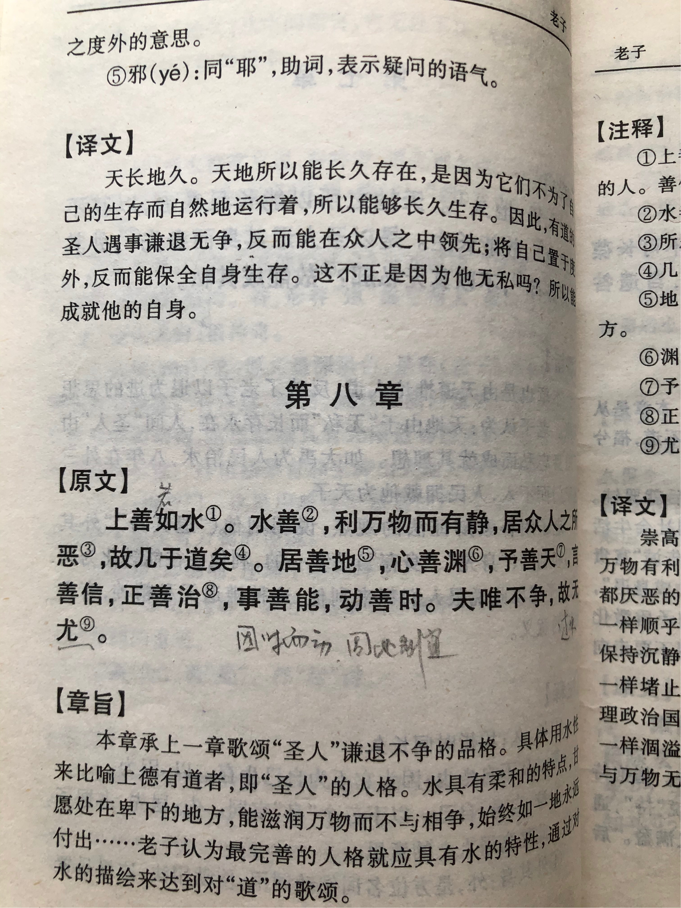
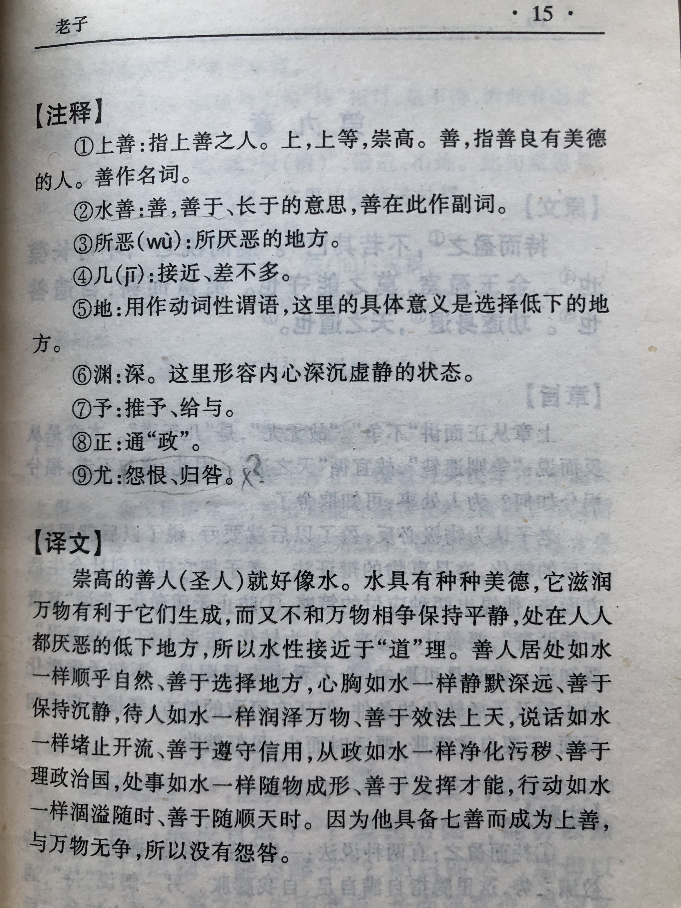

## 《道德经》第八章通行本原文：

    上善若水。水善利万物而不争，处众人之所恶，故几于道。
    
    居善地，心善渊，与善仁，言善信，政善治，事善能，动善时。
    
    夫唯不争，故无尤。

## 译文：
 
    最好的善就好像水一样。水善于滋润万物而不与万物相争，停留在众人厌恶的低洼地方，所以最接近于“道”。
    有道之人居住在善居的地方，心胸如水一般保持宁静而深不可测，待人真诚无私、效法于天，
    说话善于守信、言行一致，为政善于有条不紊、治理有方，办事善于发挥才能，行动善于把握时机。
    因为能做到与世无争，所以才不会招惹怨恨，也就没有怨咎过失。

## 逐句解释：

### 上善若水。水善利万物而不争，处众人之所恶，故几于道。
上善，即最好的善，是像水一样的。因为水的特性是滋润万物而不与争夺，也就是爱的奉献。而且水还去到那些人们不喜欢的地方，即便低洼阴暗潮湿，只要有需要，水就去到哪里，这是无我利他。统治者如果像水一样不与人争功，默默奉献，造福万民，那就是接近于“道”了。

### 居善地，心善渊，与善仁，言善信，政善治，事善能，动善时。
这里不同版本，文字略有差异。不过并无大碍，意思相同。
有道之人居住在善于修行的地方，心境明澈，如深渊一般，待人真诚，顺其自然，言而有信，治理有方，办事能干，善于把握时机。

### 夫唯不争，故无尤。
如果统治者不与人争名利，就不会招致怨咎，也就不会犯下过错。

## 心得总结：
最好的善如水一般，与世无争，去往低洼阴暗，人们厌恶的地方，这种行为的人现在少之又少了。圣人（统治者，抑或修道之人），如果懂得不争，知道谦让，则后其身而身先，外其身而身存。得道统治者或者管理者，往往善于发挥才干，选贤任能，言行合一，治理有方，做事情有条有理，懂得把握时机，敢做敢当，善于应变。这7个善于原则，有“道”的统治者和管理层是懂得如何去运用的。

建国初期，老一辈革命家，仁人志士，甘愿抛头颅洒热血；改革开放初期，身先士卒，摸石头过河，敢于创新，不断探索，具备这样品格的大有人在。现如今，世风日下，人人唯恐吃亏，以权谋私，争权夺利，相互倾轧者多。简单说，具有奉献精神的人少了，沽名钓誉，自私自利的人多了。如今正是大国崛起，国家复兴的新时代，很需要具有奉献精神，懂得大胆创新，敢于抓住时机，又与世无争，让利于民，带领国家走向富强的领导人。幸好我们有这样的领导人，一心奉公，为民谋福，善于治理，惩前毖后，不断修正，还敢于抓住时机，果断决策。国家如此，企业也一样。

所以，最好的善是如水一般，与民无争，让利于民，为民谋福，无私奉献，这是修道之德。而是否言行一致，治理有方，虑善以动，动惟厥时就是一个人的素养。当能做到如水一般的德行，遵照“道”的规律行事，与世无争，谦恭退让，那就不会犯下过失，这就是真正的善人。

## 附帛书版：

[返回目录](../) &nbsp; [上一章](./7.md)&nbsp; [下一章](./8.md)

