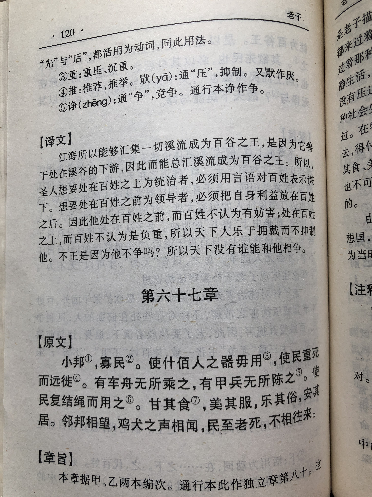
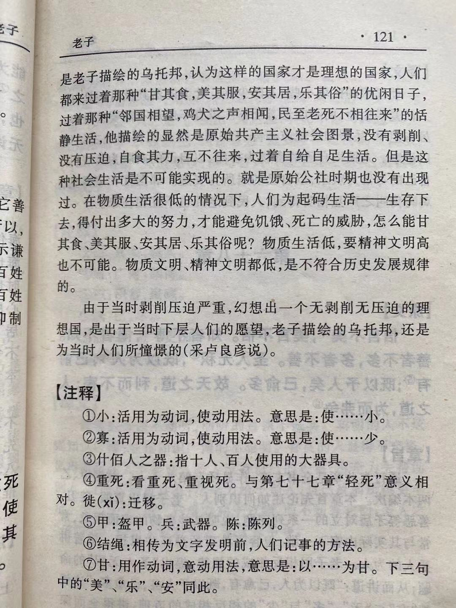

## 《道德经》第八十章通行本原文：

    小国寡民。
    
    使有什佰之器而不用，使民重死而不远徙。
    
    虽有舟车，无所乘之；虽有甲兵，无所陈之。
    
    使民复结绳而用之。
    
    甘其食，美其服，安其居，乐其俗。
    
    邻国相望，鸡犬之声相闻，民至老死，不相往来。
            
## 译文：
 
    国家可以变小点，民众也可以少点。
    
    虽有各种工具器械但并不需要使用，让人民看重死亡而无需远离迁徒。
    
    虽然有船只车辆，却不是必须乘坐；虽然有武器装备，却没有必要去陈列阵前。
    
    使人们回到远古结绳记事的朴素状态中去。
    
    使人们有甘美的食物，有漂亮的衣服，有安稳的住所，有欢乐的风俗。
    
    邻国之间互相望得见，鸡狗的叫声可以听得到，但人民从生到死，彼此并不需要互相往来。

## 逐句解释：

### 小国寡民。
帛书版为：小邦寡民，帛书版成书在刘邦当皇帝之前，无需避讳“邦”。
使得城邦变得很小，民众也不是很多。这句是在警戒那些诸侯王，不要只想着扩大领地，称霸天下。而是安身立命，管理好自己的领地，让民众安居乐业。这句话初看似乎与中央大国的概念不同，但老子说这个是有其时代背景的。那时候正值春秋末期，周天子名存实亡，天下分崩离析，各诸侯野心勃勃，为了一己私欲而争霸天下，导致百姓流离失所。老子看到了种种不好的现象，所以才寄希望于小国寡民。

### 使有什佰之器而不用，使民重死而不远徙。
什佰：十、百，意为极多，多种多样。重死：看重死亡。不远徙：徙(xǐ)：迁移，通行本增加了一个“不”字。两者意思一样，帛书版意思是远离迁移，通行本则是不迁徙远离。
虽有种类繁多的工具器械但是无需使用，让民众不因为战火或者饥荒而流离失所。老子这里并不是反对使用工具器械，也不是反对科技创新，老子反对的是通过工具器械去做伤天害理之事。如果诸侯王依赖新的工具器械挑起战争，妄图称霸天下，那就会带来无穷的灾祸。

### 虽有舟车，无所乘之；虽有甲兵，无所陈之。
甲兵：武器装备。陈：陈列。此句引申为布阵打仗。
虽然有船只车辆，却无需乘坐；虽然有武器装备，却无需陈兵列阵。当你无需在意和依赖外在的工具器械时，你就获得了真正的自由。武装力量只是用来自保，而不是侵略，因此最好的方法是保持和平。人们目的是生活变得更美好，而没有必要使用武力，挑起事端。当你无需依赖外在的东西也能过的幸福时，那才是真正的自由。现代社会人们依赖的工具非常多，这给人们带来了便利，但也带来了一定的负面影响。如何做到平衡，使得科技向善值得我们探讨。老子不是不让使用科技器械，也不是不让有武装力量，而是告诉我们什么才是根本，告诉我们不要为物所累。

### 使民复结绳而用之。
结绳：文字产生以前，人们以绳记事。指纯朴善良，相互信赖的时代。
使人们回到远古结绳记事的朴素状态中去。这句话也容易引起误会，后人以为老子主张退步，回到原始状态中去。其实不然，老子提倡的是在思想上保持纯朴善良，让人们坦诚以待，少点尔虞我诈，不要相互伤害。当人和人之间没有私欲和伤害时，和谐社会就出现了。

### 甘其食，美其服，安其居，乐其俗。
使百姓吃得香甜，穿得漂亮，住得安适，过得开心。这种境界其实是人生的理想境界，衣食住行，还有玩乐，每一样都达到合适的状态。这个不是什么愚民政策，更不是奴役人民，恰恰是领导者应该追求的目标，即让人民安居乐业、生活幸福。

### 邻国相望，鸡犬之声相闻，民至老死，不相往来。
邻国之间互相望得见，鸡狗的叫声可以听得到，但人民从生到死，彼此并不需要互相往来。这句最容易被误解为消极退步，以为老子让人们不要往来，故步自封。其实老子的意思是，即便不相往来也可以过得幸福安适，而不要通过人际来往而陷入无休止的相互倾轧和不断内卷之中。

## 心得总结：
这一章老子提出了“小国寡民”的理想模式。在老子的理想国中，没有战争，没有伤害，人们安居乐业，天下太平。老子认为，理想的国家不宜过大，人口也不宜过多，人们无需太多的工具技巧，也无需太多的往来交流。本章是被后世争论最多的章节，人们为老子的“小国寡民”是退步还是进步争论不休，也为老子的理想国是否能真正存在而争论不休。

### 人们的争论普遍存在三个误解。

1. 第一个误解认为老子的理想国是乌托邦式的理想，根本没有可行性。在这个理想国里，人们“甘其食，美其服，安其居，乐其俗。”“虽邻国相望、老死不相往来。”这里没有战争，没有伤害，人们淳朴善良，过着美好的生活，这些根本就是一种无法实现的愿望。

2. 第二个误解是认为老子的理想国虽可以实现，但却是一种退步腐朽的思想。它奴役人们的思想，使人们变成被圈养的动物。“邻国相望，鸡犬之声相闻，民至老死，不相往来。”人们吃饱穿暖，别滋生事端，给统治者做牛做马。

3. 第三个误解认为老子理想国是真正的幸福国度，是化解阶级矛盾，调和人与国、人与社会、人与人之间关系的根本法宝，也是国泰民安，安居乐业的长久之道。因此要严格按照老子的思想去做。“使有什佰之器而不用，使民重死而不远徙。”、“使民复结绳而用之。”等等都照样遵行。

这三种误解都存在同样的问题，就是根据字面意思再加上自己的偏好去理解老子。也就是不是辩证地来看老子，要么不结合历史进程就把老子直接否定，要么就不顾历史发展而盲目崇拜老子。

第一种误解在于只是看到了字面意思，就认为那种纯朴时代，那种美好社会的状态根本没法实现。这是把老子简单化了。老子岂不知阶级矛盾以及人和人之间的矛盾是长期共存的？他老人家只是在看到天下大乱的情形下，提出一种对美好生活的设想。这是一种美好的期望，的确不一定会存在，但是向往那种美好的状态，朝着幸福出发总是对的。

第二种误解在于没有理解老子当时所处的时代，也没有结合前面的章节综合来看。只是看到了小国寡民、结绳而用之以及老死不相往来之类的字句，就断然认为老子是消极退步的思想。老子相对目前的积极发展来讲的确略显保守，但这是老子遵循天道的一种无为而治的策略而已，并非消极退步思想。其实如果能明白“反者道之动”这句话，那么就能理解老子的思想绝不会保守，他只是看到了事物的对立面，从而采取一种更加高级的积极有为而已。老子的思想也是一种进步发展观，只不过相比激进的改革派，老子会倾向于平衡，希望世界万物能够和谐发展。

第三种误解在于基于前面篇章对于老子的信奉，对本章的内容全盘吸收，照章而行。前面老子提出了很多朴素的辩证思想，都非常有道理。如“有无相生，难易相成”、“合抱之木，生于毫末；九层之台，起于累土；千里之行，始于足下”、“祸兮福所倚，福兮祸所伏”等等。老子深刻地揭示了宇宙存在的普遍规律，发现了人们通常所不能发现的深层次问题。但以此就把老子的话当成金科玉律，那也是不对的，这容易陷入教条主义。老子本章描述的理想状态，在实际社会中，尤其是高度发达的现代文明中，应当是难以成立的。现代社会人们依赖大量的科技工具，人们需要不断地流动迁徙，人们需要不断地相互交流。因此，我们应当辩证地来看老子的思想，吸收老子话语中的精华，摒弃其中不符合时代发展的部分。

### 当然也有一些人并没有误解老子，而是辩证地看问题。既看到了老子深邃思想的优点，也看到了老子思想中因时代局限的不足。

 “使有什佰之器而不用，使民重死而不远徙。虽有舟车，无所乘之；虽有甲兵，无所陈之。”“什佰之器”表示数量繁多的器械工具，“重死”即不轻死，也就是珍惜生命。人们无需使用这些器械工具，但要珍惜每一个生命，有了杀人利器也不去做伤天害理之事。

“使民复结绳而用之。甘其食，美其服，安其居，乐其俗。”这是希望回到曾经质朴简单的生活状态，是对于过去美好的致敬，也是人们期望的美好生活。然而毕竟时光不能回流，我们不能回到曾经的美好，但我们可以建设新的美好。

“邻国相望，鸡犬之声相闻，民至老死，不相往来。”没有喧闹，没有争夺，也没有压迫与剥削，人与人和谐相处，彼此以诚相待。这种美好的生活，在新的社会人们往来交流，也依然可以达到。只要我们坚守心中的道，摒弃私欲杂念，保持无我利他，在他人需要困难的时候真心帮助，我们就能打造一个美好的社会。

老子的思想并没有一点保守或者消极，他的话是一种高级的积极有为。当然了，某些话语产生有其时代的局限性，我们不要照搬老子的字面意思，也不要执拗于老子的某个词语。我们应该把握老子的本质思想，从全篇的角度来理解，做到活学活用。

## 附帛书版：
通行本第八十章与帛书版六十七章同。

[返回目录](../README.md) &nbsp; [上一章](./79.md)&nbsp; [下一章](./81.md)

