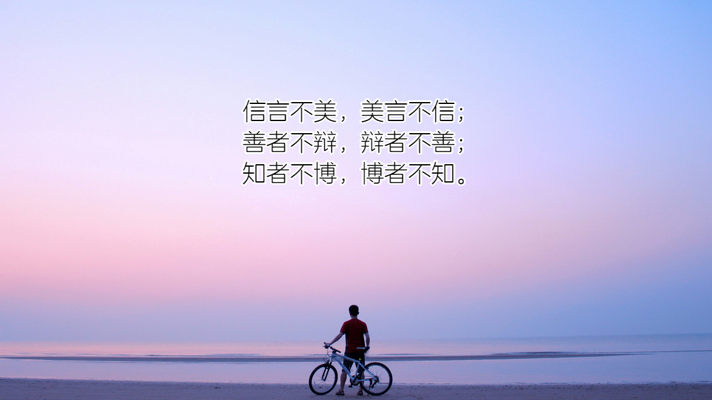
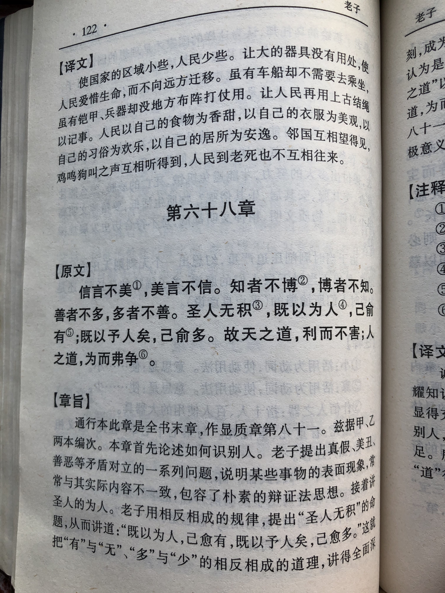
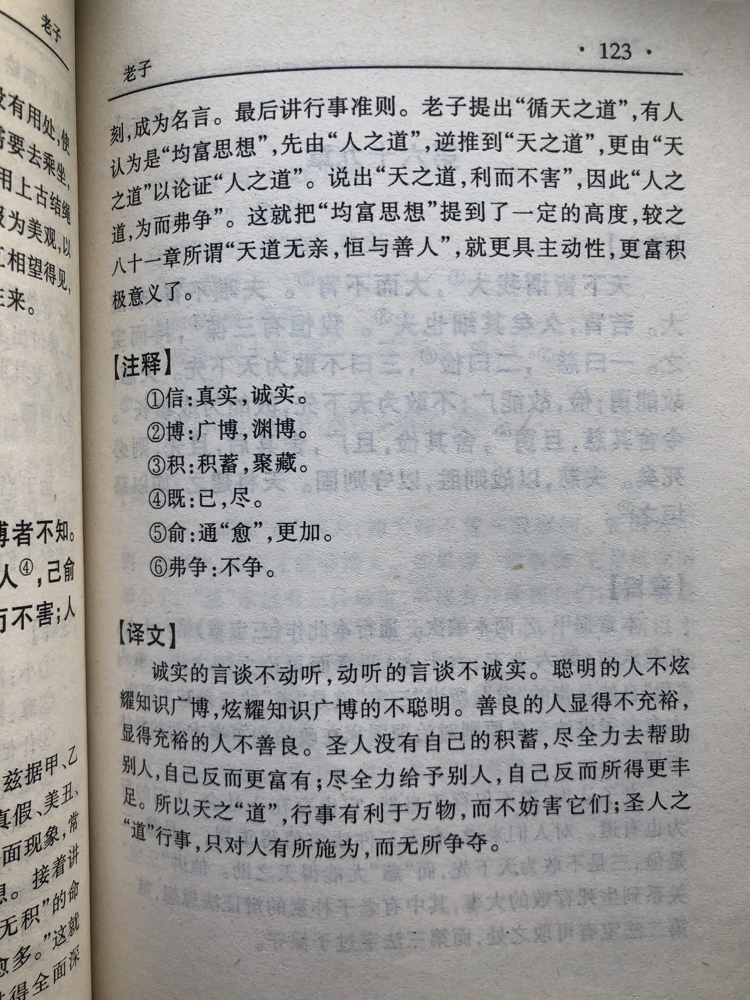

## 《道德经》第八十一章通行本原文：

    信言不美，美言不信；
    善者不辩，辩者不善；
    知者不博，博者不知。
    圣人不积。既以为人己愈有，既以与人己愈多。
    天之道，利而不害；圣人之道，为而不争。
            
## 译文：
 
    可信的话不漂亮，漂亮的话不可信。
    善良的人不巧辩，巧辩的人不善良。
    知道的人不广博，广博的人不知道。
    圣人并不需要积蓄和占有。
    帮助他人越多，自己就越充足；给予他人越多，自己就越丰富。
    上天的规律，有利于万事万物而不去妨害；
    圣人的准则，有所作为但不为自己去争夺。

## 逐句解释：

### 信言不美，美言不信；
信：人言为信，要真实可靠的，不能虚伪。美：漂亮、华丽。
真实可信的话不漂亮，听起来漂亮的话并不可信。人们总喜欢听好听的，于是谎言就多了。如果人们愿意听到真实的，那么就应该摒弃那些漂亮的话。因为漂亮的话往往是经过粉饰后的假大空话。老子劝诫人们要真实，不要被美丽的谎言所迷惑。

### 善者不辩，辩者不善；
辩：有口才，会巧辩，花言巧语，华而不实。
淳朴善良的人不会巧言善辩，而能说会道、巧言善辩的人往往并不淳朴善良。这里与帛书版有一些出入，帛书版为“善者不多，多者不善”。那个意思是得道之人的善良，是无为而不争的，不为自己争取多多的利益，而是从利他角度出发，为众生谋福祉。

### 知者不博，博者不知。
知者：有知识的人，引申为有智慧、得道之人。博：广博，宽泛。这里引申为博而不精，卖弄学问。
真正明白“道”的人不会因为知识博广而卖弄，卖弄的人还没有掌握“道”的真谛。我们通常说要博学多才，学富五车，这都是说学知识越多越好，老子怎么说博广的人还不知道呢？其实老子说得没错。一般的知识，当然是博采众长，越多越好，但是老子所说的知识是“得道”，是指按照“道”的规律行事，体现出“德”来。按照“道”的规律展现“德”并不需要广博的知识，只是需要持之以恒，慎终如始坚守“道”即可。那些看起来学识广博的人，可能花里胡哨的，粗通文墨就开始卖弄，因此离真正的“修道”相去甚远。

### 圣人不积。
积：积蓄，贮存，占有。
圣人这里指的是得道的统治者，他们并不需要太多的积蓄和占有，而是一心为民，为老百姓谋福祉。如果统治者为了私欲而不断积累占有时，那就是背道而驰。

### 既以为人己愈有，既以与人己愈多。
愈：越，更加。
圣人帮助他人越多，自己就越充足，这是因为当你一心为民时，也一定可以从民众那里获得帮助；圣人给予他人的越多，自己就越丰富，这是因为民众富有了后，也会积极回馈。

### 天之道，利而不害；圣人之道，为而不争。
利：有利、利于。害：妨害、伤害。
上天的规律，有利于万物而不去妨害它们。圣人的准则，有所作为但不为了自己去与百姓争夺。天道无仁无义，客观恒久地运行着，它没有偏爱，只是默默地滋养着万物，而不会妨害它们。统治者的治国之道，要遵循“无为而治”，也就是“为而不争”。统治者治理天下要有所作为，但不要破坏和干预自然规律，不要为了自己的私利去与人民争夺。

## 心得总结：
这一章在通行本是最后一章，而在帛书本里面是六十八章。后人把这一章放置最后也是有意义的，因为本章可作为《老子》一书的中心思想。老子提出了很多观点，从天地万物创建到“道”和“德”的运行规律，以及各种辩证思想。其中本章的“天之道，利而不害；圣人之道，为而不争。”是全书的中心思想。

### 本章从内容上也可以分为两部分，一部分是关于有道之人的言行举止，第二部分是天道的核心思想。

“信言不美，美言不信；善者不辩，辩者不善；知者不博，博者不知。”美丽的言语不可信，真实可信的言语不美丽。现实的确如此，你告诉他人真实情况，往往听上去并不那么美丽，你如果编织谎言，便可以说得天花乱坠。善良的人是非常质朴的，不会搞花里胡哨，也不会巧舌如簧，而是有点木讷，甚至笨拙，根本不屑与人争辩是非。对于“道”的理解和践行，并不需要多么广博的知识，而是需要持之以恒的信念和坚持不懈的行动。那些看起来知识博广的人，往往喜欢高谈阔论，不断卖弄，实际上却没有真正领略“道”的真谛，这样的人从修道的角度看，是相当无知的。
 

“圣人不积，既以为人己愈有，既以与人己愈多。”圣人无需自己积累，也无需彰显欲望。圣人尽量帮助别人，自己就会变得更富有；圣人尽量给予别人，自己就会得到更多。这是什么道理呢？这是因为当你尽心帮助他人时，别人也会回馈于你，这是天道。而通过帮助他人，你的内心也会更加充盈，从自己这里向内求，就会明白更多。

### 这里有两点要注意，一是老子提出的“为人”、“与人”不是那种“毫不利己，专门利人”，不是别人都有了，而自己啥也没有，这样的圣人即便存在，那也不可持续。二是老子的思想不是那种厚黑学和老谋深算，不能以利己为目标而以利他为手段，而是以利他为目标和出发点，自己最后也获得了更多。这只是自然的结果，而非刻意为之。

老子提倡的是一种“无我利他”观点，即出发点和目标是为他人的利益着想，先把自己的利益放在一边，让老百姓过得更好，最后的结果是老百姓越来越有，圣人自己也会得到更多。这也是一种双赢和平衡的思想，最后双方都获得了更多，社会变得和谐有序。

“天之道，利而不害；圣人之道，为而不争。”这是全章的总结，也是整部书的中心思想。老子一开始就提出了天道，天道究竟是什么呢？就是一种客观规律，悄无声息，不停运转，使得万物保持平衡。它有利于万物生长而不去主宰和妨害，有了成绩也不认为是自己的功劳。圣人，也就是得道的统治者，应该遵循天道来治理国家，施行无为之治，具体来讲就是“为而不争”。身处其位，当有所作为，带领大家攻坚克难，创造美好生活，不是为了自己去争名夺利、流芳百世，而是真心为老百姓谋福祉，为全天下做奉献。而当你真的这样做了，人们并不会忘记你。这就是天道。

这一章里，老子通过“利而不害，为而不争”说出了“道”的中心思想。无论治国理政，还是管理企业，亦或者为人处事，老子的观点都值得我们遵循和借鉴。人们有时候会讨论什么是文化以及什么是善良，广泛流传的一种说法是：根植于内心的修养；无需提醒的自觉；以约束为前提的自由；为别人着想的善良。其实读懂了老子，践行老子所提倡的，就是有文化，就是莫大的善良。

## 附帛书版：
通行本第八十一章与帛书版六十八章同。

[返回目录](../README.md) &nbsp; [上一章](./80.md)

