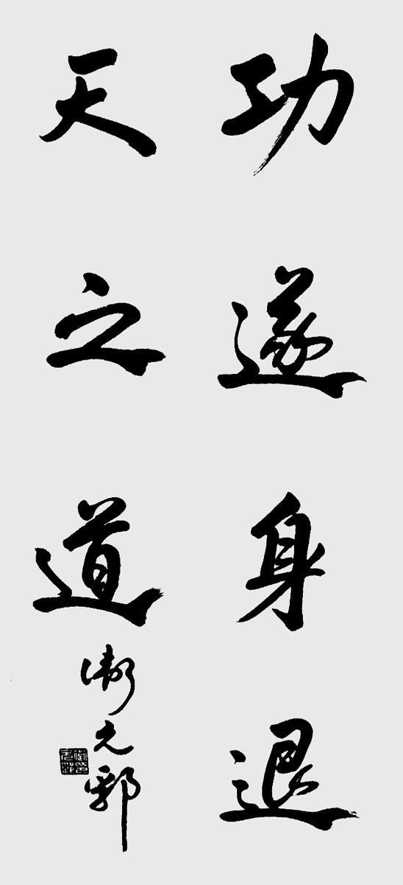
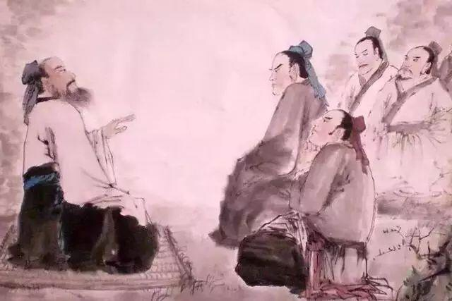

## 《道德经》第九章通行本原文：

    持而盈之，不若其已；
    揣而锐之，不可长保。
    金玉满堂，莫之能守；
    富贵而骄，自遗其咎。
    功遂身退，天之道也。

## 译文：

    端着盈满的器皿还继续加满，不如适可而止；
    捶打锋利的铁器而使之更加尖锐，是不能长久保持的。
    金玉满堂，并不能长久守住；
    富贵骄纵，是给自己带来祸害。
    功成名就之时，要懂得急流勇退，这是客观自然规律。

## 逐句解释：

### 持而盈之，不若其已，揣而锐之，不可长保。

揣：音(zhuī )或抟(tuán)，拿在手里揉搓成形。

这里“持”是拿或端着，“盈”这里是动词，即给一个器皿不断加满水，端着这个走路，那迟早会溢出来，不如放下来或倒出来一些。“揣”是捶打，“锐”也当动词用，即给一个铁器不断捶打，使之更加尖利，这样下去容易折断，是难以长久保持的。老子这是告诫我们，凡事有度，过犹不及。

### 金玉满堂，莫之能守；富贵而骄，自遗其咎。
即使家财万贯，黄金满屋，也富不过三代，财富是守不住的；如果富贵了变得骄纵，嚣张跋扈，那就是自取其祸。再多的钱财也是无法传递，与其留下财富给后辈，不如留下智慧与思想。有钱并非坏事，但钱多了人容易膨胀，如果不懂得谦卑收敛，也就没有驾驭钱财的本领，迟早会生出祸害来。

### 功遂身退，天之道也。
功成之后，名利双收，此时应给他人机会，自己适时而退，不要一直恋栈权位，贪图富贵。此是天道，也就是自然规律，至于其中道理，当以史为鉴。

## 心得总结：
这一章，老子是要告诉大家凡事有度，适可而止。日中则昃，月盈则亏。物极必反，否极泰来。一件事物，当超过一定限度后，就会朝相反的方向发展。老子后面章节讲的“反者，道之动”也是这个道理。

满招损，谦受益。做人，什么时候都要保持低调谦卑。你有钱也好，有权也罢，一旦骄纵自满，自我炫耀了，就会渐渐招致怨愤和不满，然后灾祸就降临了。做人不要过于锋芒毕露，而是给自己留一点空间，这样的人才有弹性，能伸能缩。

所以为人处事不要太满，过犹不及。如果成功了，一定要记得功成身退。前面老子提到“夫唯不居，是以不去”也是这个道理。所谓“狡兔死，走狗烹”、“飞鸟尽，良弓藏”，历史上被屠杀的功臣比比皆是，这都是因为那些功臣没懂得激流勇退的道理。

大智慧啊！真正有道之人，是懂得适可而止，顺其自然的。保持谦卑，富而不骄。收敛光芒，不断进取。这才是我们应该遵循的天道。

## 附帛书版：

[返回目录](../) &nbsp; [上一章](./8.md)&nbsp; [下一章](./10.md)

