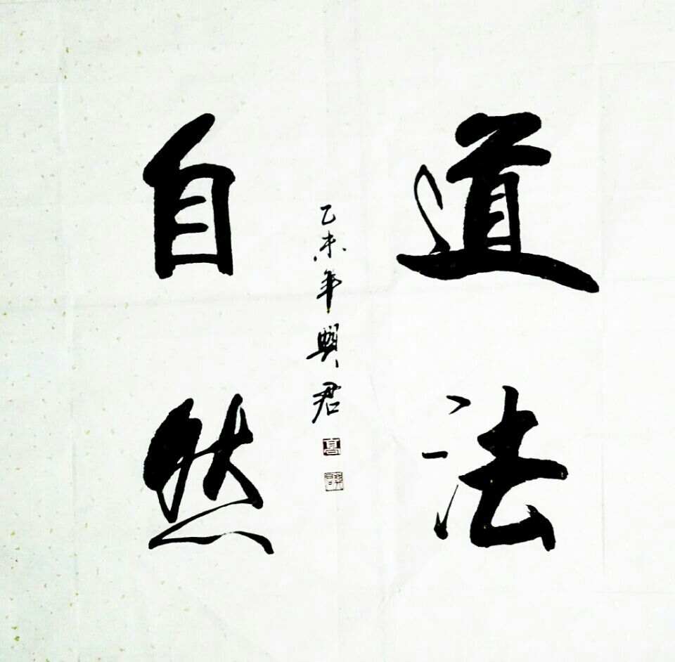
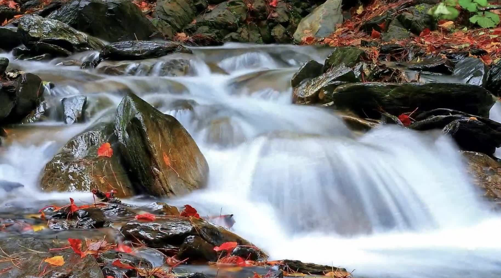
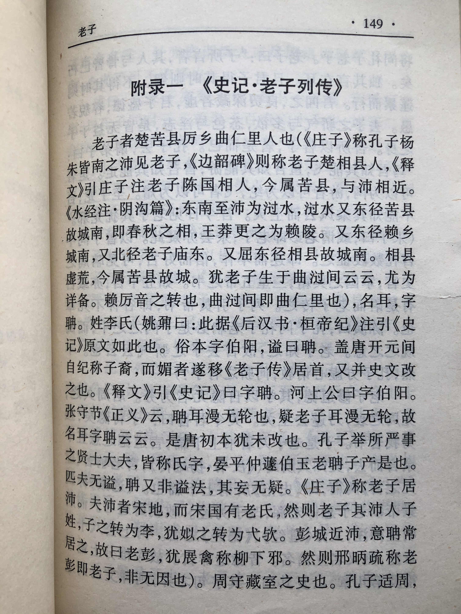
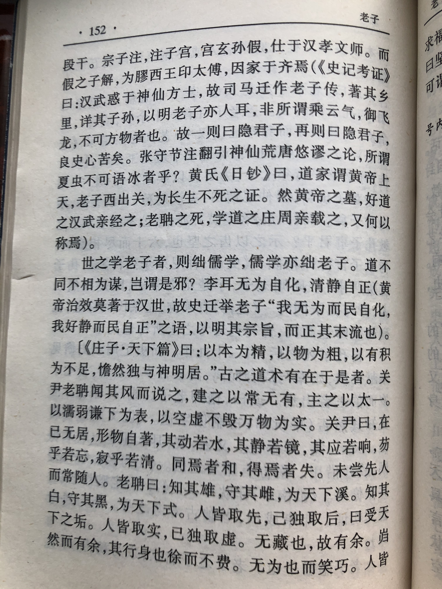
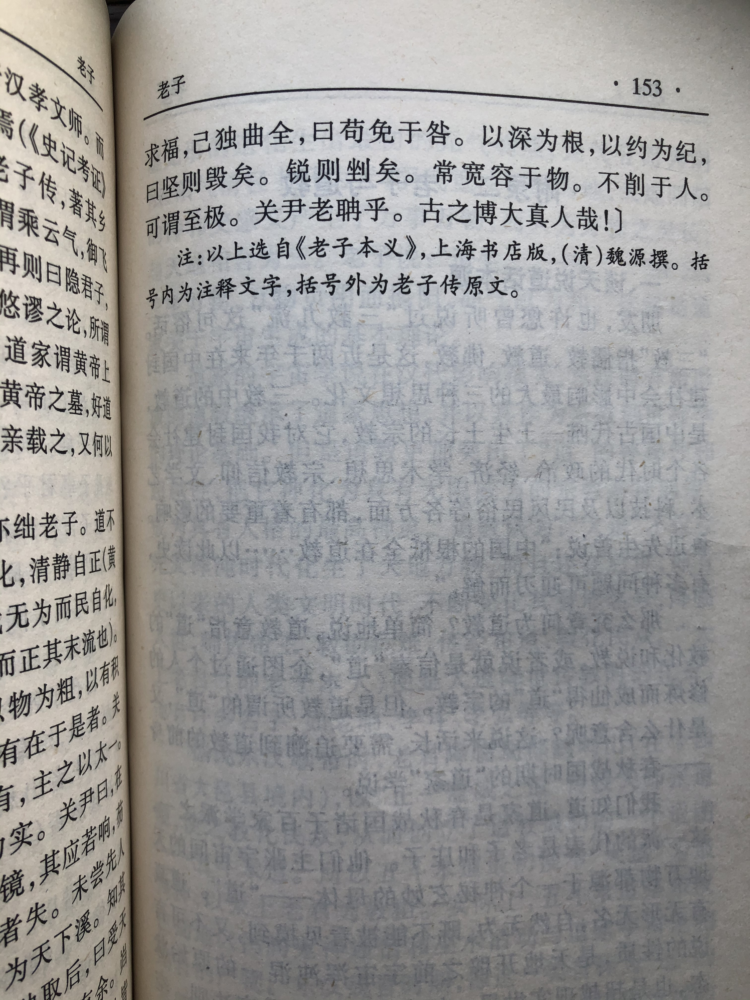

# 后记

总算完成了《道德经》的全面学习和记录整理。
这个过程很有趣，能让自己更加系统地理解《老子》，也能更加清晰地认识这个世界和人生，还能让自己的内心得以安宁。

这本书买来也近20年了，是在某读书节上，那时还是20来岁的年纪。当看到书里的一些句子犹如醍醐灌顶。如“千里之行，始于足下”、“和其光，同其尘”、“福兮祸所伏，祸兮福所倚”、“水善利万物而不争”、“大成若缺，大巧若拙”、“反者，道之动”等等，顿时有种豁然开朗，就果断买了。当时断断续续地看，把大部分句子都看了，也跟同学们简单研讨过，但并没有深入地系统化学习。后来工作繁忙了，就更是偶尔翻翻，粗浅地读一读。

因此心中一直有个念头，就是找机会把《道德经》这本书细致研读一遍，并结合自己的经验记录下一些心得体会。今年春节，马上四十不惑的年纪了，就以这个契机开始细读。从年初到现在，差不多小半年，总算完成了学习和整理。

对于《老子》的研究和分析，历史上的学者不胜枚举，相关书籍也是汗牛充栋，我不是专门的学术研究者，也不是道家学派之人，更不是道教信徒，没法像他们那样著书立说或传道解惑，我只能就自己的经历和生活感悟来理解罢了。

媒体上、网络上解说《道德经》的比比皆是，每每听来也受益匪浅，但终归没有哪一家能说解释得恰到好处，也没有哪一家能让你觉得如原文一般优美。人和人是不同的，如果能秉持开放和自由观念，那人们之间的思想就会存在着较大差异。在这个世界上，每个人心中可能都有一个老子，谁都可以有自己的见解。网络是自由的，人都有自己是思想，因此不同意见在所难免。只要你说得有道理，能够逻辑自洽，那么就可以解读，也没有必要统一认识。当然在解读的时候需要遵循虚心、真诚、开放、包容的心态，能够接纳不同的意见。

这本书总体上讲了啥呢。我觉得主要讲了以下三个方面的内容。

## 第一，本书讲了“道”和“德”的来源与构成，以及它们之间的关系，还有它们与世界万物的关系。

首先，关于“道”的来源，“道”先于天地而存在，来自于宇宙初始时的某个点。“有物混成，先天地生。寂兮寥兮，独立不改，周行而不殆，可以为天下母。吾不知其名，字之曰道，强为之名曰大。”这就是“道”的来源，即先于天地而存在的一种混沌物体，无声无息，周而复始不停运转，可理解为宇宙大爆炸前存在的那个奇点，爆炸后形成了整个宇宙，以此建立了整个宇宙运行的法则。

那么奇点是从哪里来的呢？这个没有答案，也可以说这个来源本质上是“无”，但这个“无”并不是什么也没有。你看不见、听不到、摸不着，似或存的一种状态，它究竟从哪里来的，老子并没有说得很清楚。我们只要知道”道“先于宇宙而存在，是万物之母。

“道”的构成呢？
“道可道，非常道；名可名，非常名。无，名天地之始，有，名万物之母。”从这里可以知道，“道”包括两方面，即“无”和“有”。其中“无”为本体，“有”是外在表现。“万物负阴而抱阳，冲气以为和”，也可以说“道”是由“阴”和“阳”构成的。“无”决定着“有”，而人们又通过“有”才感受到“无”。

“道”长成什么样呢？
“道之为物，惟恍惟惚“，“视之不见，听之不闻，搏之不得”。从这里可以知道“道”看不见、听不到、摸不着，似乎不存在一样，而其实是存在的。“道”是一种可抽象的可感知的存在，可以理解为一种创建万物的力量，或者一种永恒不变的规律。“道”与神话不同，它不是宗教的神秘理论；“道”与现代哲学也不完全相同，它并不只是一种形而上的理论。“道”虽然没有具体的物理形态，但它是一种可被感知的客观存在。

那么“德”呢？从哪里来，由什么构成？
“德”来源于“道”，是“道”作用在万事万物上的具体体现。“道”并非纯主观的感受，它是一种真实的存在，虽然“道”气息微弱、无声无息，但其外在的表现和特征是能够被观察和感知的，这个外在的表现和特征就是“德”。人们通过“德”来感受到“道”。具体来讲“德”就是万物天生所具有的一种禀赋，万物都创建于”道“，因此一开始就具备了“道”所赋予的特征，这个特征就是“德”。“德”包括上德和下德，上德无为，下德有为，包括上仁、上义、上礼。

总体来说，“道”是一种可感知的客观规律，包括“无”和“有”，它默默地运行并控制着一切。“德”是这种规律作用在万物上的体现，人们通过“德”来感受到“道”。

“孔德之容，惟道是从”说的是“德”完全体现着“道”的意志和规律。这是因为“道”是“德”的载体和本质，“德”是”道“的形式和表现。

## 第二，本书阐述了“道”和“德”的运行规律以及根据这个规律而形成的万事万物的运行法则。

“反者，道之动；弱者，道之用。”，这是“道”的运行规律和能动作用。”道“的运动规律是朝着事物对立面发展，不断循环往复。而一旦到达极限，则物极必反，回到事物最初的状态。“道”的作用很柔弱，但却无穷无尽，万事万物都受到它的制约。

《道德经》与辩证法的对立统一规律、量变质变规律、否定之否定这三大定律的概念也很类似。事物朝着对立面发展，然后通过量变引起质变，最后又回到原点，就这样不断正反变换。但整个过程是螺旋式上升，波浪式前进的，因此事物得以向更高级的方向前进。

“道”分为三个层级，即天、地、人。”人法地，地法天，天法道，道法自然。“这里的天层级最高，表示客观规律，指客观自然的内在秩序，亘古不变，决定着地和人。地则表示社会规律，是人们在长期生活交流中形成的行为规范和伦理秩序。人道的层级最低，指的是人们的心境和人格、价值观等。人道(个人)遵循于地道(社会)，地道遵循于天道(天下)，天道又遵循于本来的样子(自然)。

## 第三，本书目的在于教化圣人应该遵循于“道”，体现出“德”，也就是按照无为而治来治理天下。

五千字的经书里，“圣人”两个字出现了三十多处，出现的频率仅次于“道”和“德”。可以说本书主要就是介绍什么是“道”和“德”，然后再告诫圣人该如何遵循于“道”，体现出“德”。

“是以圣人处无为之事，行不言之教，万物作焉而不辞，生而不有，为而不恃，功成而弗居。”、“是以圣人之治，虚其心，实其腹；弱其志，强其骨。为无为，则无不治。”、“圣人不仁，以百姓为刍狗。”、“是以圣人后其身而身先，外其身而身存。”、“道常无为而无不为，侯王若能守之，万物将自化。”、“是以圣人常善救人，故无弃人；常善救物，故无弃物。”、“是以圣人去甚，去奢，去泰。”、“是以圣人之能成大也，以其不为大也，故能成其大。”……

关于圣人的句子非常之多，可以说《道德经》一书也是为教化统治阶级而用的，里面提到的都是治国安邦之道，同时也告诫领导者要提升个人修养，为而不争。

“上善若水。水善利万物而不争，处众人之所恶，故几于道。”、“天之道，利而不害。圣人之道，为而不争。”老子告诫圣人应该拥有水一般的品性，利于万物而不争，那样就不会有过错和怨咎。老子正是因为看到了春秋末期战火纷争，人性贪婪，统治者穷奢极欲，百姓流离失所等各种社会问题而提出的解决方案。老子告诫统治者只要做到“利而不害、为而不争”，那么天下就会大治，人们就可以过上真正幸福的生活。

“失道而后德，失德而后仁，失仁而后义，失义而后礼。”老子还将“道”、“德”、“仁”、“义”、“礼”的关系也作了说明，即“道”决定着后面几项。如果能够真正遵循于“道”，体现出“德”，那么后面的几项可有可无。所谓“仁”、“义”、“礼”，不过是一些教人们如何建立一套规范秩序而已，属于“人”和“地”这个层级，显然不如“天”高明。如果圣人能够遵循于“道”，采用无为而治，那么也就无所谓那些世俗的秩序和条框了。

综上来看，老子的思想充满着朴素唯物主义辩证法，同时也具备客观唯心主义思想。

老子是一个具备深刻洞察力和悲悯情怀的思想家，其理论功底非常深厚，看问题非常深入，也可以是中国古代真正的哲学家。但由于老子的话语都很短，大部分又都是定义式表述，而非论证，因此老子的一些观念表述得并非十分明确。有的上下文也缺乏完整的严密逻辑，因此老子的话语存在着一些不清晰甚至矛盾的地方。这也给不同的人有着不同解读发挥留下了便利。这或许也是《道德经》作为经书神奇而伟大的地方。“大成若缺”、“大巧若拙”，不完美才是完美吧。

现在人们很喜欢说三观这个词，包括世界观、人生观和价值观。老子的世界观既非唯物，也非唯心，而是“道”，一种客观存在的东西，是万事万物的根本法则，它客观存在但又无法直接感知。老子的人生观提倡清心寡欲、朴实无华、利而不害、为而不争，做一个对人们少干预而低调务实的人，老子的价值观是去私去奢，戒骄戒躁、无仁无义、上善若水，凡事顺其自然。

通过对于老子思想体系的梳理，其实我们发现老子的观念非常好懂。《老子》蕴含的思想的确很深奥，很多字词也看不懂，但是只要潜心研究，踏实下心来，保持谦虚谨慎的态度，遵循老子本来的思路，不自以为是，那么理解起来就会变得容易了。

我们不能仅从字面意思推论，也不能孤立地看某个句子或某一段落。而是要结合上下文以及全局中心思想来理解老子，这样解释起来就非常顺畅。老子的思想简单总结起来就是“道法自然，无为而治”。老子告诫人们遵循的修行是“抱朴守素，清心寡欲”，老子告诫统治者应该“利而不害，为而不争”。

一些人把《老子》解说得玄乎其神，有一些人把《老子》批评得体无完肤，也有一些人抱着审慎的态度不置可否，还有些人把《老子》当成修身养性的指南，当然更多人的人对于《道德经》是雾里看花，我想凡此种种，都是非常可惜的。希望人们能保持谦卑心态，抛却执拗，从客观公正、实事求是的角度来评价老子的思想，来学习和传播《道德经》。我想这对于我们的社会或者个人都是非常有益的。总之，学习和理解《道德经》，对我们是非常有帮助的，悟透其中道理会让我们做起事情来得心应手、从容不迫、自然而然。

## 一些问题：

本书都看完了，也梳理了相关的知识点。本着从问题出发来学习老子和理解老子，一些问题还需要不断探讨和研究。
比如：

对于老子提出的概念和观点究竟怎么来评价呢？

老子究竟是积极进取，还是消极避世呢？

老子究竟是纯真质朴，还是老谋深算呢？

老子的优点和不足又分别是哪些？

老子的观点在现实世界究竟有多少可行性？

老子的学说与当前时代的结合点在哪里？

我们该以什么态度来面对《道德经》这部书？

关于人生的意义可以从老子那里借鉴到什么？

关于人类可持续发展，老子的思想是可靠的答案吗？

如果老子还活着，他会怎么看待当今的内卷和躺平现象？

这些问题我基本都有了自己的看法，但我暂时不打算写下来，而是待到二十年后，花甲之年，那时再来重新整理和回答这几个问题。如果你也有自己的看法，不妨留言一起探讨吧。

## 附《老子列传》：

[返回目录](../README.md)

