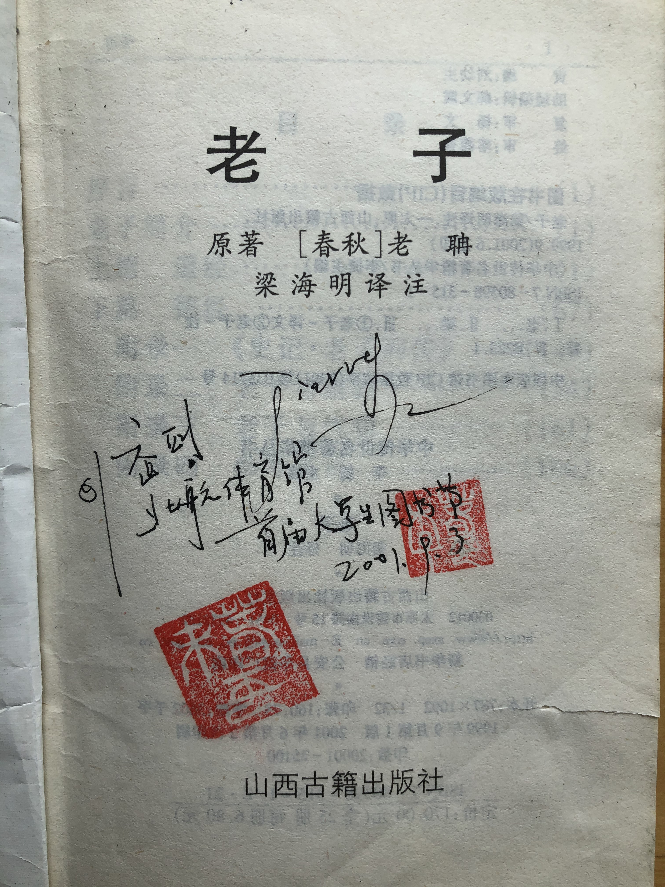

# 前言

《老子》也叫《道德经》，这本书距今2000多年了，是深奥的哲学思辨类著作，也是中国文化的奠基之一。相比《论语》，《老子》要更深奥些，也更有哲学意味，当然也更加晦涩难懂，加上各个版本不一，各种注解训诂颇多，《老子》一直是既被大众所熟知，又似乎离大众很远，每个人的理解也不尽相同。中国封建社会儒家乃是正统，因此《论语》流传更广泛些，也更被当时的官员和学子所推崇，但其实《老子》的思想和观念更加透彻，也更加符合辩证思维。

20年前偶然的机会买了几本古典书籍，包括四书五经，也含有这本《老子》。读来读去，记得深刻或者说更加赞同的当属这本《老子》。虽然我理解不甚深刻，人生阅历也还浅薄，但每每翻看这本书，总能给我答疑解惑。

《老子》的版本众多，流传开来的至少有四个版本：郭店楚简本、马王堆帛书甲乙本、河上公本和王弼本。我买的这本是马王堆帛书本，毕竟是西汉时期的，应该更接近于原著。

近些年来随着市场经济的发展，物质生活的繁荣，人们日子过得好了，但也出现了不好的一面，即道德开始整体滑坡，人与人缺乏信任，人们追逐名利而不择手段，社会上呈现一片浮躁和戾气。于是传统文化又开始盛行起来，孔子学院开到了海外，小学生开始诵读经典，企业里将管理与国学结合，市场上传播传统文化的节目越来越多。

《老子》这本书也随着这个现象一同受人关注，很多老师、学者以及民间爱好者都开始研读这本书，有出书的，有做注解的，也有录制音视频资料的。网上相关资料汗牛充栋，无论喜马拉雅音频还是公众号、头条、抖音，上面各种文字、音视频资料应有尽有。我大概翻看下，也悉数听了一些。比如早期的有南怀瑾先生的，有曾仕强老师的。近期的有傅佩荣、齐善泓、王东岳、罗大伦、郭继承先生们的等等。其中听王东岳老师和罗大伦先生的感觉最精彩，王东岳老师的中西合璧，论证严谨，逻辑性最强，罗大伦先生的结合生活例子，风趣幽默，可听性最强。这可能符合我的认知水平吧，我能感受到其中的乐趣和意境，太深奥的我也听不懂。

但听了老师们的分析和讲解，虽然受益匪浅，但又总觉得还差点什么，很需要看看原文，于是开始自己研读。自己读后也需要记录点什么，这便是一个开端。把自己的读后感和想法结合自己的经历记录下来，不设时限，不设标准，只为给自己看，供再过20年后退休时整理资料用。

欲修其身，先正其心。欲行其事，先正其名。值此40岁之际，给自己也定个小目标吧。就是细细研读下《老子》，做点记录，增加点感悟。也希望可以认识一些志同道合者，能够一起学习进步。如果有同样爱好，也在研读的朋友不妨给我留言。只言片语帮人答疑，助人解惑，善莫大焉。

